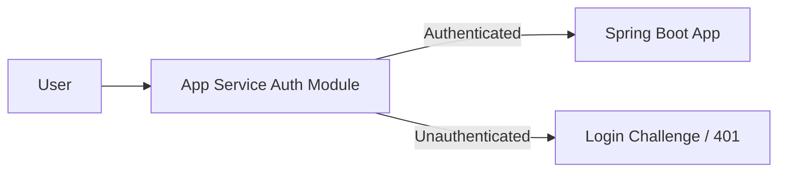

# Easy Auth (Built-in Authentication)

Enable App Service built-in authentication/authorization (Easy Auth) to protect your Java app at the platform edge with minimal code changes.

## Prerequisites

- App Service app deployed
- Microsoft Entra app registration or identity provider ready
- Permission to configure App Service auth settings

## Main Content

### How Easy Auth fits the request path



### Why use Easy Auth

- Offloads token validation and login flows to platform
- Protects endpoints before requests reach your app process
- Standardizes auth behavior across apps and slots

### Enable Easy Auth via Azure CLI

```bash
az webapp auth update \
  --resource-group "$RG" \
  --name "$APP_NAME" \
  --enabled true \
  --action LoginWithAzureActiveDirectory \
  --output json
```

Set unauthenticated behavior to require login:

```bash
az webapp auth update \
  --resource-group "$RG" \
  --name "$APP_NAME" \
  --unauthenticated-client-action RedirectToLoginPage \
  --output json
```

### Configure Entra identity provider

Use provider-specific configuration (portal or CLI) to bind the Entra app registration. Ensure redirect URI includes:

```text
https://<app-name>.azurewebsites.net/.auth/login/aad/callback
```

### Access user claims in Spring Boot

Easy Auth forwards identity headers your app can read:

- `X-MS-CLIENT-PRINCIPAL`
- `X-MS-CLIENT-PRINCIPAL-ID`
- `X-MS-CLIENT-PRINCIPAL-NAME`

Example controller snippet:

```java
@GetMapping("/api/auth/me")
public Map<String, String> me(@RequestHeader(name = "X-MS-CLIENT-PRINCIPAL-NAME", required = false) String name,
                              @RequestHeader(name = "X-MS-CLIENT-PRINCIPAL-ID", required = false) String id) {
    return Map.of(
        "principalName", name == null ? "anonymous" : name,
        "principalId", id == null ? "none" : id
    );
}
```

### Validate token expectations in app logic

If deeper authorization is needed:

- decode `X-MS-CLIENT-PRINCIPAL` payload
- map claims/groups to app roles
- enforce endpoint-level authorization policies

### Bicep-style configuration hint

For fully declarative environments, manage auth settings through ARM/Bicep resources under `Microsoft.Web/sites/config` (`authsettingsV2`) to avoid portal drift.

!!! warning "Do not trust headers outside App Service boundary"
    Only trust `X-MS-*` identity headers when requests are guaranteed to come through App Service front ends.

!!! tip "Combine with app-level authorization"
    Easy Auth handles authentication. Your app should still enforce domain-specific authorization.

!!! info "Platform architecture"
    For platform architecture details, see the [Azure App Service Guide — How App Service Works](https://yeongseon.github.io/azure-appservice-guide/concepts/01-how-app-service-works/).

## Verification

- Unauthenticated browser request is redirected to login
- After login, protected endpoint returns expected data
- `/api/auth/me` returns principal headers

## Troubleshooting

### Infinite redirect loop

Verify Entra redirect URI and auth action settings match your app hostname and custom domain.

### Auth works on default domain but not custom domain

Update allowed redirect URIs and issuer settings for the custom hostname.

### Missing `X-MS-*` headers

Confirm Easy Auth is enabled and requests are not bypassing App Service front door.

## Next Steps / See Also

- [Managed Identity](managed-identity.md)
- [Custom Domain & SSL](../07-custom-domain-ssl.md)
- [Operations: Security](../../../operations/security.md)
