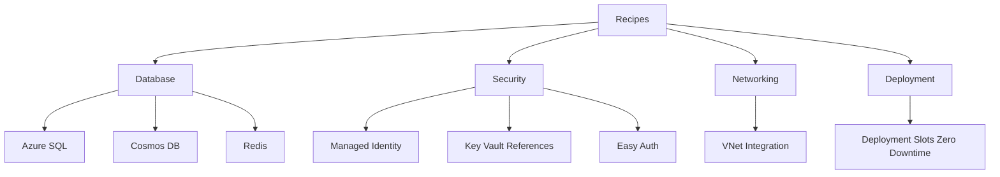

---
hide:
  - toc
content_sources:
  diagrams:
    - id: recipe-categories
      type: flowchart
      source: mslearn-adapted
      mslearn_url: https://learn.microsoft.com/en-us/azure/app-service/
---

# Recipes

Use these production-focused recipes to integrate common Azure services and operational patterns with Spring Boot on App Service.

## Prerequisites

- Completed tutorial steps [01](../01-local-run.md) through [03](../03-configuration.md)
- Deployed app with `$RG` and `$APP_NAME` available
- Access to create dependent Azure resources (SQL, Redis, networking)

## Main Content

### Recipe categories

<!-- diagram-id: recipe-categories -->

### Database recipes

| Recipe | Problem solved | Key technologies |
|---|---|---|
| [Azure SQL](azure-sql.md) | Relational data with passwordless auth | JDBC, Managed Identity, Entra auth |
| [Cosmos DB](cosmosdb.md) | Globally distributed NoSQL access | Spring Data Cosmos, partition keys |
| [Redis Cache](redis.md) | Low-latency caching and shared session state | Lettuce, Spring Data Redis, TLS |

### Security recipes

| Recipe | Problem solved | Key technologies |
|---|---|---|
| [Managed Identity](managed-identity.md) | Eliminate app secrets for Azure APIs | DefaultAzureCredential, RBAC |
| [Key Vault References](key-vault-reference.md) | Resolve secrets via platform config | `@Microsoft.KeyVault(...)` |
| [Easy Auth](easy-auth.md) | Add authentication at platform edge | App Service Authentication/Authorization |

### Networking recipes

| Recipe | Problem solved | Key technologies |
|---|---|---|
| [VNet Integration](vnet-integration.md) | Private outbound connectivity | Delegated subnet, NSG, private endpoints |

### Deployment recipes

| Recipe | Problem solved | Key technologies |
|---|---|---|
| [Deployment Slots Zero Downtime](deployment-slots-zero-downtime.md) | Safe production rollouts with rollback path | Staging slot, swap, sticky settings |

### How to use these recipes

1. Identify one operational problem (for example, secret sprawl or cold cache)
2. Apply exactly one recipe in a test environment
3. Verify with endpoint checks and Azure CLI outputs
4. Promote to production through your CI/CD process

!!! tip "Keep recipes composable"
    Start with Managed Identity before SQL/Key Vault recipes so your data integrations remain passwordless by design.

!!! info "Platform concepts"
    For platform architecture details, see [Platform: How App Service Works](../../../platform/how-app-service-works.md).

## Verification

- You can choose a recipe by category and desired outcome.
- Each linked recipe opens and includes implementation, verification, and troubleshooting sections.
- The sequence from tutorial to recipe is clear for new contributors.

## Troubleshooting

### Unsure which recipe to start with

Start with [Managed Identity](managed-identity.md), then apply a data recipe like [Azure SQL](azure-sql.md).

### You need strict network isolation

Pair [VNet Integration](vnet-integration.md) with private endpoints on each backend service.

### You need safer deployments first

Implement [Deployment Slots Zero Downtime](deployment-slots-zero-downtime.md) before service integrations.

## See Also

- [Tutorial Index](../index.md)
- [03. Configuration](../03-configuration.md)
- [04. Logging & Monitoring](../04-logging-monitoring.md)

## Sources

- [Azure App Service documentation](https://learn.microsoft.com/en-us/azure/app-service/)
