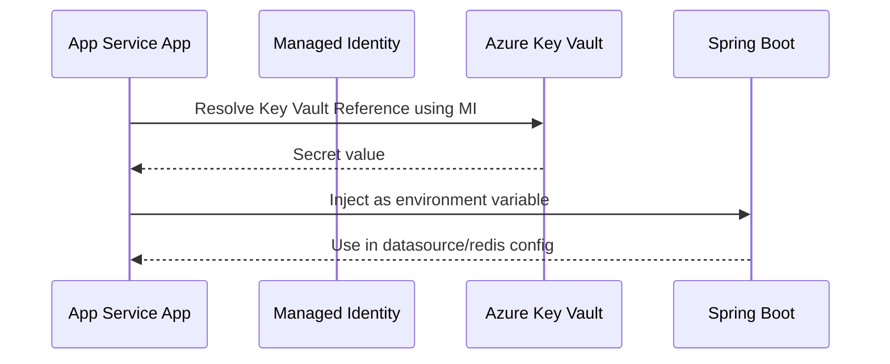

---
hide:
  - toc
content_sources:
  diagrams:
    - id: key-vault-references-no-code-changes
      type: flowchart
      source: mslearn-adapted
      mslearn_url: https://learn.microsoft.com/en-us/azure/app-service/app-service-key-vault-references
---

# Key Vault References (No Code Changes)

Use App Service Key Vault References to inject secrets into environment variables without changing Spring Boot application code.

<!-- diagram-id: key-vault-references-no-code-changes -->


## Prerequisites

- Azure Key Vault with required secrets created
- App Service app with system-assigned managed identity enabled
- Managed identity granted `Key Vault Secrets User` on the vault

## Main Content

### Why Key Vault References

This pattern keeps secret material out of:

- source code
- CI/CD definitions
- direct App Settings values

App Service resolves the secret value at runtime and exposes it as an environment variable.

### Reference syntax

Use the exact App Setting value format:

```text
@Microsoft.KeyVault(SecretUri=https://<vault-name>.vault.azure.net/secrets/<secret-name>/<secret-version>)
```

You can also omit version for latest secret version resolution.

### Set Key Vault Reference via CLI

```bash
az webapp config appsettings set \
  --resource-group "$RG" \
  --name "$APP_NAME" \
  --settings \
    DB_PASSWORD="@Microsoft.KeyVault(SecretUri=https://<vault-name>.vault.azure.net/secrets/db-password/)" \
    REDIS_ACCESS_KEY="@Microsoft.KeyVault(SecretUri=https://<vault-name>.vault.azure.net/secrets/redis-key/)" \
  --output json
```

### Grant Key Vault access to app identity

1. Get principal ID:

```bash
export APP_PRINCIPAL_ID=$(az webapp identity show \
  --resource-group "$RG" \
  --name "$APP_NAME" \
  --query principalId \
  --output tsv)
```

2. Assign role on vault scope:

```bash
export KV_ID="/subscriptions/<subscription-id>/resourceGroups/$RG/providers/Microsoft.KeyVault/vaults/<vault-name>"

az role assignment create \
  --assignee-object-id "$APP_PRINCIPAL_ID" \
  --assignee-principal-type ServicePrincipal \
  --role "Key Vault Secrets User" \
  --scope "$KV_ID" \
  --output json
```

### Spring Boot usage (unchanged)

Your app reads `DB_PASSWORD` or mapped properties as usual:

```properties
spring.datasource.password=${DB_PASSWORD:}
spring.data.redis.password=${REDIS_ACCESS_KEY:}
```

No Java code changes are required; only App Settings are updated.

### Rotation strategy

Recommended rotation flow:

1. Create new secret version in Key Vault
2. Keep same secret name
3. Restart app or wait for reference refresh behavior
4. Verify dependent endpoint health

!!! tip "Secret naming"
    Use predictable environment-scoped names like `prod-db-password`, `stg-db-password` to avoid cross-environment confusion.

### Key Vault network considerations

If Key Vault is private-only:

- enable VNet integration on App Service
- configure private endpoint + private DNS zone
- validate name resolution from app environment

!!! warning "Reference resolves at platform layer"
    If identity or network path to Key Vault fails, your app receives unresolved/empty config and may fail startup.

!!! info "Platform architecture"
    For platform architecture details, see [Platform: How App Service Works](../../../platform/how-app-service-works.md).

## Verification

- App Setting values show Key Vault reference syntax (not plaintext secret)
- App startup succeeds with required secret-backed settings
- Runtime behavior proves secret was resolved (for example DB/Redis connectivity)

## Troubleshooting

### Secret reference not resolving

Check managed identity RBAC on Key Vault and confirm secret URI is correct.

### Startup failures after secret rotation

Validate secret format/content compatibility with application expectations.

### Private Key Vault unreachable

Review VNet integration, private endpoint health, and private DNS linkage.

## See Also

- [Managed Identity](managed-identity.md)
- [VNet Integration](vnet-integration.md)
- [Tutorial: Configuration](../tutorial/03-configuration.md)

## Sources

- [Use Key Vault references for App Service](https://learn.microsoft.com/en-us/azure/app-service/app-service-key-vault-references)
- [Authenticate to Azure Key Vault using managed identity](https://learn.microsoft.com/en-us/azure/key-vault/general/authentication)
