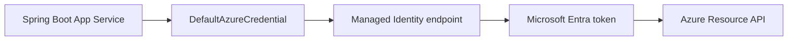

# Managed Identity (Passwordless Access)

Use system-assigned managed identity with `DefaultAzureCredential` so your Spring Boot app accesses Azure resources without embedded secrets.

## Prerequisites

- App Service app deployed
- Permission to assign RBAC roles on target resources
- Azure Identity Java SDK available in app dependencies

## Main Content

### Why managed identity first

Managed identity removes credential rotation burden from application code:

- no client secret in App Settings
- no secret exposure in CI logs
- centralized RBAC control per environment

### Architecture



### Add dependency (`pom.xml`)

```xml
<dependency>
  <groupId>com.azure</groupId>
  <artifactId>azure-identity</artifactId>
  <version>1.12.2</version>
</dependency>
```

### Enable system-assigned identity on web app

```bash
az webapp identity assign \
  --resource-group "$RG" \
  --name "$APP_NAME" \
  --output json
```

Masked output example:

```json
{
  "principalId": "xxxxxxxx-xxxx-xxxx-xxxx-xxxxxxxxxxxx",
  "tenantId": "<tenant-id>",
  "type": "SystemAssigned"
}
```

### Retrieve principal ID for role assignment

```bash
export APP_PRINCIPAL_ID=$(az webapp identity show \
  --resource-group "$RG" \
  --name "$APP_NAME" \
  --query principalId \
  --output tsv)
```

### Assign least-privilege RBAC role

Example: grant Key Vault Secrets User on one vault scope:

```bash
export KV_ID="/subscriptions/<subscription-id>/resourceGroups/$RG/providers/Microsoft.KeyVault/vaults/<vault-name>"

az role assignment create \
  --assignee-object-id "$APP_PRINCIPAL_ID" \
  --assignee-principal-type ServicePrincipal \
  --role "Key Vault Secrets User" \
  --scope "$KV_ID" \
  --output json
```

For Azure SQL/Cosmos/Storage, change role and scope accordingly.

### Use `DefaultAzureCredential` in Spring Boot

```java
import com.azure.identity.DefaultAzureCredential;
import com.azure.identity.DefaultAzureCredentialBuilder;

@Bean
public DefaultAzureCredential defaultAzureCredential() {
    return new DefaultAzureCredentialBuilder().build();
}
```

When running on App Service, this resolves to managed identity. Locally, it can use Azure CLI or developer credentials.

### Token request example

```java
TokenRequestContext context = new TokenRequestContext()
    .addScopes("https://vault.azure.net/.default");

AccessToken token = credential.getToken(context).block();
```

### Local development parity

Use the same code locally after:

```bash
az login
az account set --subscription "<subscription-id>"
```

No branching logic is needed between local and cloud identity paths.

!!! warning "RBAC propagation delay"
    New role assignments can take several minutes to become effective. Temporary `403` responses immediately after assignment are common.

!!! tip "Scope narrowly"
    Assign roles at the smallest scope possible (resource level preferred over subscription level).

!!! info "Platform architecture"
    For platform architecture details, see the [Azure App Service Guide — How App Service Works](https://yeongseon.github.io/azure-appservice-guide/concepts/01-how-app-service-works/).

## Verification

- Identity exists on App Service (`az webapp identity show`)
- Role assignment present on intended scope
- App performs token-based call successfully without secrets

## Troubleshooting

### `ManagedIdentityCredential authentication unavailable`

Verify the app is running on Azure App Service with identity enabled; local runs rely on alternate credentials in the chain.

### `403 Forbidden` despite assigned role

Check role name, scope, and principal ID correctness; wait for propagation and retry.

### Works locally, fails in Azure

Likely local credential succeeded but cloud identity lacks RBAC. Re-check Azure role assignments for app principal.

## Next Steps / See Also

- [Azure SQL](azure-sql.md)
- [Key Vault References](key-vault-reference.md)
- [Tutorial: Configuration](../03-configuration.md)
