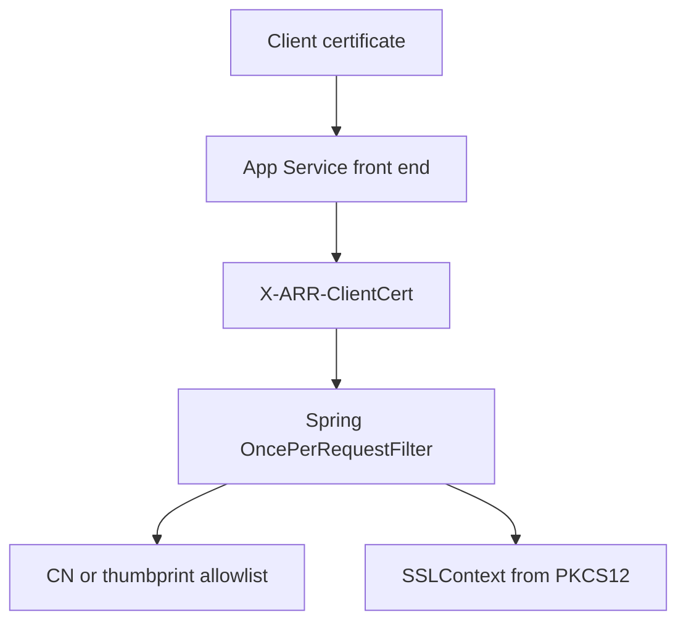

---
content_sources:
  diagrams:
    - id: java-mtls-client-certificate-flow
      type: flowchart
      source: mslearn-adapted
      mslearn_url: https://learn.microsoft.com/en-us/azure/app-service/app-service-web-configure-tls-mutual-auth
      based_on:
        - https://learn.microsoft.com/en-us/azure/app-service/configure-ssl-certificate-in-code
---

# mTLS Client Certificates

Use a Spring Boot filter to parse `X-ARR-ClientCert`, validate the forwarded certificate, and configure an outbound `SSLContext` from a PKCS#12 certificate for remote services that require mutual TLS.

<!-- diagram-id: java-mtls-client-certificate-flow -->


## Prerequisites

- Spring Boot 3 application on Azure App Service
- Inbound client certificates enabled on the site
- Private certificate available for outbound calls when required

`pom.xml` additions:

```xml
<dependencies>
    <dependency>
        <groupId>org.springframework.boot</groupId>
        <artifactId>spring-boot-starter-web</artifactId>
    </dependency>
</dependencies>
```

## What You'll Build

- A Spring filter that parses `X-ARR-ClientCert`
- Simple certificate authorization by thumbprint or common name
- An outbound `RestTemplate` backed by a client-certificate `SSLContext`

## Steps

### 1. Add the filter and controller

```java
package com.example.guide.mtls;

import java.io.ByteArrayInputStream;
import java.io.InputStream;
import java.nio.charset.StandardCharsets;
import java.security.KeyStore;
import java.security.MessageDigest;
import java.security.cert.CertificateFactory;
import java.security.cert.X509Certificate;
import java.util.Arrays;
import java.util.HashSet;
import java.util.HexFormat;
import java.util.Map;
import java.util.Set;
import javax.net.ssl.SSLContext;
import org.apache.hc.client5.http.classic.HttpClients;
import org.apache.hc.client5.http.config.RequestConfig;
import org.apache.hc.client5.http.impl.classic.CloseableHttpClient;
import org.apache.hc.client5.http.impl.io.PoolingHttpClientConnectionManagerBuilder;
import org.apache.hc.client5.http.ssl.SSLConnectionSocketFactory;
import org.apache.hc.core5.ssl.SSLContextBuilder;
import org.springframework.http.client.HttpComponentsClientHttpRequestFactory;
import org.springframework.stereotype.Component;
import org.springframework.web.bind.annotation.GetMapping;
import org.springframework.web.bind.annotation.RestController;
import org.springframework.web.client.RestTemplate;
import org.springframework.web.filter.OncePerRequestFilter;
import jakarta.servlet.FilterChain;
import jakarta.servlet.ServletException;
import jakarta.servlet.http.HttpServletRequest;
import jakarta.servlet.http.HttpServletResponse;

@Component
public class ClientCertificateFilter extends OncePerRequestFilter {

    private final Set<String> allowedCommonNames = new HashSet<>(Arrays.asList(
        System.getenv().getOrDefault("ALLOWED_CLIENT_CERT_COMMON_NAMES", "api-client.contoso.com").split(",")
    ));

    private final Set<String> allowedThumbprints = new HashSet<>(Arrays.asList(
        System.getenv().getOrDefault("ALLOWED_CLIENT_CERT_THUMBPRINTS", "").toUpperCase().split(",")
    ));

    @Override
    protected void doFilterInternal(HttpServletRequest request, HttpServletResponse response, FilterChain filterChain)
        throws ServletException, java.io.IOException {

        if ("/health".equals(request.getRequestURI())) {
            filterChain.doFilter(request, response);
            return;
        }

        String headerValue = request.getHeader("X-ARR-ClientCert");
        if (headerValue == null || headerValue.isBlank()) {
            response.sendError(HttpServletResponse.SC_FORBIDDEN, "client certificate header missing");
            return;
        }

        try {
            String pem = "-----BEGIN CERTIFICATE-----\n" + headerValue + "\n-----END CERTIFICATE-----\n";
            InputStream stream = new ByteArrayInputStream(pem.getBytes(StandardCharsets.UTF_8));
            X509Certificate certificate = (X509Certificate) CertificateFactory.getInstance("X.509").generateCertificate(stream);

            String thumbprint = HexFormat.of().formatHex(MessageDigest.getInstance("SHA-1").digest(certificate.getEncoded())).toUpperCase();
            String subject = certificate.getSubjectX500Principal().getName();
            String commonName = Arrays.stream(subject.split(","))
                .map(String::trim)
                .filter(part -> part.startsWith("CN="))
                .map(part -> part.substring(3))
                .findFirst()
                .orElse(null);

            if ((!allowedThumbprints.isEmpty() && allowedThumbprints.contains(thumbprint))
                || (commonName != null && allowedCommonNames.contains(commonName))) {
                request.setAttribute("clientCertificateThumbprint", thumbprint);
                request.setAttribute("clientCertificateCommonName", commonName);
                filterChain.doFilter(request, response);
                return;
            }

            response.sendError(HttpServletResponse.SC_FORBIDDEN, "client certificate is not allowlisted");
        } catch (Exception ex) {
            response.sendError(HttpServletResponse.SC_FORBIDDEN, "unable to parse forwarded certificate");
        }
    }

    public static RestTemplate outboundMtlsRestTemplate() throws Exception {
        String p12Path = System.getenv().getOrDefault("OUTBOUND_CLIENT_CERT_PATH", "/var/ssl/private/<thumbprint>.p12");
        String password = System.getenv().getOrDefault("OUTBOUND_CLIENT_CERT_PASSWORD", "");

        KeyStore keyStore = KeyStore.getInstance("PKCS12");
        try (InputStream input = java.nio.file.Files.newInputStream(java.nio.file.Path.of(p12Path))) {
            keyStore.load(input, password.isEmpty() ? null : password.toCharArray());
        }

        SSLContext sslContext = SSLContextBuilder.create()
            .loadKeyMaterial(keyStore, password.isEmpty() ? null : password.toCharArray())
            .build();

        SSLConnectionSocketFactory socketFactory = new SSLConnectionSocketFactory(sslContext);
        CloseableHttpClient httpClient = HttpClients.custom()
            .setConnectionManager(
                PoolingHttpClientConnectionManagerBuilder.create()
                    .setSSLSocketFactory(socketFactory)
                    .build()
            )
            .setDefaultRequestConfig(RequestConfig.custom().setResponseTimeout(org.apache.hc.core5.util.Timeout.ofSeconds(10)).build())
            .build();

        return new RestTemplate(new HttpComponentsClientHttpRequestFactory(httpClient));
    }
}

@RestController
class MtlsController {

    @GetMapping("/cert-info")
    Map<String, Object> certInfo(HttpServletRequest request) {
        return Map.of(
            "thumbprint", request.getAttribute("clientCertificateThumbprint"),
            "commonName", request.getAttribute("clientCertificateCommonName")
        );
    }
}
```

### 2. Configure environment variables

```bash
az webapp config appsettings set \
  --resource-group $RG \
  --name $APP_NAME \
  --settings \
    ALLOWED_CLIENT_CERT_COMMON_NAMES="api-client.contoso.com,partner-gateway.contoso.com" \
    ALLOWED_CLIENT_CERT_THUMBPRINTS="" \
    OUTBOUND_CLIENT_CERT_PATH="/var/ssl/private/<thumbprint>.p12" \
    OUTBOUND_CLIENT_CERT_PASSWORD="<certificate-password>" \
  --output json
```

### 3. Test with curl

```bash
curl --include \
  --cert ./client.pem \
  --key ./client.key \
  "https://$APP_NAME.azurewebsites.net/cert-info"
```

## Verification

- `/cert-info` returns thumbprint and CN for allowlisted callers
- A caller without a valid certificate receives `403`
- Outbound `RestTemplate` calls succeed only when the PKCS#12 file and password are correct and the downstream service trusts the client certificate

## Next Steps / Clean Up

- Replace simple CN parsing with SAN and issuer validation
- Add full trust-store handling if your security model requires private CA validation in code
- Move diagnostics routes behind administrative authorization if they remain enabled

## See Also

- [Incoming Client Certificates](../../../operations/incoming-client-certificates.md)
- [Outbound Client Certificates](../../../operations/outbound-client-certificates.md)
- [Easy Auth](./easy-auth.md)

## Sources

- [Set up TLS mutual authentication for Azure App Service (Microsoft Learn)](https://learn.microsoft.com/en-us/azure/app-service/app-service-web-configure-tls-mutual-auth)
- [Use TLS/SSL certificates in your application code in Azure App Service (Microsoft Learn)](https://learn.microsoft.com/en-us/azure/app-service/configure-ssl-certificate-in-code)
