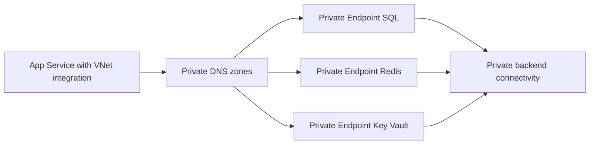

---
hide:
  - toc
content_sources:
  diagrams:
    - id: private-endpoints
      type: flowchart
      source: mslearn-adapted
      mslearn_url: https://learn.microsoft.com/en-us/azure/app-service/networking/private-endpoint
---

# Private Endpoints

Connect App Service to backend services over private networking using VNet integration and private endpoints for SQL, Redis, and Key Vault.

<!-- diagram-id: private-endpoints -->


## Prerequisites

- App Service Plan tier that supports VNet integration
- Virtual network with dedicated integration subnet
- Backend services configured for private endpoint support

## Main Content

### 1) Networking architecture

Recommended layout:

- `snet-appservice-integration`: delegated for App Service VNet integration
- `snet-private-endpoints`: hosts private endpoint NICs
- Private DNS zones linked to the VNet

### 2) Enable VNet integration (Linux App Service)

```bash
az webapp vnet-integration add \
  --resource-group "$RG" \
  --name "$APP_NAME" \
  --vnet "$VNET_NAME" \
  --subnet "snet-appservice-integration" \
  --output json
```

### 3) Create private endpoint for Azure SQL

```bash
az network private-endpoint create \
  --resource-group "$RG" \
  --name "pe-sql-guide" \
  --vnet-name "$VNET_NAME" \
  --subnet "snet-private-endpoints" \
  --private-connection-resource-id "/subscriptions/<subscription-id>/resourceGroups/<sql-rg>/providers/Microsoft.Sql/servers/<sql-server>" \
  --group-id sqlServer \
  --connection-name "pe-sql-guide-conn" \
  --output json
```

### 4) Create private endpoint for Redis

```bash
az network private-endpoint create \
  --resource-group "$RG" \
  --name "pe-redis-guide" \
  --vnet-name "$VNET_NAME" \
  --subnet "snet-private-endpoints" \
  --private-connection-resource-id "/subscriptions/<subscription-id>/resourceGroups/<redis-rg>/providers/Microsoft.Cache/Redis/<redis-name>" \
  --group-id redisCache \
  --connection-name "pe-redis-guide-conn" \
  --output json
```

### 5) NSG and route guidance

Allow outbound from integration subnet to:

- SQL private endpoint IP on 1433
- Redis private endpoint IP on 6380
- Key Vault private endpoint IP on 443

Block broad internet egress only after dependencies are confirmed reachable.

### 6) Connection string and DNS assumptions

Keep service hostnames unchanged (for example, `<sql-server>.database.windows.net`).
Private DNS resolution should map these names to private endpoint IPs within the VNet.

### 7) App code stays unchanged

Spring Boot automatically picks up connection details from environment variables or `application.properties`.

```properties
# application.properties
spring.datasource.url=jdbc:sqlserver://<sql-server>.database.windows.net:1433;database=<db-name>;encrypt=true;
spring.data.redis.host=<redis-name>.redis.cache.windows.net
spring.data.redis.port=6380
spring.data.redis.ssl=true
```

The same code can run with public or private networking if configuration and DNS are consistent.

### 8) GitHub Actions networking validation step

```yaml
- name: Validate private endpoint state
  run: |
    az network private-endpoint list \
      --resource-group "$RG" \
      --output table
```

!!! warning "Private endpoint without DNS is incomplete"
    Most connectivity incidents are DNS-related, not code-related.
    Always validate private DNS zone links and effective name resolution from the app environment.

## Verification

1. Confirm VNet integration is connected.
2. Confirm private endpoints are in `Approved` state.
3. Confirm app can reach SQL/Redis with normal hostnames.

```bash
az webapp vnet-integration list --resource-group "$RG" --name "$APP_NAME" --output table
```

Use dependency telemetry and synthetic API checks to verify end-to-end connectivity.

## Troubleshooting

### Name resolution still points to public IP

- Validate private DNS zone records.
- Ensure VNet links are correct.
- Confirm app is integrated with expected VNet/subnet.

### Connection timeout to backend

- Review NSG rules and UDRs.
- Confirm backend firewall permits private endpoint traffic.
- Check TLS settings for SQL/Redis client configuration.

### Intermittent connectivity during scale events

Use resilient retry settings (Spring Data JPA retry logic, Redis reconnect behavior) and monitor transient errors.

## See Also

- [Azure SQL](azure-sql.md)
- [Redis Cache](redis.md)
- [VNet Integration](vnet-integration.md)
- [Platform: How App Service Works](../../../platform/how-app-service-works.md)

## Sources

- [Use private endpoints for Azure App Service apps](https://learn.microsoft.com/en-us/azure/app-service/networking/private-endpoint)
- [Integrate your app with an Azure virtual network](https://learn.microsoft.com/en-us/azure/app-service/configure-vnet-integration-enable)
