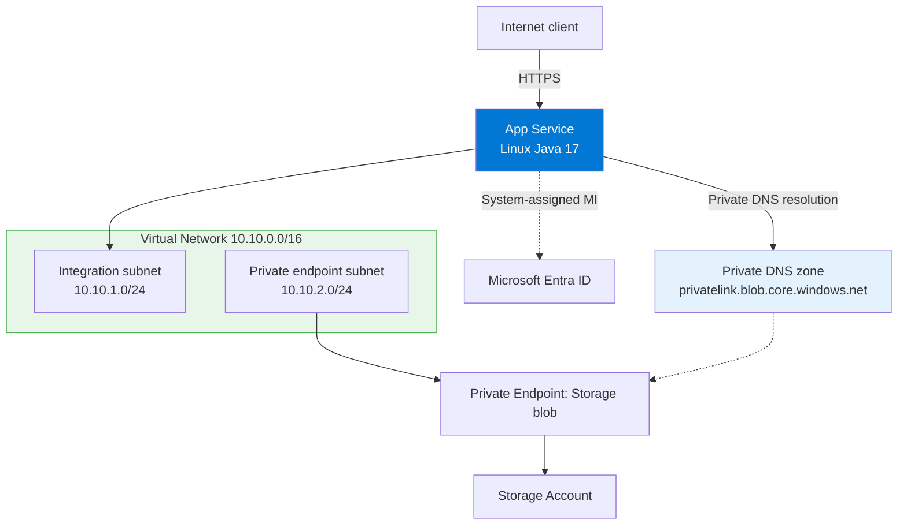

---
hide:
  - toc
content_sources:
  diagrams:
    - id: private-network-deploy
      type: flowchart
      source: self-generated
      justification: "Synthesized end-to-end scenario from Microsoft Learn guidance for App Service VNet integration, private endpoints, and managed identity."
      based_on:
        - https://learn.microsoft.com/en-us/azure/app-service/configure-vnet-integration-enable
        - https://learn.microsoft.com/en-us/azure/app-service/networking/private-endpoint
        - https://learn.microsoft.com/en-us/azure/app-service/overview-managed-identity
---

# Private Network Deploy

Deploy the Java app with private outbound connectivity, a storage private endpoint, and system-assigned managed identity.

<!-- diagram-id: private-network-deploy -->


## Prerequisites

- Completed [02. First Deploy](../02-first-deploy.md)
- Basic or higher App Service plan
- Permission to create VNets, subnets, private endpoints, private DNS zones, and role assignments
- Existing Java app that already runs in App Service

## Main Content

### Step 1: Set advanced deployment variables

```bash
RG="rg-java-guide"
APP_NAME="app-java-guide-abc123"
LOCATION="koreacentral"
VNET_NAME="vnet-java-guide"
INTEGRATION_SUBNET_NAME="snet-appservice-integration"
PRIVATE_ENDPOINT_SUBNET_NAME="snet-private-endpoints"
STORAGE_NAME="stjavaguideabc123"
PRIVATE_DNS_ZONE_NAME="privatelink.blob.core.windows.net"
```

| Command/Code | Purpose |
|--------------|---------|
| `RG="rg-java-guide"` | Reuses the resource group that contains the deployed web app. |
| `APP_NAME="app-java-guide-abc123"` | Targets the existing App Service app. |
| `LOCATION="koreacentral"` | Keeps networking resources in the same Azure region. |
| `VNET_NAME="vnet-java-guide"` | Names the virtual network used for private connectivity. |
| `INTEGRATION_SUBNET_NAME="snet-appservice-integration"` | Names the delegated subnet for App Service VNet integration. |
| `PRIVATE_ENDPOINT_SUBNET_NAME="snet-private-endpoints"` | Names the subnet reserved for private endpoint NICs. |
| `STORAGE_NAME="stjavaguideabc123"` | Sets a globally unique storage account name for the private endpoint example. |
| `PRIVATE_DNS_ZONE_NAME="privatelink.blob.core.windows.net"` | Defines the private DNS zone used by the storage blob private endpoint. |

### Step 2: Create the VNet and both subnets

```bash
az network vnet create --resource-group $RG --name $VNET_NAME --location $LOCATION --address-prefixes 10.10.0.0/16
az network vnet subnet create --resource-group $RG --vnet-name $VNET_NAME --name $INTEGRATION_SUBNET_NAME --address-prefixes 10.10.1.0/24 --delegations Microsoft.Web/serverFarms
az network vnet subnet create --resource-group $RG --vnet-name $VNET_NAME --name $PRIVATE_ENDPOINT_SUBNET_NAME --address-prefixes 10.10.2.0/24 --disable-private-endpoint-network-policies true
```

| Command/Code | Purpose |
|--------------|---------|
| `az network vnet create --resource-group $RG --name $VNET_NAME --location $LOCATION --address-prefixes 10.10.0.0/16` | Creates the virtual network that will host App Service outbound integration and private endpoints. |
| `az network vnet subnet create --resource-group $RG --vnet-name $VNET_NAME --name $INTEGRATION_SUBNET_NAME --address-prefixes 10.10.1.0/24 --delegations Microsoft.Web/serverFarms` | Creates the delegated subnet required for App Service VNet integration. |
| `az network vnet subnet create --resource-group $RG --vnet-name $VNET_NAME --name $PRIVATE_ENDPOINT_SUBNET_NAME --address-prefixes 10.10.2.0/24 --disable-private-endpoint-network-policies true` | Creates the private endpoint subnet and disables the policy that blocks private endpoint NICs. |

### Step 3: Connect the web app to the integration subnet

```bash
az webapp vnet-integration add --resource-group $RG --name $APP_NAME --vnet $VNET_NAME --subnet $INTEGRATION_SUBNET_NAME
```

| Command/Code | Purpose |
|--------------|---------|
| `az webapp vnet-integration add --resource-group $RG --name $APP_NAME --vnet $VNET_NAME --subnet $INTEGRATION_SUBNET_NAME` | Routes the app's outbound traffic through the delegated subnet so it can reach private resources. |

### Step 4: Enable managed identity

```bash
az webapp identity assign --resource-group $RG --name $APP_NAME
APP_PRINCIPAL_ID="$(az webapp identity show --resource-group $RG --name $APP_NAME --query principalId --output tsv)"
```

| Command/Code | Purpose |
|--------------|---------|
| `az webapp identity assign --resource-group $RG --name $APP_NAME` | Enables a system-assigned managed identity on the web app. |
| `APP_PRINCIPAL_ID="$(az webapp identity show --resource-group $RG --name $APP_NAME --query principalId --output tsv)"` | Captures the managed identity principal ID for RBAC assignment. |

### Step 5: Create a storage account, private endpoint, and private DNS zone

```bash
az storage account create --resource-group $RG --name $STORAGE_NAME --location $LOCATION --sku Standard_LRS --kind StorageV2
STORAGE_ID="$(az storage account show --resource-group $RG --name $STORAGE_NAME --query id --output tsv)"
az network private-endpoint create --resource-group $RG --name pe-storage-blob --vnet-name $VNET_NAME --subnet $PRIVATE_ENDPOINT_SUBNET_NAME --private-connection-resource-id $STORAGE_ID --group-id blob --connection-name pe-storage-blob-connection
az network private-dns zone create --resource-group $RG --name $PRIVATE_DNS_ZONE_NAME
az network private-dns link vnet create --resource-group $RG --zone-name $PRIVATE_DNS_ZONE_NAME --name link-java-guide-vnet --virtual-network $VNET_NAME --registration-enabled false
az network private-endpoint dns-zone-group create --resource-group $RG --endpoint-name pe-storage-blob --name storage-blob-zone-group --private-dns-zone $PRIVATE_DNS_ZONE_NAME --zone-name blob
```

| Command/Code | Purpose |
|--------------|---------|
| `az storage account create --resource-group $RG --name $STORAGE_NAME --location $LOCATION --sku Standard_LRS --kind StorageV2` | Creates the storage account used in the private endpoint scenario. |
| `STORAGE_ID="$(az storage account show --resource-group $RG --name $STORAGE_NAME --query id --output tsv)"` | Retrieves the storage account resource ID required by the private endpoint command. |
| `az network private-endpoint create --resource-group $RG --name pe-storage-blob --vnet-name $VNET_NAME --subnet $PRIVATE_ENDPOINT_SUBNET_NAME --private-connection-resource-id $STORAGE_ID --group-id blob --connection-name pe-storage-blob-connection` | Creates the blob private endpoint in the dedicated subnet. |
| `az network private-dns zone create --resource-group $RG --name $PRIVATE_DNS_ZONE_NAME` | Creates the private DNS zone for blob endpoint name resolution. |
| `az network private-dns link vnet create --resource-group $RG --zone-name $PRIVATE_DNS_ZONE_NAME --name link-java-guide-vnet --virtual-network $VNET_NAME --registration-enabled false` | Links the private DNS zone to the VNet so the app resolves the storage hostname to a private IP. |
| `az network private-endpoint dns-zone-group create --resource-group $RG --endpoint-name pe-storage-blob --name storage-blob-zone-group --private-dns-zone $PRIVATE_DNS_ZONE_NAME --zone-name blob` | Associates the private endpoint with the private DNS zone. |

### Step 6: Grant the managed identity access to Storage

```bash
az role assignment create --assignee-object-id $APP_PRINCIPAL_ID --assignee-principal-type ServicePrincipal --role "Storage Blob Data Contributor" --scope $STORAGE_ID
```

| Command/Code | Purpose |
|--------------|---------|
| `az role assignment create --assignee-object-id $APP_PRINCIPAL_ID --assignee-principal-type ServicePrincipal --role "Storage Blob Data Contributor" --scope $STORAGE_ID` | Grants the web app identity permission to access blob data without storing secrets. |

### Step 7: Configure the app to use the storage endpoint

```bash
az webapp config appsettings set --resource-group $RG --name $APP_NAME --settings STORAGE_ACCOUNT_URL="https://$STORAGE_NAME.blob.core.windows.net"
```

| Command/Code | Purpose |
|--------------|---------|
| `az webapp config appsettings set --resource-group $RG --name $APP_NAME --settings STORAGE_ACCOUNT_URL="https://$STORAGE_NAME.blob.core.windows.net"` | Stores the standard blob endpoint hostname so the app can use private DNS resolution transparently. |

### Step 8: Use `DefaultAzureCredential` in the app

```java
import com.azure.identity.DefaultAzureCredentialBuilder;
import com.azure.storage.blob.BlobServiceClient;
import com.azure.storage.blob.BlobServiceClientBuilder;

BlobServiceClient blobServiceClient = new BlobServiceClientBuilder()
    .endpoint(System.getenv("STORAGE_ACCOUNT_URL"))
    .credential(new DefaultAzureCredentialBuilder().build())
    .buildClient();
```

| Command/Code | Purpose |
|--------------|---------|
| `new DefaultAzureCredentialBuilder().build()` | Uses the App Service managed identity in Azure and developer credentials locally. |
| `.endpoint(System.getenv("STORAGE_ACCOUNT_URL"))` | Connects to the normal blob hostname, which private DNS maps to the private endpoint address inside the VNet. |
| `.buildClient()` | Creates the Blob service client used by the application. |

### Step 9: Verify networking and identity

```bash
az webapp vnet-integration list --resource-group $RG --name $APP_NAME --output table
az network private-endpoint show --resource-group $RG --name pe-storage-blob --query "{name:name,provisioningState:provisioningState}" --output json
az role assignment list --assignee $APP_PRINCIPAL_ID --scope $STORAGE_ID --output table
```

| Command/Code | Purpose |
|--------------|---------|
| `az webapp vnet-integration list --resource-group $RG --name $APP_NAME --output table` | Confirms the app is attached to the expected VNet integration subnet. |
| `az network private-endpoint show --resource-group $RG --name pe-storage-blob --query "{name:name,provisioningState:provisioningState}" --output json` | Confirms the private endpoint exists and is provisioned. |
| `az role assignment list --assignee $APP_PRINCIPAL_ID --scope $STORAGE_ID --output table` | Confirms the managed identity has the expected storage role assignment. |

## Verification

- `az webapp vnet-integration list` shows the integration subnet
- `az network private-endpoint show` returns `Succeeded`
- `az role assignment list` shows `Storage Blob Data Contributor`
- The app uses `DefaultAzureCredential` and does not require a storage key or connection string

## Troubleshooting

### The app still resolves the public storage endpoint

- Confirm the private DNS zone is linked to the same VNet used for App Service integration.
- Confirm the private endpoint DNS zone group exists.

### The app gets `403 Forbidden` from Storage

- Wait a few minutes for RBAC propagation.
- Recheck the role assignment scope and principal ID.

### The app cannot reach the private endpoint

- Confirm the app is integrated with the expected subnet.
- Review NSG and route table changes if you added them after initial validation.

## See Also

- [VNet Integration](vnet-integration.md)
- [Private Endpoints](private-endpoints.md)
- [Managed Identity](managed-identity.md)

## Sources

- [Integrate your app with an Azure virtual network](https://learn.microsoft.com/en-us/azure/app-service/configure-vnet-integration-enable)
- [Use private endpoints for Azure App Service apps](https://learn.microsoft.com/en-us/azure/app-service/networking/private-endpoint)
- [Use managed identities for App Service and Azure Functions](https://learn.microsoft.com/en-us/azure/app-service/overview-managed-identity)
