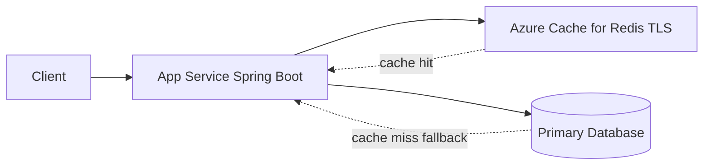

---
hide:
  - toc
---

# Azure Cache for Redis

Use Azure Cache for Redis with Spring Boot to reduce database load, accelerate reads, and share session state across scaled-out App Service instances.

## Prerequisites

- Azure Cache for Redis instance available
- App Service app deployed and running
- Redis hostname, port (`6380`), and access key or Entra-based auth plan

## Main Content

### Architecture



### Maven dependencies (`pom.xml`)

```xml
<dependencies>
  <dependency>
    <groupId>org.springframework.boot</groupId>
    <artifactId>spring-boot-starter-data-redis</artifactId>
  </dependency>
  <dependency>
    <groupId>org.springframework.session</groupId>
    <artifactId>spring-session-data-redis</artifactId>
  </dependency>
</dependencies>
```

Spring Boot uses Lettuce as the default Redis client.

### Redis TLS configuration (`application.properties`)

```properties
spring.data.redis.host=<redis-name>.redis.cache.windows.net
spring.data.redis.port=6380
spring.data.redis.password=${REDIS_ACCESS_KEY:}
spring.data.redis.ssl.enabled=true
spring.data.redis.timeout=2s

spring.session.store-type=redis
spring.session.redis.namespace=appservice-java-guide
```

### App Settings for production

```bash
az webapp config appsettings set \
  --resource-group "$RG" \
  --name "$APP_NAME" \
  --settings \
    SPRING_DATA_REDIS_HOST="<redis-name>.redis.cache.windows.net" \
    SPRING_DATA_REDIS_PORT="6380" \
    SPRING_DATA_REDIS_SSL_ENABLED="true" \
    REDIS_ACCESS_KEY="<redacted>" \
  --output json
```

!!! warning "Use TLS always"
    Azure Cache for Redis should be accessed over TLS (`6380`) in production. Avoid plaintext port `6379` unless explicitly required in isolated environments.

### Cache-aside service pattern

```java
@Service
public class ProductService {
    private final RedisTemplate<String, String> redisTemplate;

    public ProductService(RedisTemplate<String, String> redisTemplate) {
        this.redisTemplate = redisTemplate;
    }

    public String getCachedValue(String key, Supplier<String> loader) {
        String cached = redisTemplate.opsForValue().get(key);
        if (cached != null) {
            return cached;
        }
        String fresh = loader.get();
        redisTemplate.opsForValue().set(key, fresh, Duration.ofMinutes(10));
        return fresh;
    }
}
```

### Session store pattern

With `spring-session-data-redis`, session state survives:

- instance restarts
- scale-out to multiple workers
- slot swaps (when routing moves)

### Operational tuning guidance

- Keep value payloads compact
- Set explicit TTL on cache entries
- Use separate key prefixes by bounded context
- Monitor hit ratio and eviction trends

### Verify connectivity endpoint pattern

```java
@GetMapping("/api/redis/ping")
public Map<String, Object> redisPing(StringRedisTemplate redis) {
    String key = "ping:" + Instant.now().toString();
    redis.opsForValue().set(key, "ok", Duration.ofSeconds(30));
    return Map.of("status", redis.opsForValue().get(key));
}
```

!!! tip "Co-locate region"
    Deploy Redis and App Service in the same Azure region to minimize latency and cross-zone cost.

!!! info "Platform architecture"
    For platform architecture details, see [Platform: How App Service Works](../../../platform/how-app-service-works.md).

## Verification

- Deploy app with Redis dependencies/config
- Call `/api/redis/ping` and confirm response status
- Observe reduced latency on cache-hit paths
- Confirm sessions persist across restarts/scale-out

## Troubleshooting

### `RedisConnectionFailureException`

Validate host, key, TLS (`ssl.enabled=true`), and NSG/firewall network path.

### Frequent cache misses

Review TTL policy and key design; ensure cache keys include stable identifiers.

### Session reset after deployment

Check session namespace consistency and verify all instances point to the same Redis cache.

## See Also

- [Managed Identity](managed-identity.md)
- [VNet Integration](vnet-integration.md)
- [Tutorial: Scaling](../../../operations/scaling.md)

## Sources

- [Quickstart: Use Azure Cache for Redis in Java](https://learn.microsoft.com/en-us/azure/azure-cache-for-redis/cache-java-get-started)
- [Azure Cache for Redis documentation](https://learn.microsoft.com/en-us/azure/azure-cache-for-redis/)
