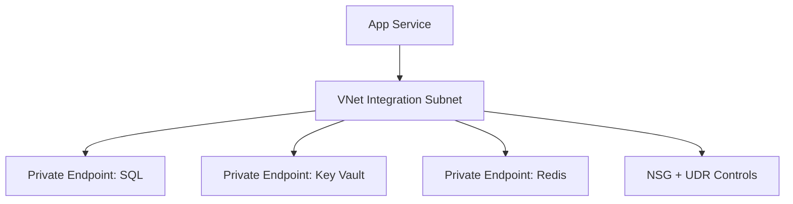

---
content_sources:
  diagrams:
    - id: networking-pattern
      type: flowchart
      source: mslearn-adapted
      mslearn_url: https://learn.microsoft.com/en-us/azure/app-service/overview-vnet-integration
---

# VNet Integration

Enable VNet Integration so your App Service app can reach private backend services through controlled outbound networking.

## Prerequisites

- App Service Plan tier that supports VNet Integration
- Existing virtual network and empty delegated subnet for App Service
- Permissions to configure networking resources (VNet, NSG, private endpoints)

## Main Content

### Networking pattern

<!-- diagram-id: networking-pattern -->


### Step 1: create delegated subnet

```bash
az network vnet subnet create \
  --resource-group "$RG" \
  --vnet-name "vnet-appservice" \
  --name "snet-appservice-integration" \
  --address-prefixes "10.10.1.0/24" \
  --delegations "Microsoft.Web/serverFarms" \
  --output json
```

### Step 2: connect web app to subnet

```bash
az webapp vnet-integration add \
  --resource-group "$RG" \
  --name "$APP_NAME" \
  --vnet "vnet-appservice" \
  --subnet "snet-appservice-integration" \
  --output json
```

### Step 3: route all outbound traffic through VNet (optional)

```bash
az webapp config appsettings set \
  --resource-group "$RG" \
  --name "$APP_NAME" \
  --settings WEBSITE_VNET_ROUTE_ALL=1 \
  --output json
```

This enforces stricter egress control but requires proper route and DNS design.

### Step 4: NSG baseline rules

Apply NSG to integration subnet with least privilege:

- allow required backend ports (for example 1433, 6380, 443)
- deny broad outbound destinations where possible
- log NSG flow events for troubleshooting

### Step 5: private endpoints for backend services

Create private endpoints for SQL/Key Vault/Redis in dedicated subnets, then link private DNS zones so app can resolve private FQDNs.

Example private DNS zones:

- `privatelink.database.windows.net`
- `privatelink.vaultcore.azure.net`
- `privatelink.redis.cache.windows.net`

### Step 6: verify DNS from app runtime

Use Kudu SSH/console and run name resolution checks to confirm private IP resolution for backend hostnames.

!!! note "Inbound vs outbound"
    VNet Integration controls outbound from app to private services. It does not place App Service itself inside your VNet for inbound traffic.

### Bicep integration concept

When codifying networking, split into modules:

- vnet/subnet module
- private endpoint module per backend
- appservice integration module

Keep app and network lifecycle loosely coupled for safer operations.

### App setting patterns for private dependencies

```bash
az webapp config appsettings set \
  --resource-group "$RG" \
  --name "$APP_NAME" \
  --settings \
    SPRING_DATASOURCE_URL="jdbc:sqlserver://<sql-private-fqdn>:1433;database=<db>;encrypt=true;hostNameInCertificate=*.database.windows.net;authentication=ActiveDirectoryManagedIdentity" \
    SPRING_DATA_REDIS_HOST="<redis-private-fqdn>" \
  --output json
```

!!! warning "Plan subnet capacity"
    Integration subnet size impacts scaling headroom. Start with a subnet range that supports expected instance growth.

!!! info "Platform architecture"
    For platform architecture details, see [Platform: How App Service Works](../../../platform/architecture/index.md).

## Verification

- `az webapp vnet-integration list` shows configured integration
- Backend FQDN resolves to private IPs from app runtime tools
- App successfully accesses private SQL/Key Vault/Redis endpoints

## Troubleshooting

### App cannot reach private backend

Validate NSG rules, private endpoint approval state, and private DNS zone links.

### DNS resolves public endpoint instead of private

Check VNet DNS settings and private DNS zone association to the integration VNet.

### Connectivity broke after enabling route-all

Review route table (`UDR`) and ensure required Azure service endpoints are reachable through your forced egress path.

## See Also

- [Key Vault References](key-vault-reference.md)
- [Azure SQL](azure-sql.md)
- [Operations: Networking](../../../operations/networking.md)

## Sources

- [Integrate your app with an Azure virtual network](https://learn.microsoft.com/en-us/azure/app-service/configure-vnet-integration-enable)
- [Use private endpoints for Azure App Service apps](https://learn.microsoft.com/en-us/azure/app-service/networking/private-endpoint)
