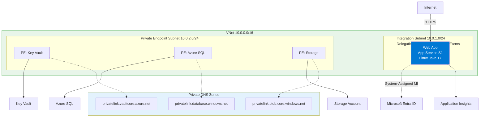
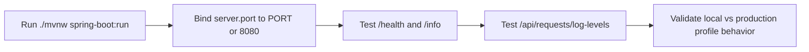

---
content_sources:
  diagrams:
    - id: 01-local-run
      type: flowchart
      source: mslearn-adapted
      mslearn_url: https://learn.microsoft.com/en-us/azure/app-service/
    - id: diagram-2
      type: flowchart
      source: mslearn-adapted
      mslearn_url: https://learn.microsoft.com/en-us/azure/app-service/
---

# 01. Local Run

Run the Spring Boot reference app locally using the same runtime assumptions Azure App Service uses in production.

!!! info "Infrastructure Context"
    **Service**: App Service (Linux, Standard S1) | **Network**: VNet integrated | **VNet**: ✅

    This tutorial assumes a production-ready App Service deployment with VNet integration, private endpoints for backend services, and managed identity for authentication.

<!-- diagram-id: 01-local-run -->


<!-- diagram-id: diagram-2 -->


## Prerequisites

- Java 17 installed (`java --version`)
- Maven Wrapper executable in `app/` (`./mvnw`)
- `curl` for endpoint validation

## What you'll learn

- How to run the app with `./mvnw spring-boot:run`
- Why `server.port=${PORT:8080}` is required for App Service compatibility
- How to validate `/health`, `/info`, and `/api/requests/log-levels`
- How to simulate production profile behavior locally

## Main Content

### Start the application

From the repository root:

```bash
cd app
./mvnw spring-boot:run
```

| Command/Code | Purpose |
|--------------|---------|
| `cd app` | Moves into the Spring Boot app directory before running Maven commands. |
| `./mvnw spring-boot:run` | Starts the application locally with the Maven Wrapper and Spring Boot plugin. |

Expected startup behavior:

- Spring Boot starts on `8080` when `PORT` is unset
- CORS config is applied from `WebConfig`
- Controllers map `/health`, `/info`, and `/api/requests/log-levels`

### Understand port binding for App Service

The app uses this property:

```properties
server.port=${PORT:8080}
```

| Command/Code | Purpose |
|--------------|---------|
| `server.port=${PORT:8080}` | Binds the app to the App Service `PORT` value when present, or falls back to local port `8080`. |

This gives two safe modes:

- **Local mode**: `PORT` missing → runs on `8080`
- **App Service mode**: platform injects `PORT` → app listens where reverse proxy expects

!!! warning "Do not hardcode a fixed port"
    On App Service, traffic is forwarded to the process port assigned by the platform. If your app ignores `PORT`, health checks fail and startup may loop.

### Verify core endpoints locally

In a second terminal:

```bash
curl http://localhost:8080/health
curl http://localhost:8080/info
curl "http://localhost:8080/api/requests/log-levels?userId=local-user"
```

| Command/Code | Purpose |
|--------------|---------|
| `curl http://localhost:8080/health` | Checks that the health endpoint responds locally. |
| `curl http://localhost:8080/info` | Verifies runtime and environment metadata exposed by the app. |
| `curl "http://localhost:8080/api/requests/log-levels?userId=local-user"` | Triggers sample requests that emit logs at multiple severity levels. |

Typical `/health` response:

```json
{
  "status": "healthy",
  "timestamp": "2026-04-04T10:30:00Z"
}
```

Typical `/info` response:

```json
{
  "name": "azure-app-service-practical-guide",
  "version": "1.0.0",
  "java": "17",
  "framework": "Spring Boot 3.2",
  "environment": "local"
}
```

### Generate and inspect log levels

The `RequestController` intentionally emits `DEBUG`, `INFO`, `WARN`, and `ERROR` events:

```java
logger.debug("debug log emitted for userId={}", userId);
logger.info("info log emitted for userId={}", userId);
logger.warn("warn log emitted for userId={}", userId);
logger.error("error log emitted for userId={} at={}", userId, Instant.now());
```

| Command/Code | Purpose |
|--------------|---------|
| `logger.debug(...)` | Emits a DEBUG log entry for low-level diagnostic detail. |
| `logger.info(...)` | Emits an INFO log entry for normal application activity. |
| `logger.warn(...)` | Emits a WARN log entry for recoverable or suspicious conditions. |
| `logger.error(...)` | Emits an ERROR log entry with a timestamp for failure tracking. |

Call the endpoint and inspect terminal output for all severities.

### Run in production profile locally

Test production log formatting and profile behavior:

```bash
SPRING_PROFILES_ACTIVE=production ./mvnw spring-boot:run
```

| Command/Code | Purpose |
|--------------|---------|
| `SPRING_PROFILES_ACTIVE=production` | Forces the app to use the production Spring profile during local execution. |
| `./mvnw spring-boot:run` | Starts the app with Maven Wrapper so you can test production profile behavior locally. |

In production profile, `logback-spring.xml` switches to JSON console output suitable for ingestion by Application Insights.

### Optional: emulate App Service port locally

```bash
PORT=8181 SPRING_PROFILES_ACTIVE=production ./mvnw spring-boot:run
curl http://localhost:8181/health
```

| Command/Code | Purpose |
|--------------|---------|
| `PORT=8181` | Simulates the platform-provided port assignment locally. |
| `SPRING_PROFILES_ACTIVE=production` | Runs the app with the same profile expected in App Service. |
| `./mvnw spring-boot:run` | Launches the app with the simulated port and profile settings. |
| `curl http://localhost:8181/health` | Confirms the app listens successfully on the injected port. |

!!! tip "Why this test matters"
    This validates the same startup contract used by App Service (`PORT`, production profile, structured logs) before your first deployment.

!!! info "Platform architecture"
    For platform architecture details, see [Platform: How App Service Works](../../../platform/how-app-service-works.md).

## Verification

- `./mvnw spring-boot:run` starts without errors
- `/health` returns HTTP 200
- `/info` shows expected metadata and environment
- `/api/requests/log-levels` returns `status: ok` and log lines appear in terminal
- Production profile emits JSON logs

## Troubleshooting

### Port already in use

Stop the conflicting process or run with another port:

```bash
PORT=8181 ./mvnw spring-boot:run
```

| Command/Code | Purpose |
|--------------|---------|
| `PORT=8181` | Overrides the default local port to avoid conflicts. |
| `./mvnw spring-boot:run` | Restarts the app on the alternate port using Maven Wrapper. |

### `./mvnw` permission denied

```bash
chmod +x ./mvnw
./mvnw spring-boot:run
```

| Command/Code | Purpose |
|--------------|---------|
| `chmod +x ./mvnw` | Makes the Maven Wrapper executable on Unix-like systems. |
| `./mvnw spring-boot:run` | Runs the app again after fixing wrapper permissions. |

### Endpoint returns 404

Ensure you are hitting the correct base URL and port (`localhost:8080` by default), and confirm startup completed before testing.

## See Also

- [02. First Deploy](02-first-deploy.md)
- [03. Configuration](03-configuration.md)
- [Recipes Index](../recipes/index.md)

## Sources

- [Configure a Java app for Azure App Service](https://learn.microsoft.com/en-us/azure/app-service/configure-language-java)
- [Quickstart: Deploy a Java app to Azure App Service](https://learn.microsoft.com/en-us/azure/app-service/quickstart-java)
