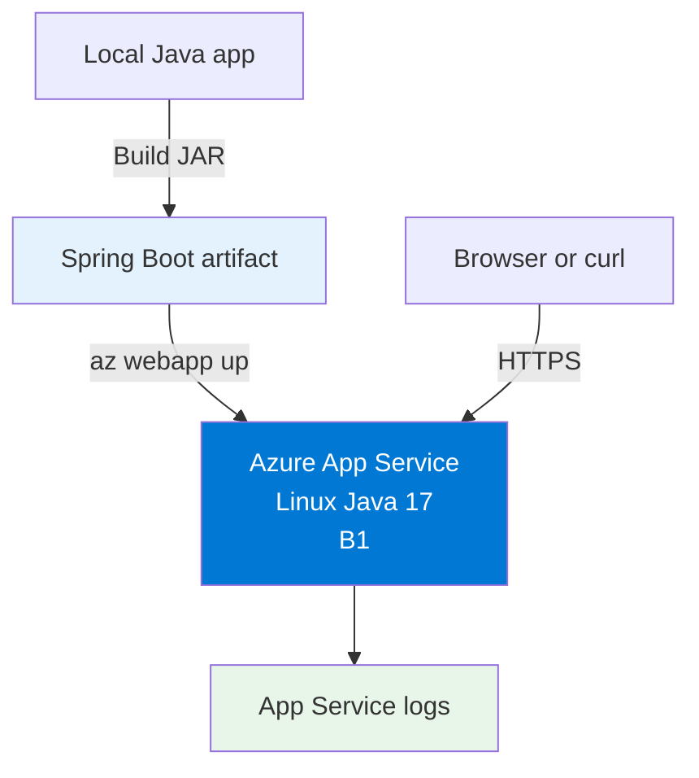
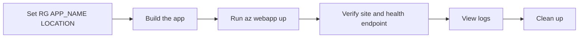

---
content_sources:
  diagrams:
    - id: 02-first-deploy
      type: flowchart
      source: mslearn-adapted
      mslearn_url: https://learn.microsoft.com/en-us/azure/app-service/quickstart-java
    - id: deployment-flow
      type: flowchart
      source: mslearn-adapted
      mslearn_url: https://learn.microsoft.com/en-us/azure/app-service/quickstart-java
---

# 02. First Deploy

Deploy the Spring Boot reference app to Azure App Service in about five minutes with `az webapp up`.

!!! info "Keep this tutorial simple"
    This page covers the fastest path to a working deployment. For VNet integration, private endpoints, and managed identity, use [Recipe: Private Network Deploy](../recipes/private-network-deploy.md).

<!-- diagram-id: 02-first-deploy -->


## Prerequisites

- Completed [01. Local Run](01-local-run.md)
- Azure CLI authenticated with `az login`
- Maven or Gradle installed

## Main Content

<!-- diagram-id: deployment-flow -->


### Step 1: Set deployment variables

```bash
RG="rg-java-guide"
APP_NAME="app-java-guide-abc123"
LOCATION="koreacentral"
```

| Command/Parameter | Purpose |
|-------------------|---------|
| `RG="rg-java-guide"` | Defines the resource group that `az webapp up` creates or reuses. |
| `APP_NAME="app-java-guide-abc123"` | Sets the globally unique App Service app name. |
| `LOCATION="koreacentral"` | Selects the Azure region for the new App Service resources. |

???+ example "Expected output"
    ```text
    Variables prepared for resource group rg-java-guide and app app-java-guide-abc123.
    ```

### Step 2: Build the app

Choose the command that matches your project.

=== "Maven"
    ```bash
    mvn package
    ```

    | Command/Parameter | Purpose |
    |-------------------|---------|
    | `mvn package` | Builds the Spring Boot application and creates the deployable artifact in `target/`. |
    | `mvn` | Runs the Maven build tool for the current project. |
    | `package` | Runs the Maven package lifecycle phase that produces the JAR file used for deployment. |

=== "Gradle"
    ```bash
    gradle build
    ```

    | Command/Parameter | Purpose |
    |-------------------|---------|
    | `gradle build` | Builds the application and runs the standard Gradle build pipeline. |
    | `gradle` | Runs the Gradle build tool for the current project. |
    | `build` | Produces the deployable artifact in `build/libs/` for App Service deployment. |

???+ example "Expected output"
    ```text
    BUILD SUCCESS
    ```

### Step 3: Deploy with `az webapp up`

```bash
az webapp up --name $APP_NAME --resource-group $RG --location $LOCATION --runtime "JAVA:17-java17" --sku B1
```

| Command/Parameter | Purpose |
|-------------------|---------|
| `az webapp up --name $APP_NAME --resource-group $RG --location $LOCATION --runtime "JAVA:17-java17" --sku B1` | Creates the resource group, App Service plan, and web app if needed, then deploys the current app to App Service. |
| `--name $APP_NAME` | Uses the chosen globally unique web app name. |
| `--resource-group $RG` | Places all created resources in the target resource group. |
| `--location $LOCATION` | Creates the App Service resources in the selected Azure region. |
| `--runtime "JAVA:17-java17"` | Selects the Linux Java 17 runtime stack. |
| `--sku B1` | Uses the Basic B1 pricing tier for a low-cost first deployment. |

???+ example "Expected output"
    ```text
    Webapp URL: http://app-java-guide-abc123.azurewebsites.net
    Creating AppServicePlan 'appsvc_rg_java_guide'
    Creating webapp 'app-java-guide-abc123'
    Configuring default logging for the app
    Deployment successful
    ```

### Step 4: Verify deployment

```bash
WEB_APP_URL="https://$(az webapp show --resource-group $RG --name $APP_NAME --query defaultHostName --output tsv)"
curl $WEB_APP_URL/health
az webapp show --resource-group $RG --name $APP_NAME --query "{name:name,state:state,defaultHostName:defaultHostName}" --output json
```

| Command/Parameter | Purpose |
|-------------------|---------|
| `WEB_APP_URL="https://$(az webapp show --resource-group $RG --name $APP_NAME --query defaultHostName --output tsv)"` | Builds the site URL from the deployed web app hostname. |
| `az webapp show --resource-group $RG --name $APP_NAME --query defaultHostName --output tsv` | Returns only the default hostname so the shell can build the site URL. |
| `--resource-group $RG` | Queries the web app inside the tutorial resource group. |
| `--name $APP_NAME` | Selects the deployed web app to inspect. |
| `--query defaultHostName` | Extracts only the default hostname value from the response. |
| `--output tsv` | Formats the hostname as plain text for shell substitution. |
| `curl $WEB_APP_URL/health` | Confirms the Spring Boot health endpoint responds after deployment. |
| `az webapp show --resource-group $RG --name $APP_NAME --query "{name:name,state:state,defaultHostName:defaultHostName}" --output json` | Verifies the app is running and returns the default hostname. |
| `--query "{name:name,state:state,defaultHostName:defaultHostName}"` | Limits the response to the app name, state, and default hostname fields. |
| `--output json` | Formats the verification result as JSON. |

???+ example "Expected output"
    ```json
    {
      "status": "healthy",
      "timestamp": "2026-04-10T09:30:00Z"
    }
    ```

### Step 5: View logs

```bash
az webapp log tail --resource-group $RG --name $APP_NAME
```

| Command/Parameter | Purpose |
|-------------------|---------|
| `az webapp log tail --resource-group $RG --name $APP_NAME` | Streams live application logs from the deployed web app. |
| `--resource-group $RG` | Targets the resource group that contains the app. |
| `--name $APP_NAME` | Selects the specific App Service instance for log streaming. |

???+ example "Expected output"
    ```text
    2026-04-10T09:32:14.221Z INFO 1 --- [main] c.example.guide.Application : Started Application in 8.421 seconds
    2026-04-10T09:32:20.014Z INFO 1 --- [nio-8080-exec-1] c.e.g.controller.HealthController : Health endpoint invoked
    ```

### Step 6: Clean up

```bash
az group delete --name $RG --yes --no-wait
```

| Command/Parameter | Purpose |
|-------------------|---------|
| `az group delete --name $RG --yes --no-wait` | Deletes the resource group and all App Service resources created by this tutorial. |
| `--name $RG` | Targets the tutorial resource group for removal. |
| `--yes` | Confirms the delete operation without prompting. |
| `--no-wait` | Starts the deletion and returns immediately. |

## Troubleshooting

### `az webapp up` fails because the app name is already taken

Choose a more unique `APP_NAME` value and run the deploy command again.

### The app URL loads but `/health` fails

Use log streaming to check startup output:

```bash
az webapp log tail --resource-group $RG --name $APP_NAME
```

| Command/Parameter | Purpose |
|-------------------|---------|
| `az webapp log tail --resource-group $RG --name $APP_NAME` | Shows live startup and request logs so you can diagnose why the app is not healthy yet. |
| `--resource-group $RG` | Reads logs from the resource group that contains the app. |
| `--name $APP_NAME` | Streams logs for the specific Java web app. |

## See Also

- [03. Configuration](03-configuration.md)
- [04. Logging & Monitoring](04-logging-monitoring.md)
- [Recipe: Private Network Deploy](../recipes/private-network-deploy.md)

## Sources

- [Quickstart: Create a Java app on Azure App Service](https://learn.microsoft.com/en-us/azure/app-service/quickstart-java)
- [Deploy your app to Azure App Service using the Azure CLI](https://learn.microsoft.com/en-us/azure/app-service/deploy-zip#deploy-your-app-to-azure-app-service-using-the-azure-cli)
