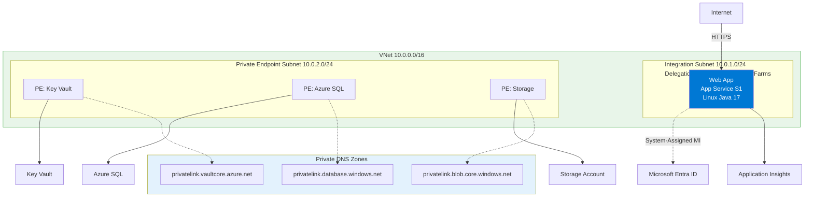
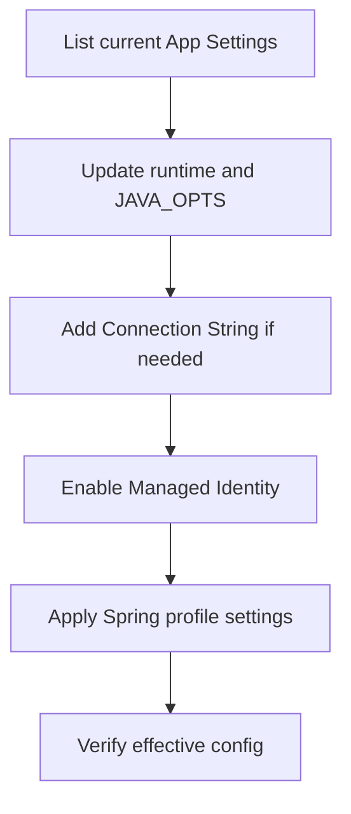

---
content_sources:
  diagrams:
    - id: 03-configuration
      type: flowchart
      source: mslearn-adapted
      mslearn_url: https://learn.microsoft.com/en-us/azure/app-service/configure-common
    - id: diagram-2
      type: flowchart
      source: mslearn-adapted
      mslearn_url: https://learn.microsoft.com/en-us/azure/app-service/configure-common
---

# 03. Configuration

Configure runtime behavior, secrets, and identity for your Spring Boot app on Azure App Service without rebuilding the JAR.

!!! info "Infrastructure Context"
    **Service**: App Service (Linux, Standard S1) | **Network**: VNet integrated | **VNet**: ✅

    This tutorial assumes a production-ready App Service deployment with VNet integration, private endpoints for backend services, and managed identity for authentication.

<!-- diagram-id: 03-configuration -->


<!-- diagram-id: diagram-2 -->


## Prerequisites

- Completed [02. First Deploy](02-first-deploy.md)
- `RG` and `APP_NAME` exported in your shell

## What you'll learn

- How App Settings map to Spring Boot properties
- How to apply and tune `JAVA_OPTS`
- When to use App Settings vs Connection Strings
- Managed Identity basics for passwordless access
- How profiles (`development` vs `production`) affect behavior

## Main Content

### Configuration surface area on App Service

| Mechanism | Best for | Spring Boot access pattern |
|---|---|---|
| App Settings | General environment variables | `System.getenv()` or relaxed binding |
| Connection Strings | Legacy typed DB strings | `CUSTOMCONNSTR_*`, `SQLCONNSTR_*` env variables |
| Key Vault Reference | Secret indirection | Appears as resolved environment value |
| Managed Identity | Passwordless auth to Azure resources | Azure Identity SDK (`DefaultAzureCredential`) |

### List current App Settings

```bash
az webapp config appsettings list \
  --resource-group "$RG" \
  --name "$APP_NAME" \
  --output table
```

| Command/Code | Purpose |
|--------------|---------|
| `az webapp config appsettings list` | Lists the current App Service application settings. |
| `--resource-group "$RG"` | Targets the resource group that contains the app. |
| `--name "$APP_NAME"` | Selects the web app whose settings you want to inspect. |
| `--output table` | Displays the settings in a readable table format. |

You should see values like `SPRING_PROFILES_ACTIVE=production`, `JAVA_OPTS=...`, and `APPLICATIONINSIGHTS_CONNECTION_STRING`.

### Update runtime settings with long flags

```bash
az webapp config appsettings set \
  --resource-group "$RG" \
  --name "$APP_NAME" \
  --settings \
    LOGGING_LEVEL_COM_EXAMPLE_GUIDE=INFO \
    SPRING_PROFILES_ACTIVE=production \
    JAVA_OPTS="-XX:+UseContainerSupport -XX:MaxRAMPercentage=75.0 -Djava.security.egd=file:/dev/./urandom" \
  --output json
```

| Command/Code | Purpose |
|--------------|---------|
| `az webapp config appsettings set` | Updates App Service application settings without rebuilding the app. |
| `LOGGING_LEVEL_COM_EXAMPLE_GUIDE=INFO` | Sets the application logger level for the sample package. |
| `SPRING_PROFILES_ACTIVE=production` | Forces the deployed app to use the production Spring profile. |
| `JAVA_OPTS="-XX:+UseContainerSupport -XX:MaxRAMPercentage=75.0 -Djava.security.egd=file:/dev/./urandom"` | Applies JVM options tuned for container-aware memory usage and startup behavior. |
| `--output json` | Returns the updated settings as JSON for confirmation. |

!!! tip "Spring relaxed binding"
    Spring maps uppercase underscore environment keys to dotted properties. Example: `LOGGING_LEVEL_ROOT` maps to `logging.level.root`.

### Use Connection Strings when required

Some teams standardize on Connection Strings for operational visibility.

```bash
az webapp config connection-string set \
  --resource-group "$RG" \
  --name "$APP_NAME" \
  --connection-string-type Custom \
  --settings APP_DB="Server=tcp:<server>.database.windows.net,1433;Database=<db>;" \
  --output json
```

| Command/Code | Purpose |
|--------------|---------|
| `az webapp config connection-string set` | Stores a connection string in the App Service configuration store. |
| `--connection-string-type Custom` | Marks the value as a custom connection string instead of a built-in database type. |
| `--settings APP_DB="Server=tcp:<server>.database.windows.net,1433;Database=<db>;"` | Saves the database connection string under the `APP_DB` key. |
| `--output json` | Shows the resulting connection string configuration in JSON format. |

In Java, this appears as `CUSTOMCONNSTR_APP_DB`.

### Managed Identity basics

Enable system-assigned managed identity:

```bash
az webapp identity assign \
  --resource-group "$RG" \
  --name "$APP_NAME" \
  --output json
```

| Command/Code | Purpose |
|--------------|---------|
| `az webapp identity assign` | Enables a system-assigned managed identity for the web app. |
| `--resource-group "$RG"` | Targets the resource group that owns the app. |
| `--name "$APP_NAME"` | Selects the web app that should receive the identity. |
| `--output json` | Returns the identity details for later RBAC configuration. |

Example masked output:

```json
{
  "principalId": "xxxxxxxx-xxxx-xxxx-xxxx-xxxxxxxxxxxx",
  "tenantId": "<tenant-id>",
  "type": "SystemAssigned"
}
```

After identity exists, grant least-privilege RBAC on target resources (SQL, Key Vault, Storage, etc.).

### Profile behavior: development vs production

Local default for the sample app:

- `spring.profiles.active` falls back to `local` in `/info`

In App Service:

- `SPRING_PROFILES_ACTIVE=production` is set by Bicep
- `logback-spring.xml` switches to JSON log appender in production

Test profile switch quickly:

```bash
SPRING_PROFILES_ACTIVE=production ./mvnw spring-boot:run
```

| Command/Code | Purpose |
|--------------|---------|
| `SPRING_PROFILES_ACTIVE=production` | Sets the active Spring profile for this local test run. |
| `./mvnw spring-boot:run` | Starts the app with Maven Wrapper so you can validate production-profile behavior. |

### Slot-sticky settings for safer swaps

For staging/production slot workflows, make environment-specific settings sticky:

```bash
az webapp config appsettings set \
  --resource-group "$RG" \
  --name "$APP_NAME" \
  --slot-settings \
    SPRING_PROFILES_ACTIVE=production \
    API_BASE_URL=https://api.example.internal \
  --output json
```

| Command/Code | Purpose |
|--------------|---------|
| `az webapp config appsettings set` | Updates App Service settings and marks selected values as slot-sticky. |
| `--slot-settings` | Makes the listed settings stay with the deployment slot during swaps. |
| `SPRING_PROFILES_ACTIVE=production` | Keeps the production profile fixed to the slot that needs it. |
| `API_BASE_URL=https://api.example.internal` | Stores an environment-specific backend URL as a sticky setting. |
| `--output json` | Returns the updated slot settings in JSON format. |

!!! warning "Do not store secrets in source control"
    Keep secrets in Key Vault and expose them via Key Vault References in App Settings.

!!! info "Platform architecture"
    For platform architecture details, see [Platform: How App Service Works](../../../platform/how-app-service-works.md).

## Verification

```bash
az webapp config appsettings list \
  --resource-group "$RG" \
  --name "$APP_NAME" \
  --output table

curl "https://$APP_NAME.azurewebsites.net/info"
```

| Command/Code | Purpose |
|--------------|---------|
| `az webapp config appsettings list ... --output table` | Re-checks the deployed app settings after configuration changes. |
| `curl "https://$APP_NAME.azurewebsites.net/info"` | Verifies that runtime metadata reflects the expected configuration in Azure. |

Confirm expected profile and config-driven behavior.

## Troubleshooting

### Settings changed but app behavior unchanged

Restart app to force process recycle:

```bash
az webapp restart \
  --resource-group "$RG" \
  --name "$APP_NAME" \
  --output json
```

| Command/Code | Purpose |
|--------------|---------|
| `az webapp restart` | Restarts the web app so configuration changes take effect in a new process. |
| `--resource-group "$RG"` | Targets the app's resource group. |
| `--name "$APP_NAME"` | Selects the web app to restart. |
| `--output json` | Returns restart operation details in JSON format. |

### JVM memory pressure after scaling down

Reduce `MaxRAMPercentage` in `JAVA_OPTS` and retest startup time + GC behavior.

### Managed Identity enabled but access denied

Identity creation and RBAC propagation can take several minutes; validate role assignment scope and wait briefly.

## See Also

- [04. Logging & Monitoring](04-logging-monitoring.md)
- [Recipes: Key Vault References](../recipes/key-vault-reference.md)
- [Recipes: Managed Identity](../recipes/managed-identity.md)

## Sources

- [Configure an App Service app](https://learn.microsoft.com/en-us/azure/app-service/configure-common)
- [Configure a Java app for Azure App Service](https://learn.microsoft.com/en-us/azure/app-service/configure-language-java)
- [Use Key Vault references for App Service](https://learn.microsoft.com/en-us/azure/app-service/app-service-key-vault-references)
