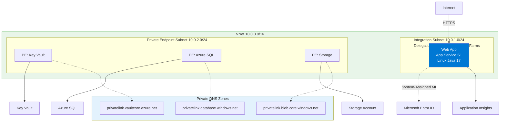
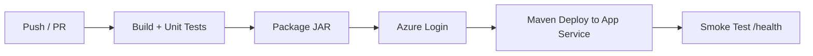

---
content_sources:
  diagrams:
    - id: 06-ci-cd
      type: flowchart
      source: mslearn-adapted
      mslearn_url: https://learn.microsoft.com/en-us/azure/app-service/deploy-continuous-deployment
    - id: pipeline-design
      type: flowchart
      source: mslearn-adapted
      mslearn_url: https://learn.microsoft.com/en-us/azure/app-service/deploy-continuous-deployment
---

# 06. CI/CD

Implement GitHub Actions CI/CD for repeatable Java builds and controlled deployments to Azure App Service.

!!! info "Infrastructure Context"
    **Service**: App Service (Linux, Standard S1) | **Network**: VNet integrated | **VNet**: ✅

    This tutorial assumes a production-ready App Service deployment with VNet integration, private endpoints for backend services, and managed identity for authentication.

<!-- diagram-id: 06-ci-cd -->


## Prerequisites

- GitHub repository with this project
- Azure resources already provisioned
- Service principal or OIDC-based federated credential configured
- Repository secrets/variables prepared

## What you'll learn

- How to build and validate the Spring Boot app in CI
- How to deploy with `azure-webapp-maven-plugin` from GitHub Actions
- How to gate deployment on branch/environment policies
- How to preserve reproducibility with explicit tool versions

## Main Content

### Pipeline design

<!-- diagram-id: pipeline-design -->


### Required GitHub secrets and variables

Set these in repository settings:

- Secret: `AZURE_CREDENTIALS` (service principal JSON) or OIDC setup
- Variable: `RESOURCE_GROUP_NAME`
- Variable: `APP_NAME`
- Variable: `LOCATION`

Masked credential JSON example:

```json
{
  "clientId": "xxxxxxxx-xxxx-xxxx-xxxx-xxxxxxxxxxxx",
  "clientSecret": "<redacted>",
  "subscriptionId": "<subscription-id>",
  "tenantId": "<tenant-id>"
}
```

### Complete workflow example

Create `.github/workflows/java-appservice-cicd.yml`:

```yaml
name: java-appservice-cicd

on:
  push:
    branches: [ "main" ]
  pull_request:
    branches: [ "main" ]
  workflow_dispatch:

jobs:
  build:
    runs-on: ubuntu-latest
    steps:
      - name: Checkout
        uses: actions/checkout@v4

      - name: Set up JDK 17
        uses: actions/setup-java@v4
        with:
          distribution: temurin
          java-version: '17'
          cache: maven

      - name: Build and test
        working-directory: app
        run: ./mvnw --batch-mode clean verify

  deploy:
    if: github.ref == 'refs/heads/main'
    needs: build
    runs-on: ubuntu-latest
    environment: production
    steps:
      - name: Checkout
        uses: actions/checkout@v4

      - name: Set up JDK 17
        uses: actions/setup-java@v4
        with:
          distribution: temurin
          java-version: '17'
          cache: maven

      - name: Azure login
        uses: azure/login@v2
        with:
          creds: ${{ secrets.AZURE_CREDENTIALS }}

      - name: Package app
        working-directory: app
        run: ./mvnw --batch-mode clean package -DskipTests

      - name: Deploy with Maven plugin
        working-directory: app
        env:
          RESOURCE_GROUP_NAME: ${{ vars.RESOURCE_GROUP_NAME }}
          APP_NAME: ${{ vars.APP_NAME }}
          LOCATION: ${{ vars.LOCATION }}
        run: ./mvnw --batch-mode azure-webapp:deploy

      - name: Smoke test
        run: |
          curl --fail "https://${{ vars.APP_NAME }}.azurewebsites.net/health"
          curl --fail "https://${{ vars.APP_NAME }}.azurewebsites.net/info"
```

| Command/Code | Purpose |
|--------------|---------|
| `on.push.branches: [ "main" ]` | Triggers the workflow automatically for pushes to `main`. |
| `on.pull_request.branches: [ "main" ]` | Runs CI validation for pull requests targeting `main`. |
| `actions/checkout@v4` | Checks out the repository so the workflow can build and deploy it. |
| `actions/setup-java@v4` | Installs JDK 17 and configures Maven caching for the workflow. |
| `run: ./mvnw --batch-mode clean verify` | Builds the app and runs tests in CI using Maven Wrapper. |
| `clean` | Removes previous Maven build artifacts before verification. |
| `verify` | Executes the Maven lifecycle up to verification, including tests. |
| `azure/login@v2` | Authenticates the workflow to Azure before deployment. |
| `run: ./mvnw --batch-mode clean package -DskipTests` | Packages the deployable JAR in the deployment job. |
| `package` | Creates the Spring Boot JAR artifact for deployment. |
| `-DskipTests` | Skips tests in the deploy stage because validation already ran in the build stage. |
| `run: ./mvnw --batch-mode azure-webapp:deploy` | Deploys the app to Azure App Service using the Maven plugin configuration. |
| `curl --fail "https://${{ vars.APP_NAME }}.azurewebsites.net/health"` | Fails the workflow if the deployed app health endpoint is unavailable. |
| `curl --fail "https://${{ vars.APP_NAME }}.azurewebsites.net/info"` | Validates that the deployed app serves runtime metadata after deployment. |

### Why deploy with Maven plugin in CI

- Reuses the same deployment contract defined in `pom.xml`
- Avoids duplicating runtime assumptions across scripts
- Keeps deployment behavior consistent between local and pipeline runs

### Recommended branch controls

- Protect `main` branch
- Require PR checks (`build` job)
- Require manual approval on `production` environment
- Restrict who can edit environment secrets

!!! tip "Prefer OIDC in production"
    Use GitHub OIDC federation instead of long-lived secrets where possible for stronger credential hygiene.

### Optional: deploy only changed app code

For monorepos, use path filters so docs-only changes do not trigger deployments.

### Optional: add infrastructure stage

Run `az deployment group what-if` for `infra/main.bicep` in PRs, then deploy infra on approved merges.

!!! info "Platform architecture"
    For platform architecture details, see [Platform: How App Service Works](../../../platform/how-app-service-works.md).

## Verification

- PR run executes `clean verify` successfully
- `main` run deploys and passes smoke test calls
- App Service deployment history shows latest artifact rollout
- `/info` endpoint reflects expected runtime metadata

## Troubleshooting

### `azure/login` fails

Re-check secret JSON keys and tenant/subscription alignment.

### Maven deploy succeeds but app unhealthy

Inspect App Service logs and confirm startup command still includes `--server.port=$PORT`.

### Pipeline is slow

Ensure Maven cache is enabled in `actions/setup-java`, and avoid redundant `clean package` steps.

## See Also

- [07. Custom Domain & SSL](07-custom-domain-ssl.md)
- [Recipes: Deployment Slots Zero Downtime](../recipes/deployment-slots-zero-downtime.md)
- [Reference: Troubleshooting](../../../reference/troubleshooting.md)

## Sources

- [Continuous deployment to Azure App Service](https://learn.microsoft.com/en-us/azure/app-service/deploy-continuous-deployment)
- [Use GitHub Actions to deploy to Azure App Service](https://learn.microsoft.com/en-us/azure/app-service/deploy-github-actions)
