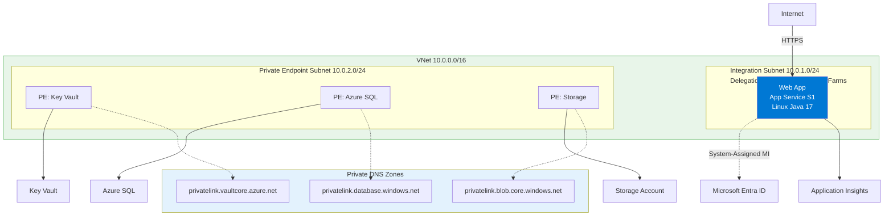
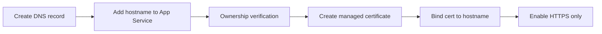

---
hide:
  - toc
content_sources:
  diagrams:
    - id: 07-custom-domain-ssl
      type: flowchart
      source: mslearn-adapted
      mslearn_url: https://learn.microsoft.com/en-us/azure/app-service/app-service-web-tutorial-custom-domain
    - id: domain-and-certificate-flow
      type: flowchart
      source: mslearn-adapted
      mslearn_url: https://learn.microsoft.com/en-us/azure/app-service/app-service-web-tutorial-custom-domain
---

# 07. Custom Domain & SSL

Map a custom domain to your Java App Service app and secure it with a managed TLS certificate.

!!! info "Infrastructure Context"
    **Service**: App Service (Linux, Standard S1) | **Network**: VNet integrated | **VNet**: ✅

    This tutorial assumes a production-ready App Service deployment with VNet integration, private endpoints for backend services, and managed identity for authentication.

<!-- diagram-id: 07-custom-domain-ssl -->


## Prerequisites

- Running App Service app (`$APP_NAME`) in Azure
- Access to your DNS provider zone
- Standard tier or above if your specific domain/cert scenario requires it

## What you'll learn

- How to map `www` or root domains to App Service
- How Azure verifies domain ownership
- How to issue and bind an App Service Managed Certificate
- How to enforce HTTPS and validate final routing

## Main Content

### Domain and certificate flow

<!-- diagram-id: domain-and-certificate-flow -->


### Step 1: choose hostname strategy

Common options:

- `www.example.com` (CNAME to `app-name.azurewebsites.net`)
- `app.example.com` (CNAME)
- `example.com` apex/root (A record + TXT verification)

For easiest operation, start with a subdomain (`www` or `app`).

### Step 2: create DNS records

At your DNS provider:

- Create `CNAME` for `www` pointing to `$APP_NAME.azurewebsites.net`
- Create TXT verification record (`asuid.www`) with value from Azure portal or CLI flow

!!! note "Propagation delay"
    DNS propagation may take minutes to hours depending on TTL and provider behavior.

### Step 3: add hostname to App Service

```bash
export CUSTOM_HOSTNAME="www.example.com"

az webapp config hostname add \
  --resource-group "$RG" \
  --webapp-name "$APP_NAME" \
  --hostname "$CUSTOM_HOSTNAME" \
  --output json
```

| Command/Code | Purpose |
|--------------|---------|
| `export CUSTOM_HOSTNAME="www.example.com"` | Stores the custom hostname so later commands can reuse it. |
| `az webapp config hostname add` | Adds the custom domain binding to the App Service app. |
| `--resource-group "$RG"` | Targets the resource group that contains the app. |
| `--webapp-name "$APP_NAME"` | Selects the App Service app that will receive the hostname. |
| `--hostname "$CUSTOM_HOSTNAME"` | Specifies the DNS hostname to map to the app. |
| `--output json` | Returns hostname binding details in JSON format. |

List current hostnames:

```bash
az webapp config hostname list \
  --resource-group "$RG" \
  --webapp-name "$APP_NAME" \
  --output table
```

| Command/Code | Purpose |
|--------------|---------|
| `az webapp config hostname list` | Lists the hostnames currently bound to the web app. |
| `--resource-group "$RG"` | Targets the app's resource group. |
| `--webapp-name "$APP_NAME"` | Selects the App Service app to inspect. |
| `--output table` | Displays the hostname list in a readable table format. |

### Step 4: create App Service Managed Certificate

```bash
az webapp config ssl create \
  --resource-group "$RG" \
  --name "$APP_NAME" \
  --hostname "$CUSTOM_HOSTNAME" \
  --output json
```

| Command/Code | Purpose |
|--------------|---------|
| `az webapp config ssl create` | Requests an App Service Managed Certificate for the custom hostname. |
| `--resource-group "$RG"` | Targets the resource group that contains the app. |
| `--name "$APP_NAME"` | Selects the web app that will own the certificate. |
| `--hostname "$CUSTOM_HOSTNAME"` | Specifies the validated hostname for certificate issuance. |
| `--output json` | Returns certificate creation details in JSON format. |

Then list available certs:

```bash
az webapp config ssl list \
  --resource-group "$RG" \
  --output table
```

| Command/Code | Purpose |
|--------------|---------|
| `az webapp config ssl list` | Lists available certificates in the resource group. |
| `--resource-group "$RG"` | Restricts the certificate list to the target resource group. |
| `--output table` | Shows certificate details in a compact table view. |

Capture certificate thumbprint (masked example below):

```text
THUMBPRINT=XXXXXXXXXXXXXXXXXXXXXXXXXXXXXXXXXXXXXXXX
```

### Step 5: bind certificate to hostname

```bash
az webapp config ssl bind \
  --resource-group "$RG" \
  --name "$APP_NAME" \
  --certificate-thumbprint "$THUMBPRINT" \
  --ssl-type SNI \
  --output json
```

| Command/Code | Purpose |
|--------------|---------|
| `az webapp config ssl bind` | Binds the issued certificate to the app's custom hostname. |
| `--certificate-thumbprint "$THUMBPRINT"` | Selects the certificate to bind by thumbprint. |
| `--ssl-type SNI` | Uses Server Name Indication for hostname-based TLS binding. |
| `--output json` | Returns binding details in JSON format. |

### Step 6: enforce HTTPS only

```bash
az webapp update \
  --resource-group "$RG" \
  --name "$APP_NAME" \
  --https-only true \
  --output json
```

| Command/Code | Purpose |
|--------------|---------|
| `az webapp update` | Updates general web app settings after certificate binding. |
| `--https-only true` | Forces the app to accept only HTTPS traffic. |
| `--output json` | Returns the updated web app configuration in JSON format. |

### Verify endpoint behavior on custom domain

```bash
curl "https://$CUSTOM_HOSTNAME/health"
curl "https://$CUSTOM_HOSTNAME/info"
```

| Command/Code | Purpose |
|--------------|---------|
| `curl "https://$CUSTOM_HOSTNAME/health"` | Confirms the custom domain resolves and the health endpoint returns successfully over TLS. |
| `curl "https://$CUSTOM_HOSTNAME/info"` | Verifies the app serves runtime metadata on the custom domain over HTTPS. |

You should get HTTP 200 and a valid certificate chain.

!!! warning "Managed certificate scope"
    App Service Managed Certificates have platform-specific limitations (for example wildcard coverage). Validate your domain pattern before committing to this approach.

!!! info "Platform architecture"
    For platform architecture details, see [Platform: How App Service Works](../../../platform/how-app-service-works.md).

## Verification

- `az webapp config hostname list` includes your custom host
- TLS certificate is issued and bound to hostname
- HTTPS requests to custom domain succeed
- HTTP requests redirect or are blocked as intended

## Troubleshooting

### Hostname add fails verification

Check DNS records and TXT ownership record name/value exactly; wait for propagation and retry.

### Certificate creation fails

Confirm hostname is validated and publicly resolvable. Managed certificate issuance requires successful domain mapping.

### Browser shows old certificate

Clear DNS/TLS cache or test with another network; propagation can lag at edge resolvers.

## See Also

- [Recipes: Easy Auth](../recipes/easy-auth.md)
- [Recipes: Deployment Slots Zero Downtime](../recipes/deployment-slots-zero-downtime.md)
- [Operations: Networking](../../../operations/networking.md)

## Sources

- [Map a custom DNS name to Azure App Service](https://learn.microsoft.com/en-us/azure/app-service/app-service-web-tutorial-custom-domain)
- [Secure a custom DNS name with a TLS/SSL binding](https://learn.microsoft.com/en-us/azure/app-service/configure-ssl-bindings)
