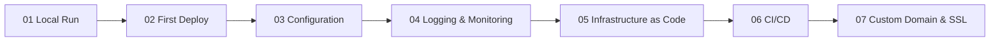

---
content_sources:
  text:
    - type: mslearn-adapted
      url: https://learn.microsoft.com/en-us/azure/app-service/quickstart-java
  diagrams:
    - id: tutorial-flow
      type: flowchart
      source: mslearn-adapted
      mslearn_url: https://learn.microsoft.com/en-us/azure/app-service/quickstart-java
---

# Java Tutorial Index

This tutorial walks through the full Azure App Service Java journey, from local development to custom domain and SSL setup.

## Prerequisites

- Java 17 or later
- Maven 3.8 or later
- Azure CLI

## Tutorial Flow

<!-- diagram-id: tutorial-flow -->

## Steps

| Step | Topic | Link |
|---|---|---|
| 01 | Local Run | [01-local-run.md](./01-local-run.md) |
| 02 | First Deploy | [02-first-deploy.md](./02-first-deploy.md) |
| 03 | Configuration | [03-configuration.md](./03-configuration.md) |
| 04 | Logging and Monitoring | [04-logging-monitoring.md](./04-logging-monitoring.md) |
| 05 | Infrastructure as Code | [05-infrastructure-as-code.md](./05-infrastructure-as-code.md) |
| 06 | CI/CD | [06-ci-cd.md](./06-ci-cd.md) |
| 07 | Custom Domain and SSL | [07-custom-domain-ssl.md](./07-custom-domain-ssl.md) |

## Related Pages

- [Java guide overview](../index.md)
- [Java runtime](../java-runtime.md)
- [Java recipes](../recipes/index.md)
