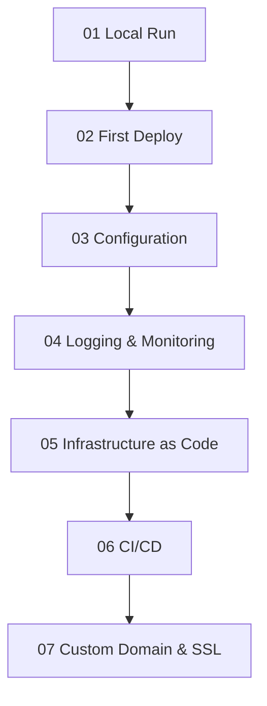

---
content_sources:
  text:
  - type: mslearn-adapted
    url: https://learn.microsoft.com/en-us/azure/app-service/quickstart-java
  diagrams:
  - id: tutorial-flow
    type: flowchart
    source: mslearn-adapted
    mslearn_url: https://learn.microsoft.com/en-us/azure/app-service/quickstart-java
validation:
  az_cli:
    last_tested: null
    cli_version: null
    result: not_tested
---
# Java Tutorial Index

This tutorial walks through the full Azure App Service Java journey, from local development to custom domain and SSL setup.

## Prerequisites

- Java 17 or later
- Maven 3.8 or later
- Azure CLI

## Tutorial Flow

<!-- diagram-id: tutorial-flow -->

```mermaid
flowchart TD
    A[01 Local Run] --> B[02 First Deploy]
    B --> C[03 Configuration]
    C --> D[04 Logging & Monitoring]
    D --> E[05 Infrastructure as Code]
    E --> F[06 CI/CD]
    F --> G[07 Custom Domain & SSL]
```

## Steps

| Step | Topic | Link |
|---|---|---|
| 01 | Local Run | [01-local-run.md](./01-local-run.md) |
| 02 | First Deploy | [02-first-deploy.md](./02-first-deploy.md) |
| 03 | Configuration | [03-configuration.md](./03-configuration.md) |
| 04 | Logging and Monitoring | [04-logging-monitoring.md](./04-logging-monitoring.md) |
| 05 | Infrastructure as Code | [05-infrastructure-as-code.md](./05-infrastructure-as-code.md) |
| 06 | CI/CD | [06-ci-cd.md](./06-ci-cd.md) |
| 07 | Custom Domain and SSL | [07-custom-domain-ssl.md](./07-custom-domain-ssl.md) |

## Related Pages

- [Java guide overview](../index.md)
- [Java runtime](../java-runtime.md)
- [Java recipes](../recipes/index.md)

## Run It in the Portal

#### Portal view: App Service Web App overview (tutorial destination blade)

![Azure portal Overview blade for `app-test-20251107` (Web App) with a command bar (`Browse`, `Stop`, `Swap`, `Restart`, `Delete`, `Refresh`, `Download publish profile`, `Reset publish profile`, `Share to mobile`, `Send us your feedback`) and an Essentials panel showing Resource group `rg-test-20251107`, Status `Running`, Location `Korea Central`, Subscription `Visual Studio Enterprise Subscription`, Subscription ID `00000000-0000-0000-0000-000000000000`, Default domain `app-test-20251107.azurewebsites.net`, App Service Plan `asp-test-20251107 (P0v3: 1)`, Operating System `Linux`, and Health Check `Not Configured`. The Properties tab is selected (next to Monitoring, Logs, Capabilities, Notifications (1), Recommendations) and surfaces Web app (`Publishing model: Code`, `Runtime Stack: Python - 3.11`, `Runtime status: Healthy`), Domains (`2 Domains View all`), Hosting (`Plan Type: App Service plan`, `Instance Count: 1`, `SKU and size: Premium0V3 (P0v3)` with `Scale up` link), Deployment Center (`Last deployment: Successful on Thursday, November 6, 10:58:01 PM`, `Deployment provider: None`), Application Insights (`Name: ai-test-20251107`, `Region: Korea Central`), and Networking (`Inbound IP addresses: 20.200.197.3, 2603:1040:f05:3::208`, `Private endpoint connections: 0 private endpoints`, `Virtual network integration: Not configured`). Left nav under the search box lists Overview (selected), Activity log, Access control (IAM), Tags, Diagnose and solve problems, Microsoft Defender for Cloud, Events (preview), Log stream, AI (preview), Resource visualizer, with collapsed groups Deployment, Settings, Performance, App Service plan, Development Tools, API, Monitoring, Automation, and Support + troubleshooting.](../../../assets/platform/architecture/01-app-service-overview.png)

The Web App `Overview` blade brings the main tutorial state into one visible page. The `Essentials` panel shows `Status: Running`, `Default domain`, `App Service Plan: asp-test-20251107 (P0v3: 1)`, and `Operating System: Linux`, all of which match this Java tutorial's target Linux App Service shape. The selected `Properties` tab also surfaces a `Runtime Stack` row — in this Python-built screenshot it reads `Python - 3.11`, and for a Java SE app the equivalent value is `Java - 17` after deploying with `linuxFxVersion: JAVA|17-java17`. The blade additionally shows hosting, deployment, monitoring, and networking summaries in the `Hosting`, `Deployment Center`, `Application Insights`, and `Networking` sections, and the command bar at the top exposes the visible management actions including `Browse`, `Stop`, `Swap`, `Restart`, `Delete`, and `Refresh`.

## See Also

- [Guide home](../../../index.md)
- [Start here](../../../start-here/overview.md)

## Sources

- [Microsoft Learn source 1](https://learn.microsoft.com/en-us/azure/app-service/quickstart-java)
