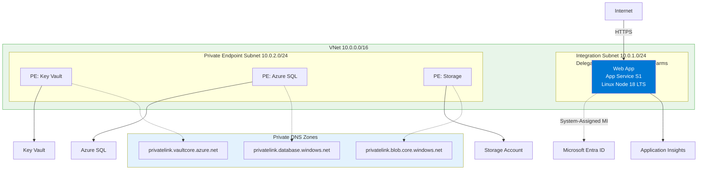

---
hide:
  - toc
content_sources:
  diagrams:
    - id: diagram-1
      type: flowchart
      source: mslearn-adapted
      mslearn_url: https://learn.microsoft.com/en-us/azure/app-service/
    - id: overview
      type: flowchart
      source: mslearn-adapted
      mslearn_url: https://learn.microsoft.com/en-us/azure/app-service/
---

# 01. Local Run

**Time estimate: 10 minutes**

Run the application locally with App Service-safe defaults before deploying to Azure.

!!! info "Infrastructure Context"
    **Service**: App Service (Linux, Standard S1) | **Network**: VNet integrated | **VNet**: ✅

    This tutorial assumes a production-ready App Service deployment with VNet integration, private endpoints for backend services, and managed identity for authentication.

<!-- diagram-id: diagram-1 -->


## Overview

<!-- diagram-id: overview -->
```mermaid
flowchart LR
    A[Clone Repo] --> B[npm install]
    B --> C[npm start]
    C --> D[localhost:3000]
    D --> E{Test Endpoints}
    E --> F[/health]
    E --> G[/info]
    E --> H[/api/*]
```

## Prerequisites

- **Node.js** v20+ (LTS recommended)
- **npm** or **yarn**
- Basic terminal familiarity

## What you'll learn

- How to run an Express app locally
- Why the `PORT` environment variable is critical for Azure
- How to test production-like behavior on your machine

## Quick Start

```bash
cd app
npm install
npm start
```

| Command/Code | Purpose |
|--------------|---------|
| `cd app` | Moves into the sample Node.js application directory |
| `npm install` | Installs the dependencies declared in `package.json` |
| `npm start` | Starts the application by running the package start script |

Visit http://localhost:3000

## App Service-Safe Defaults

This application follows App Service conventions out of the box:

!!! tip "Why App Service-Safe?"
    Following these conventions ensures your app works identically in local development and Azure deployment with zero configuration changes.

### 1. Port Binding

**CRITICAL**: The app binds to `process.env.PORT`, which App Service sets automatically. While many apps default to 3000 locally, Azure App Service uses a random port and routes traffic to it via a reverse proxy (IIS/Nginx).

```javascript
// app/server.js
const PORT = process.env.PORT || 3000;
app.listen(PORT, () => {
  console.log(`Server running on port ${PORT}`);
});
```

| Command/Code | Purpose |
|--------------|---------|
| `const PORT = process.env.PORT || 3000;` | Uses the App Service-provided port in Azure and falls back to `3000` locally |
| `app.listen(PORT, ...)` | Starts the Express server on the selected port |
| ``console.log(`Server running on port ${PORT}`);`` | Writes a startup message so you can confirm the active port |

!!! warning "Common Mistake"
    Never hardcode ports like `3000` or bind to `localhost` (127.0.0.1) only. App Service expects the app to listen on `0.0.0.0:PORT`.

For more details on how the runtime handles your code, see [Node.js Runtime Concepts](../../platform/how-app-service-works.md).

### 2. Environment Variables

Default configuration works without any environment variables:

| Variable | Local Default | App Service |
|----------|--------------|-------------|
| `PORT` | 3000 | Set by platform |
| `NODE_ENV` | development | Set to `production` |
| `LOG_LEVEL` | info | Configurable via App Settings |

### 3. Production Mode Testing

Test production mode locally:

```bash
NODE_ENV=production npm start
```

| Command/Code | Purpose |
|--------------|---------|
| `NODE_ENV=production npm start` | Starts the app in production mode to test Azure-like behavior locally |

This enables:
- JSON log format (instead of colored dev logs)
- Production error messages (no stack traces in responses)

## Verify Local Setup

### Health Check

```bash
curl http://localhost:3000/health
```

| Command/Code | Purpose |
|--------------|---------|
| `curl http://localhost:3000/health` | Calls the health endpoint to confirm the local app is responding |

Expected response:
```json
{
  "status": "healthy",
  "timestamp": "2026-04-01T13:59:14.151Z"
}
```

| Command/Code | Purpose |
|--------------|---------|
| `status` | Shows the application reported itself as healthy |
| `timestamp` | Records when the health response was generated |

### App Info

```bash
curl http://localhost:3000/info
```

| Command/Code | Purpose |
|--------------|---------|
| `curl http://localhost:3000/info` | Retrieves runtime metadata from the sample app |

Expected response:
```json
{
  "name": "azure-app-service-practical-guide",
  "version": "1.0.0",
  "node": "v20.20.0",
  "environment": "development",
  "telemetryMode": "basic"
}
```

| Command/Code | Purpose |
|--------------|---------|
| `name` | Identifies the application package |
| `version` | Shows the deployed app version |
| `node` | Shows the active Node.js runtime version |
| `environment` | Confirms whether the app is running in development or production mode |
| `telemetryMode` | Shows which logging/telemetry configuration is active |

!!! note "Production vs Development"
    When running on Azure, `environment` will show `"production"` instead of `"development"`.

### Generate Sample Logs

```bash
curl "http://localhost:3000/api/requests/log-levels?userId=local-user"
```

| Command/Code | Purpose |
|--------------|---------|
| `curl "http://localhost:3000/api/requests/log-levels?userId=local-user"` | Triggers the demo endpoint so the app emits sample logs with a test user ID |

**Example output:**
```json
{"level":"info","message":"Log level test requested","userId":"local-user","timestamp":"2026-04-01T14:00:00.000Z"}
{"level":"error","message":"Sample error log","userId":"local-user","timestamp":"2026-04-01T14:00:00.005Z"}
{"level":"warn","message":"Sample warning log","userId":"local-user","timestamp":"2026-04-01T14:00:00.010Z"}
```

| Command/Code | Purpose |
|--------------|---------|
| `level` | Indicates the severity of each generated log entry |
| `message` | Describes the event that was logged |
| `userId` | Carries the request context into each log record |
| `timestamp` | Shows when each log entry was emitted |

Check terminal output for structured logs at all severity levels.

## Troubleshooting

### Port Already in Use

```bash
# Find and kill process using port 3000
lsof -i :3000
kill -9 <PID>
```

| Command/Code | Purpose |
|--------------|---------|
| `lsof -i :3000` | Finds the process currently using port `3000` |
| `kill -9 <PID>` | Force-stops the process that is blocking the local server port |

### Module Not Found

```bash
cd app
rm -rf node_modules package-lock.json
npm install
```

| Command/Code | Purpose |
|--------------|---------|
| `cd app` | Moves back into the sample application directory |
| `rm -rf node_modules package-lock.json` | Removes installed packages and the lock file to reset the local dependency state |
| `npm install` | Reinstalls dependencies from scratch |

## Next Steps

Once local development works, proceed to:
- [02. First Deploy](./02-first-deploy.md) - Deploy Azure resources

---

## Advanced Options

!!! info "Coming Soon"
    - Containerizing for local development
    - Mocking Azure dependencies locally
- [Contribute](https://github.com/yeongseon/azure-app-service-practical-guide/issues)

## See Also
- [02. First Deploy](./02-first-deploy.md)
- [Node.js Runtime Concepts](../../platform/how-app-service-works.md)

## Sources
- [Configure Node.js app on Azure App Service (Microsoft Learn)](https://learn.microsoft.com/azure/app-service/configure-language-nodejs)
- [App Service local development setup (Microsoft Learn)](https://learn.microsoft.com/azure/app-service/overview-local-cache)
