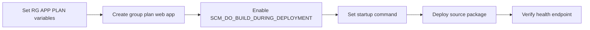

---
hide:
  - toc
content_sources:
  diagrams:
    - id: diagram-1
      type: flowchart
      source: mslearn-adapted
      mslearn_url: https://learn.microsoft.com/en-us/azure/app-service/quickstart-python
    - id: overview
      type: flowchart
      source: mslearn-adapted
      mslearn_url: https://learn.microsoft.com/en-us/azure/app-service/quickstart-python
---

# 02. Deploy Application

**Time estimate: 15-20 minutes**

Deploy your Node.js application to Azure App Service using various methods and learn how to manage deployment versions.

!!! info "Infrastructure Context"
    **Service**: App Service (Linux, Standard S1) | **Network**: VNet integrated | **VNet**: ✅

    This tutorial assumes a production-ready App Service deployment with VNet integration, private endpoints for backend services, and managed identity for authentication.

<!-- diagram-id: diagram-1 -->
    ```mermaid
    flowchart TD
        INET[Internet] -->|HTTPS| WA["Web App\nApp Service S1\nLinux Node 18 LTS"]

        subgraph VNET["VNet 10.0.0.0/16"]
            subgraph INT_SUB["Integration Subnet 10.0.1.0/24\nDelegation: Microsoft.Web/serverFarms"]
                WA
            end
            subgraph PE_SUB["Private Endpoint Subnet 10.0.2.0/24"]
                PE_KV[PE: Key Vault]
                PE_SQL[PE: Azure SQL]
                PE_ST[PE: Storage]
            end
        end

        PE_KV --> KV[Key Vault]
        PE_SQL --> SQL[Azure SQL]
        PE_ST --> ST[Storage Account]

        subgraph DNS[Private DNS Zones]
            DNS_KV[privatelink.vaultcore.azure.net]
            DNS_SQL[privatelink.database.windows.net]
            DNS_ST[privatelink.blob.core.windows.net]
        end

        PE_KV -.-> DNS_KV
        PE_SQL -.-> DNS_SQL
        PE_ST -.-> DNS_ST

        WA -.->|System-Assigned MI| ENTRA[Microsoft Entra ID]
        WA --> AI[Application Insights]

        style WA fill:#0078d4,color:#fff
        style VNET fill:#E8F5E9,stroke:#4CAF50
        style DNS fill:#E3F2FD
    ```

## Overview

<!-- diagram-id: overview -->


## Prerequisites

- Local development environment set up ([01. Local Run](./01-local-run.md))
- An Azure subscription with Azure CLI installed and logged in (`az login`)
- A resource group and App Service Plan provisioned (see [05. Infrastructure as Code](./05-infrastructure-as-code.md) for automated setup, or create manually below)
- Deployment outputs loaded: `source infra/.deploy-output.env`

## Main Content

### Step 1: Prepare deployment variables

```bash
SUBSCRIPTION_ID="<subscription-id>"
RG="rg-express-tutorial"
LOCATION="koreacentral"
PLAN_NAME="plan-express-tutorial-s1"
APP_NAME="app-express-tutorial-abc123"
VNET_NAME="vnet-express-tutorial"
INTEGRATION_SUBNET_NAME="snet-appsvc-integration"
PE_SUBNET_NAME="snet-private-endpoints"
STORAGE_NAME="stexpresstutorialabc123"
```

???+ example "Expected output"
    ```text
    Variables loaded for subscription, compute, network, and storage resources.
    ```

### Step 2: Select the target subscription

```bash
az account set --subscription $SUBSCRIPTION_ID
az account show --query "{subscriptionId:id, tenantId:tenantId, user:user.name}" --output json
```

???+ example "Expected output"
    ```json
    {
      "subscriptionId": "<subscription-id>",
      "tenantId": "<tenant-id>",
      "user": "user@example.com"
    }
    ```

### Step 3: Create resource group, App Service plan, and web app

```bash
az group create --name $RG --location $LOCATION
az appservice plan create --resource-group $RG --name $PLAN_NAME --is-linux --sku S1
az webapp create --resource-group $RG --plan $PLAN_NAME --name $APP_NAME --runtime "NODE|18-lts"
```

???+ example "Expected output"
    ```json
    {
      "defaultHostName": "app-express-tutorial-abc123.azurewebsites.net",
      "enabledHostNames": [
        "app-express-tutorial-abc123.azurewebsites.net",
        "app-express-tutorial-abc123.scm.azurewebsites.net"
      ],
      "state": "Running"
    }
    ```

### Step 4: Create VNet and delegated integration subnet

```bash
az network vnet create --resource-group $RG --name $VNET_NAME --location $LOCATION --address-prefixes 10.0.0.0/16
az network vnet subnet create --resource-group $RG --vnet-name $VNET_NAME --name $INTEGRATION_SUBNET_NAME --address-prefixes 10.0.1.0/24 --delegations Microsoft.Web/serverFarms
```

???+ example "Expected output"
    ```json
    {
      "addressPrefix": "10.0.1.0/24",
      "delegations": [
        {
          "serviceName": "Microsoft.Web/serverFarms"
        }
      ],
      "name": "snet-appsvc-integration"
    }
    ```

### Step 5: Create private endpoint subnet

```bash
az network vnet subnet create --resource-group $RG --vnet-name $VNET_NAME --name $PE_SUBNET_NAME --address-prefixes 10.0.2.0/24 --disable-private-endpoint-network-policies true
```

???+ example "Expected output"
    ```json
    {
      "addressPrefix": "10.0.2.0/24",
      "name": "snet-private-endpoints",
      "privateEndpointNetworkPolicies": "Disabled"
    }
    ```

### Step 6: Integrate the web app with the VNet

```bash
az webapp vnet-integration add --resource-group $RG --name $APP_NAME --vnet $VNET_NAME --subnet $INTEGRATION_SUBNET_NAME
```

???+ example "Expected output"
    ```json
    {
      "isSwift": true,
      "subnetResourceId": "/subscriptions/<subscription-id>/resourceGroups/rg-express-tutorial/providers/Microsoft.Network/virtualNetworks/vnet-express-tutorial/subnets/snet-appsvc-integration"
    }
    ```

### Step 7: Assign managed identity to the web app

```bash
az webapp identity assign --resource-group $RG --name $APP_NAME
```

???+ example "Expected output"
    ```json
    {
      "principalId": "<object-id>",
      "tenantId": "<tenant-id>",
      "type": "SystemAssigned"
    }
    ```

### Step 8: Enable build automation and set startup command

```bash
az webapp config appsettings set --resource-group $RG --name $APP_NAME --settings SCM_DO_BUILD_DURING_DEPLOYMENT=true NODE_ENV=production
az webapp config set --resource-group $RG --name $APP_NAME --startup-file "node server.js"
```

???+ example "Expected output"
    ```json
    [
      {
        "name": "SCM_DO_BUILD_DURING_DEPLOYMENT",
        "value": "true"
      },
      {
        "name": "NODE_ENV",
        "value": "production"
      }
    ]
    ```

### Step 9: Deploy from local source

```bash
az webapp up --resource-group $RG --name $APP_NAME --runtime "NODE:18-lts"
```

???+ example "Expected output"
    ```text
    {"status":"Build successful"}
    {"status":"Deployment successful"}
    You can launch the app at http://app-express-tutorial-abc123.azurewebsites.net
    ```

### Step 10: Verify URL, health, and deployment history

```bash
WEB_APP_URL="https://$(az webapp show --resource-group $RG --name $APP_NAME --query defaultHostName --output tsv)"
curl $WEB_APP_URL/health
az webapp log deployment list --resource-group $RG --name $APP_NAME --output table
```

???+ example "Expected output"
    ```text
    {"status":"healthy"}

    Id    Status   Author     Message
    ----  -------  ---------  ----------------------
    1234  Success  N/A        deployment successful
    ```

### Step 11 (Optional): Create a private endpoint for Storage

```bash
az storage account create --resource-group $RG --name $STORAGE_NAME --location $LOCATION --sku Standard_LRS --kind StorageV2
STORAGE_ID="$(az storage account show --resource-group $RG --name $STORAGE_NAME --query id --output tsv)"
az network private-endpoint create --resource-group $RG --name pe-storage-blob --vnet-name $VNET_NAME --subnet $PE_SUBNET_NAME --private-connection-resource-id $STORAGE_ID --group-id blob --connection-name pe-storage-blob-connection
```

???+ example "Expected output"
    ```json
    {
      "name": "pe-storage-blob",
      "privateLinkServiceConnections": [
        {
          "groupIds": [
            "blob"
          ],
          "privateLinkServiceId": "/subscriptions/<subscription-id>/resourceGroups/rg-express-tutorial/providers/Microsoft.Storage/storageAccounts/stexpresstutorialabc123"
        }
      ]
    }
    ```

### Step 12: Stream live logs

!!! note "Enable logging first"
    `az webapp log tail` only streams output if application logging is enabled.

    ```bash
    az webapp log config --resource-group $RG --name $APP_NAME --application-logging filesystem --level information
    ```

```bash
az webapp log tail --resource-group $RG --name $APP_NAME
```

???+ example "Expected output"
    ```text
    2026-04-09T12:10:26  Connected to log stream.
    2026-04-09T12:10:30  GET /health 200 4.123 ms
    ```

### Step 13: Inspect files in Kudu (SCM)

```bash
SCM_HOSTNAME="$(az webapp show --resource-group $RG --name $APP_NAME --query \"enabledHostNames[?contains(@, '.scm.azurewebsites.net')] | [0]\" --output tsv)"
az webapp deployment list-publishing-profiles --resource-group $RG --name $APP_NAME --xml
echo "https://$SCM_HOSTNAME"
```

???+ example "Expected output"
    ```text
    Publishing profile retrieved.
    Open https://app-express-tutorial-abc123.scm.azurewebsites.net in your browser to inspect /home/site/wwwroot.
    ```

## Advanced Topics

Use Zip Deploy when you need immutable artifacts for release promotion, and pin Node.js dependencies with a committed lock file to keep Oryx build outcomes deterministic across environments.

## See Also
- [06. CI/CD](./06-ci-cd.md)
- [Deployment Slots](../../operations/deployment-slots.md)
- [Custom Container Recipe](./recipes/custom-container.md)

## Sources
- [Quickstart: Build a Node.js app in Azure App Service (Microsoft Learn)](https://learn.microsoft.com/azure/app-service/quickstart-nodejs)
- [Deploy a ZIP file to Azure App Service (Microsoft Learn)](https://learn.microsoft.com/azure/app-service/deploy-zip)
- [Kudu service overview (Microsoft Learn)](https://learn.microsoft.com/azure/app-service/resources-kudu)
- [Enable diagnostic logging (Microsoft Learn)](https://learn.microsoft.com/azure/app-service/troubleshoot-diagnostic-logs)
