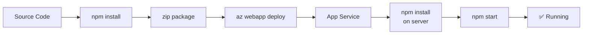

# 02. Deploy Application

**Time estimate: 15-20 minutes**

Deploy your Node.js application to Azure App Service using various methods and learn how to manage deployment versions.

## Overview



## Prerequisites

- Local development environment set up ([01. Local Run](./01-local-run.md))
- An Azure subscription with Azure CLI installed and logged in (`az login`)
- A resource group and App Service Plan provisioned (see [05. Infrastructure as Code](./05-infrastructure-as-code.md) for automated setup, or create manually below)
- Deployment outputs loaded: `source infra/.deploy-output.env`

## What you'll learn

- Multiple ways to deploy code to App Service
- How to verify a successful deployment
- How to rollback to a previous version

## Deployment Methods

App Service supports multiple deployment methods. Choose the one that best fits your workflow.

### 1. ZIP Deploy (Recommended for CLI/Scripts)

ZIP deploy is the most reliable method for manual or scripted deployments. It pushes a ZIP file to the `/home/site/wwwroot` directory.

#### Step 1: Package the Application

```bash
cd app
# We exclude node_modules to let Azure build them specifically for the Linux environment
zip -r ../app.zip . -x "node_modules/*"
cd ..
```

#### Step 2: Deploy using Azure CLI

```bash
source infra/.deploy-output.env

az webapp deploy \
  --resource-group $RG \
  --name $APP_NAME \
  --src-path app.zip \
  --type zip \
  --output json
```

**Example output:**
```json
{
  "complete": true,
  "deployer": "ZipDeploy",
  "id": "abc12345-6789-abcd-efgh-ijklmnopqrst",
  "message": "Deployment successful",
  "progress": "",
  "provisioningState": "Succeeded",
  "receivedTime": "2026-04-01T12:00:00Z",
  "siteName": "app-myapp-abc123",
  "startTime": "2026-04-01T12:00:05Z",
  "status": 4,
  "status_text": "Deployment successful"
}
```

### 2. Git Deploy (Local Git)

You can push code directly from your local git repository to a git endpoint hosted by App Service.

#### Step 1: Configure Deployment User (One-time)

```bash
az webapp deployment user set --user-name <unique-username> --password <strong-password>
```

#### Step 2: Add Git Remote and Push

```bash
# Get the deployment URL
DEPLOY_URL=$(az webapp deployment source config-local-git \
  --name $APP_NAME \
  --resource-group $RG \
  --query url --output json | jq -r '.')

git remote add azure $DEPLOY_URL
git push azure main
```

### 3. VS Code Extension

1. Install the **Azure Resources** and **Azure App Service** extensions.
2. Sign in to your Azure account.
3. Right-click the `app` folder in the explorer.
4. Select **Deploy to Web App...** and follow the prompts.

## Verification

After any deployment, always verify the application state:

### 1. Find Your App URL

The app is reachable at `https://<app-name>.azurewebsites.net` as soon as the deployment completes.

To retrieve it via CLI:

```bash
az webapp show \
  --resource-group $RG \
  --name $APP_NAME \
  --query defaultHostName --output tsv
```

In the **Azure Portal**: navigate to your App Service → **Overview** → **Default domain**.

### 2. Check Health Endpoint
```bash
WEB_APP_URL="https://$(az webapp show --resource-group $RG --name $APP_NAME --query defaultHostName --output tsv)"
curl $WEB_APP_URL/health
```

**Example output:**
```json
{
  "status": "healthy",
  "timestamp": "2026-04-01T12:05:00.000Z"
}
```

### 3. View Deployment Status in the Portal

In the **Azure Portal**: App Service → **Deployment Center** — shows deployment history, status, and build logs (commit-level detail is available for source-control-connected deployments).

### 4. Stream Live Logs

!!! note "Enable logging first"
    `az webapp log tail` only streams output if application logging is enabled. If the stream appears empty, enable it first:
    ```bash
    az webapp log config --resource-group $RG --name $APP_NAME --application-logging filesystem --level information
    ```

```bash
az webapp log tail --resource-group $RG --name $APP_NAME
```

In the **Azure Portal**: App Service → **Monitoring → Log stream** — streams stdout/stderr in real time.

### 5. Inspect Files via Kudu (SCM)

Open `https://<app-name>.scm.azurewebsites.net` in a browser. Kudu provides:

- **File browser** — browse `/home/site/wwwroot` and verify deployed files
- **Bash console** — run commands inside the container
- **Log stream** — view raw platform and app logs

### 6. View Deployment History
```bash
az webapp log deployment list \
  --resource-group $RG \
  --name $APP_NAME \
  --output table
```

## Rollback

If a deployment introduces a bug, you can quickly revert to a previous version.

### List Previous Deployments
```bash
az webapp deployment show-container-settings \
  --resource-group $RG \
  --name $APP_NAME \
  --output json
```

Note: For standard ZIP/Git deployments, rollback is typically managed by re-deploying a previous known-good commit or artifact. If using **Deployment Slots**, you can swap back immediately.

## Troubleshooting

### Deployment Success but 404/500 Error
- Verify `process.env.PORT` usage (see [01. Local Run](./01-local-run.md)).
- Check `package.json` has a `"start"` script.
- Ensure `SCM_DO_BUILD_DURING_DEPLOYMENT` is set to `true` in App Settings.

## Next Steps

- [03. Configuration](./03-configuration.md) - Manage environment variables and secrets.
- [04. Logging & Monitoring](./04-logging-monitoring.md) - View logs and track performance.

---

## Advanced Options

!!! info "Coming Soon"
    - Blue-Green deployments with Slots
    - Docker container deployments
- [Contribute](https://github.com/yeongseon/azure-appservice/issues)

## See Also
- [06. CI/CD](./06-ci-cd.md)
- [Deployment Slots](../../operations/deployment-slots.md)
- [Custom Container Recipe](./recipes/custom-container.md)

## References
- [Quickstart: Build a Node.js app in Azure App Service (Microsoft Learn)](https://learn.microsoft.com/azure/app-service/quickstart-nodejs)
- [Deploy a ZIP file to Azure App Service (Microsoft Learn)](https://learn.microsoft.com/azure/app-service/deploy-zip)
- [Kudu service overview (Microsoft Learn)](https://learn.microsoft.com/azure/app-service/resources-kudu)
- [Enable diagnostic logging (Microsoft Learn)](https://learn.microsoft.com/azure/app-service/troubleshoot-diagnostic-logs)
