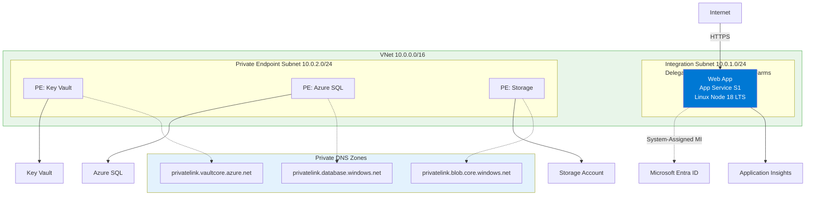
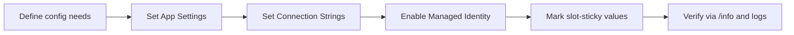

---
hide:
  - toc
content_sources:
  diagrams:
    - id: diagram-1
      type: flowchart
      source: mslearn-adapted
      mslearn_url: https://learn.microsoft.com/en-us/azure/app-service/configure-common
    - id: diagram-2
      type: flowchart
      source: mslearn-adapted
      mslearn_url: https://learn.microsoft.com/en-us/azure/app-service/configure-common
---

# 03. Configuration

**Time estimate: 20 minutes**

Manage environment variables, secrets, and identity for your Node.js application in Azure.

!!! info "Infrastructure Context"
    **Service**: App Service (Linux, Standard S1) | **Network**: VNet integrated | **VNet**: ✅

    This tutorial assumes a production-ready App Service deployment with VNet integration, private endpoints for backend services, and managed identity for authentication.

<!-- diagram-id: diagram-1 -->


<!-- diagram-id: diagram-2 -->


## Prerequisites

- Application deployed to Azure ([02. Deploy Application](./02-first-deploy.md))
- Azure CLI logged in and source loaded: `source infra/.deploy-output.env`

## What you'll learn

- How to manage Application Settings (standard environment variables)
- How to use typed Connection Strings for databases
- Managed Identity basics for passwordless access
- Slot-sticky settings for multi-environment deployments

## App Settings (Standard Environment Variables)

In App Service, Application Settings are injected into your Node.js app as standard environment variables available via `process.env`.

### List Current Settings
```bash
az webapp config appsettings list \
  --resource-group $RG \
  --name $APP_NAME \
  --output table
```

**Example output:**
```
Name                                        SlotSetting    Value
------------------------------------------  -------------  --------------------------
APPLICATIONINSIGHTS_CONNECTION_STRING       False          InstrumentationKey=...
ApplicationInsightsAgent_EXTENSION_VERSION  False          ~3
TELEMETRY_MODE                              False          basic
LOG_LEVEL                                   False          info
NODE_ENV                                    False          production
SCM_DO_BUILD_DURING_DEPLOYMENT              False          true
WEBSITE_NODE_DEFAULT_VERSION                False          ~20
WEBSITE_HTTPLOGGING_RETENTION_DAYS          False          7
```

### Add or Update Settings
```bash
az webapp config appsettings set \
  --resource-group $RG \
  --name $APP_NAME \
  --settings LOG_LEVEL=debug CUSTOM_VAR=value \
  --output json
```

### Verification
After setting a value, it should be reflected in the app's environment. You can verify this by checking the `/info` endpoint of the sample app if available, or using Log Stream to see logs influenced by these settings.

## Connection Strings (Typed Secrets)

Connection Strings are similar to App Settings but allow for specific types (SQLServer, MySQL, etc.). These are exposed as environment variables with a prefix.

```bash
az webapp config connection-string set \
  --resource-group $RG \
  --name $APP_NAME \
  --connection-string-type Custom \
  --settings DATABASE_URL="mongodb://example.com" \
  --output json
```

In Node.js, this is accessed as `process.env.CUSTOMCONNSTR_DATABASE_URL`.

## Managed Identity Basics

Instead of storing database passwords or API keys in App Settings, you can use **System Assigned Managed Identity** to give your application its own identity in Azure AD (Entra ID).

### Enable Managed Identity
```bash
az webapp identity assign \
  --resource-group $RG \
  --name $APP_NAME \
  --output json
```

For detailed security setup and authentication, see [Security & Authentication (Easy Auth)](../../operations/security.md).

## Slot-Sticky Settings

Deployment Slots (e.g., `production` vs `staging`) often require different configurations (e.g., pointing to a development database).

- **Standard Setting**: Swaps along with the code.
- **Slot-Sticky Setting**: Stays with the slot during a swap.

### Create a Slot-Sticky Setting
```bash
az webapp config appsettings set \
  --resource-group $RG \
  --name $APP_NAME \
  --slot-settings \
    ENVIRONMENT_NAME=production \
  --output json
```

## Verification

1. **Check values** in the [Azure Portal](https://portal.azure.com) under your App Service → Configuration.
2. **Restart the app** after significant configuration changes to ensure they are picked up:
   ```bash
   az webapp restart --name $APP_NAME --resource-group $RG --output json
   ```

## Next Steps

- [04. Logging & Monitoring](./04-logging-monitoring.md) - Track your app's health and performance.
- [Security Operations](../../operations/security.md) - Go deeper into authentication and managed identity.

---

## Advanced Options

!!! info "Coming Soon"
    - Key Vault Integration for secrets
    - App Configuration service for dynamic settings
- [Contribute](https://github.com/yeongseon/azure-app-service-practical-guide/issues)

## See Also
- [Security Operations](../../operations/security.md)

## Sources
- [Azure App Configuration documentation](https://learn.microsoft.com/en-us/azure/azure-app-configuration/overview)
- [Configure app settings in App Service (Microsoft Learn)](https://learn.microsoft.com/azure/app-service/configure-common)
