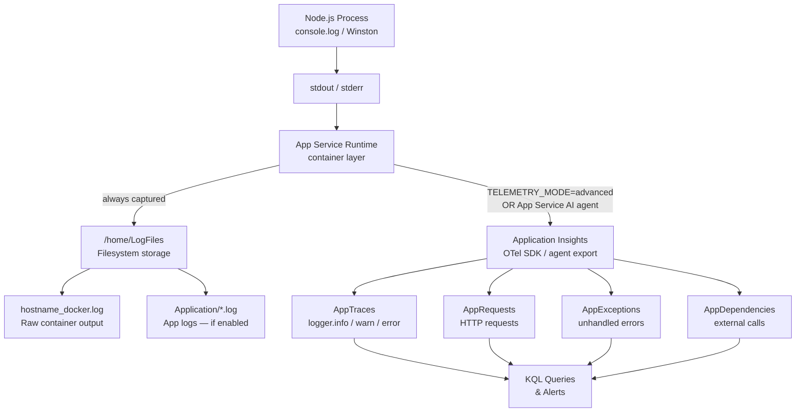
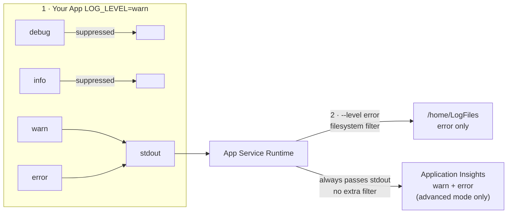
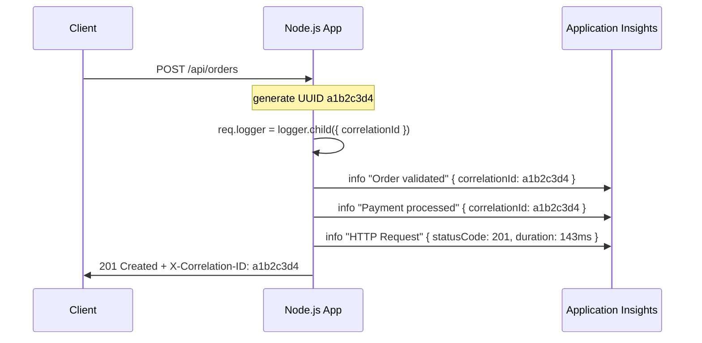
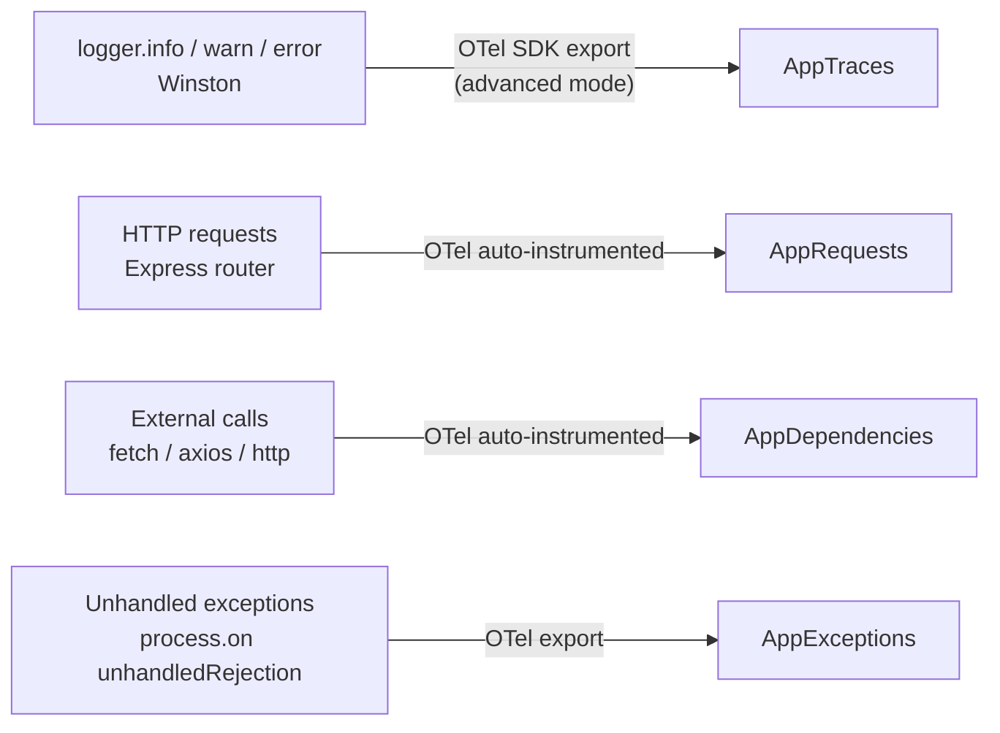

---
hide:
  - toc
---

# 04. Logging & Monitoring

**Time estimate: 30 minutes**

Monitor your Node.js application's health, track performance, and diagnose issues with Azure's integrated observability tools.

!!! info "Infrastructure Context"
    **Service**: App Service (Linux, Standard S1) | **Network**: VNet integrated | **VNet**: ✅

    This tutorial assumes a production-ready App Service deployment with VNet integration, private endpoints for backend services, and managed identity for authentication.

    ```mermaid
    flowchart TD
        INET[Internet] -->|HTTPS| WA["Web App\nApp Service S1\nLinux Node 18 LTS"]

        subgraph VNET["VNet 10.0.0.0/16"]
            subgraph INT_SUB["Integration Subnet 10.0.1.0/24\nDelegation: Microsoft.Web/serverFarms"]
                WA
            end
            subgraph PE_SUB["Private Endpoint Subnet 10.0.2.0/24"]
                PE_KV[PE: Key Vault]
                PE_SQL[PE: Azure SQL]
                PE_ST[PE: Storage]
            end
        end

        PE_KV --> KV[Key Vault]
        PE_SQL --> SQL[Azure SQL]
        PE_ST --> ST[Storage Account]

        subgraph DNS[Private DNS Zones]
            DNS_KV[privatelink.vaultcore.azure.net]
            DNS_SQL[privatelink.database.windows.net]
            DNS_ST[privatelink.blob.core.windows.net]
        end

        PE_KV -.-> DNS_KV
        PE_SQL -.-> DNS_SQL
        PE_ST -.-> DNS_ST

        WA -.->|System-Assigned MI| ENTRA[Microsoft Entra ID]
        WA --> AI[Application Insights]

        style WA fill:#0078d4,color:#fff
        style VNET fill:#E8F5E9,stroke:#4CAF50
        style DNS fill:#E3F2FD
    ```

## Prerequisites

- Application deployed and running on Azure ([02. Deploy Application](./02-first-deploy.md))
- Azure CLI logged in and source loaded: `source infra/.deploy-output.env`

## How Logs Flow

Understanding where your logs end up is the foundation of any debugging workflow.
Every `console.log` or Winston statement your app emits follows this path:



| Destination | Retention | Best For |
|---|---|---|
| `/home/LogFiles/*_docker.log` | ~35 MB rolling | Container crashes, startup errors |
| `/home/LogFiles/Application/` | Up to 100 MB / 7 days | Short-term log archive |
| Application Insights `AppTraces` | 90 days default | Long-term analysis, alerting, KQL |

## Step 1 — Choose Your Telemetry Mode

The reference app ships two modes via the `TELEMETRY_MODE` environment variable:

```
TELEMETRY_MODE=basic     # Default: JSON stdout only, zero extra dependencies
TELEMETRY_MODE=advanced  # Winston + OpenTelemetry → Application Insights
```

| Mode | Extra Dependencies | Sent to App Insights? | Best For |
|---|---|---|---|
| `basic` | None | Only via App Insights auto-collect | Getting started, cost-sensitive |
| `advanced` | `winston`, `@azure/monitor-opentelemetry` | Yes, via SDK | Production workloads |

Set the mode in App Settings:

```bash
az webapp config appsettings set \
  --resource-group $RG \
  --name $APP_NAME \
  --settings TELEMETRY_MODE=advanced
```

## Step 2 — Structured JSON Logging

Both modes emit newline-delimited JSON to stdout. In `advanced` mode the OTel SDK also
ships telemetry directly to Application Insights — no extra plugins required.

### Pattern 1 — Normal Operational Logging

Use structured fields so KQL queries can filter and aggregate without string parsing.

The `/log-levels` demo route uses the module-level `logger` directly.  
For routes that need per-request correlation, use `req.logger` — a child logger with
`correlationId` pre-bound by `app/src/middleware/correlation.js`.  
See `app/src/routes/demo/requests.js`:

```js
// routes/demo/requests.js — /log-levels demo (uses module-level logger)
router.get('/log-levels', (req, res) => {
  const userId = req.query.userId || 'demo-user-123';

  logger.debug('Debug level log - detailed diagnostic info', {
    userId,
    endpoint: '/api/requests/log-levels',
    cacheStatus: 'miss',
  });

  logger.info('Info level log - normal operational message', {
    userId,
    action: 'log-levels-demo',
  });

  logger.warn('Warn level log - potential issue detected', {
    userId,
    warning: 'Demo warning: userId parameter not provided',
  });

  logger.error('Error level log - application error', {
    userId,
    errorCode: 'DEMO_ERROR',
    severity: 'high',
  });

  res.json({ message: 'Log level examples generated' });
});

// Use req.logger when you need correlationId auto-injected per request:
router.post('/user-login', (req, res) => {
  const { username } = req.body;
  req.logger.info('User login successful', { username });   // ← correlationId bound automatically
  res.json({ correlationId: req.correlationId });
});
```

**stdout — one JSON line per call:**

```json
{"timestamp":"2025-01-02T10:30:34.100Z","level":"debug","message":"Cache lookup","service":"app-service-reference","environment":"production","correlationId":"a1b2c3d4","userId":"demo-user-123","cacheStatus":"miss"}
{"timestamp":"2025-01-02T10:30:34.101Z","level":"info","message":"Request processed","service":"app-service-reference","environment":"production","correlationId":"a1b2c3d4","userId":"demo-user-123","action":"log-levels-demo"}
{"timestamp":"2025-01-02T10:30:34.102Z","level":"warn","message":"Rate limit approaching","service":"app-service-reference","environment":"production","correlationId":"a1b2c3d4","userId":"demo-user-123","remaining":3}
{"timestamp":"2025-01-02T10:30:34.103Z","level":"error","message":"Quota exceeded","service":"app-service-reference","environment":"production","correlationId":"a1b2c3d4","userId":"demo-user-123","errorCode":"QUOTA_EXCEEDED"}
```

### Pattern 2 — External Dependency Tracking

Always record the URL, status code, and elapsed time so you can diagnose slow or failing
dependencies in Application Insights. See `app/src/routes/demo/dependencies.js`:

```js
// routes/demo/dependencies.js
router.get('/external', async (req, res) => {
  const apiUrl = 'https://jsonplaceholder.typicode.com/posts/1';
  const start = Date.now();

  try {
    const response = await fetch(apiUrl, { signal: AbortSignal.timeout(10_000) });
    const duration = Date.now() - start;

    req.logger.info('External API call successful', {
      url: apiUrl,
      statusCode: response.status,
      duration,
    });
    res.json({ data: await response.json(), duration });

  } catch (err) {
    const duration = Date.now() - start;
    req.logger.error('External API call failed', {
      url: apiUrl,
      error: err.message,
      duration,
    });
    res.status(503).json({ error: 'Service Unavailable', correlationId: req.correlationId });
  }
});
```

**stdout on timeout:**

```json
{
  "timestamp": "2025-01-02T10:30:44.234Z",
  "level": "error",
  "message": "External API call failed",
  "service": "app-service-reference",
  "environment": "production",
  "correlationId": "a1b2c3d4-e5f6-7890-abcd-ef1234567890",
  "url": "https://jsonplaceholder.typicode.com/posts/1",
  "error": "The operation was aborted due to timeout",
  "duration": 10043
}
```

### Pattern 3 — Unhandled Exception Logging

`app/src/server.js` catches all unhandled errors in the Express error handler and logs them
with full context before returning an error response:

```js
// server.js — global error handler
app.use((err, req, res, next) => {
  logger.error('Unhandled error', {
    error: err.message,
    stack: err.stack,
    url: req.originalUrl,
    method: req.method,
    correlationId: req.correlationId,
  });

  res.status(err.status || 500).json({
    error: 'Internal Server Error',
    message: process.env.NODE_ENV === 'production' ? 'An error occurred' : err.message,
    correlationId: req.correlationId,
  });
});

// Catch unhandled Promise rejections (e.g. async routes that forget try/catch)
process.on('unhandledRejection', (reason) => {
  logger.error('Unhandled Promise Rejection', {
    reason: reason instanceof Error ? reason.message : reason,
    stack: reason instanceof Error ? reason.stack : undefined,
  });
});
```

In `advanced` mode this entry lands in `AppTraces` (SeverityLevel 3). Separate exception
telemetry may also appear in `AppExceptions` when the OTel SDK captures the error object,
but the two records are not guaranteed to be identical or always co-emitted.

### Advanced Mode (Winston + OpenTelemetry)

`app/src/config/telemetry/advanced.js` adds Winston and ships telemetry directly to Application Insights via the OpenTelemetry SDK. The `logger.error(...)` call above lands in Application Insights as:

- **Table:** `AppTraces`
- **SeverityLevel:** `3` (Error)
- **Properties:** `{ correlationId, url, error, duration }`

## Log Levels & Filtering

There are **two independent filters** that control what you see. Confusing one for the other
is a common source of "I can't see my logs" issues.



| Filter | Controls | Affects |
|---|---|---|
| `LOG_LEVEL` env var | What your app sends to stdout | stdout, `/home/LogFiles`, App Insights |
| `az webapp log config --level` | What App Service writes to `/home/LogFiles` | Filesystem only — **not** App Insights |

!!! warning "App Insights is not filtered by `--level`"
    Setting `--level error` on the filesystem does **not** suppress info logs from Application Insights.
    Only raising `LOG_LEVEL` in your app controls what reaches App Insights.

### Node.js Level → Application Insights Severity

| Node.js Level | `LOG_LEVEL` value | App Insights `severityLevel` | KQL filter |
|---|---|---|---|
| `debug` | `debug` | 0 — Verbose | `SeverityLevel == 0` |
| `http` | `http` | 0 — Verbose | `SeverityLevel == 0` |
| `info` | `info` (default) | 1 — Information | `SeverityLevel == 1` |
| `warn` | `warn` | 2 — Warning | `SeverityLevel == 2` |
| `error` | `error` | 3 — Error | `SeverityLevel == 3` |

### Change Log Level

!!! warning "App Setting changes restart the app"
    Changing `LOG_LEVEL` via App Settings triggers an app restart — there is no hot-reload.
    The log level is read at startup from `process.env.LOG_LEVEL`.

```bash
# Production: suppress debug and http to reduce noise and cost
az webapp config appsettings set \
  --resource-group $RG \
  --name $APP_NAME \
  --settings LOG_LEVEL=warn

# Incident investigation: enable debug temporarily
az webapp config appsettings set \
  --resource-group $RG \
  --name $APP_NAME \
  --settings LOG_LEVEL=debug
```

!!! tip "Remember to revert after debugging"
    `debug` level can emit sensitive data and significantly increase Application Insights ingestion costs.
    Set `LOG_LEVEL=info` or `warn` again once the incident is resolved.

### Correlation ID — Tracing a Single Request

`app/src/middleware/correlation.js` injects a unique `correlationId` into every request and
binds it to `req.logger` so all log lines for the same request share the same ID automatically:



When a user reports an error, ask for the `X-Correlation-ID` response header value and use it
to pull every log line for that single request from Application Insights.

## Step 3 — Enable App Service Log Capture

Enable filesystem logging so stdout/stderr is persisted to `/home/LogFiles`:

```bash
az webapp log config \
  --resource-group $RG \
  --name $APP_NAME \
  --application-logging filesystem \
  --level verbose \
  --output json
```

**Example output:**

```json
{
  "applicationLogs": {
    "fileSystem": {
      "level": "Verbose"
    }
  },
  "httpLogs": {
    "fileSystem": {
      "enabled": true,
      "retentionInDays": 7,
      "retentionInMb": 100
    }
  }
}
```

## Step 4 — Real-time Log Stream

Tail live logs directly in your terminal — useful during deployments and smoke tests:

```bash
az webapp log tail \
  --resource-group $RG \
  --name $APP_NAME
```

Press `Ctrl+C` to exit. Your JSON log lines appear interleaved with platform events
(health probes, container restarts, etc).

**Filter to app logs only (jq):**

```bash
az webapp log tail \
  --resource-group $RG \
  --name $APP_NAME \
  | grep --line-buffered '"level"'
```

## Step 5 — Browse Logs on the Filesystem

All stdout/stderr written by your container is stored under `/home/LogFiles` on the
shared persistent storage that survives container restarts.

```
/home/LogFiles/
├── <hostname>_docker.log              ← Container stdout, always written
├── Application/
│   └── <date>_<hostname>_default_docker.log   ← App logs (filesystem logging enabled)
└── kudu/
    └── deployment/                    ← Deployment / build logs
```

**Access via Kudu (browser):**

```
https://<APP_NAME>.scm.azurewebsites.net
  → Debug Console → Bash
  → ls /home/LogFiles
  → tail -100 /home/LogFiles/Application/*.log
```

**Download all logs as a zip:**

```bash
az webapp log download \
  --resource-group $RG \
  --name $APP_NAME \
  --log-file ./logs.zip

unzip logs.zip -d ./logs
```

**SSH and tail live:**

```bash
az webapp ssh --resource-group $RG --name $APP_NAME

# Inside the container:
tail -f /home/LogFiles/*_docker.log
```

## Step 6 — Application Insights

Application Insights collects telemetry into four queryable tables when either:

- **`TELEMETRY_MODE=advanced`** — the app initializes the OTel SDK at startup (see `app/src/config/telemetry/advanced.js`), **or**
- The **App Service Application Insights agent** is enabled in the portal (App Service → Application Insights → Turn on).

Setting `APPLICATIONINSIGHTS_CONNECTION_STRING` alone is not sufficient — telemetry only reaches Application Insights when one of the above paths is active.

!!! warning "Query location matters"
    Table names differ by where you run the query. See [KQL Queries Reference — Table Naming](../../reference/kql-queries.md#table-naming) for details.
    
    - **Application Insights → Logs**: `traces`, `requests`, `dependencies`
    - **Log Analytics Workspace → Logs**: `AppTraces`, `AppRequests`, `AppDependencies`

### What Gets Collected



### Verify the Connection

```bash
az webapp config appsettings list \
  --resource-group $RG \
  --name $APP_NAME \
  --query "[?name=='APPLICATIONINSIGHTS_CONNECTION_STRING']"
```

### Access Application Insights

1. Azure Portal → search for your Application Insights resource
2. **Logs** → paste KQL queries below
3. **Live Metrics** → real-time request rate, failure rate, and server telemetry

### KQL — Find All Logs for One Request

Use the `correlationId` from the `X-Correlation-ID` response header:

```kql
AppTraces
| where TimeGenerated > ago(24h)
| extend correlationId = tostring(Properties["correlationId"])
| where correlationId == "a1b2c3d4-e5f6-7890-abcd-ef1234567890"
| project TimeGenerated, SeverityLevel, Message, Properties
| order by TimeGenerated asc
```

### KQL — Recent Errors with Context

```kql
AppTraces
| where TimeGenerated > ago(1h)
| where SeverityLevel == 3
| extend
    correlationId = tostring(Properties["correlationId"]),
    userId        = tostring(Properties["userId"]),
    errorCode     = tostring(Properties["errorCode"])
| project TimeGenerated, Message, correlationId, userId, errorCode
| order by TimeGenerated desc
```

### KQL — Error Rate Over Time

```kql
AppRequests
| where TimeGenerated > ago(6h)
| summarize
    total  = count(),
    failed = countif(Success == false)
  by bin(TimeGenerated, 5m)
| extend errorRate = (failed * 100.0) / total
| render timechart
```

### KQL — Slowest Requests

```kql
AppRequests
| where TimeGenerated > ago(1h)
| top 10 by DurationMs desc
| project TimeGenerated, Name, DurationMs, ResultCode, Success
```

## End-to-End Debugging Scenario

A user reports an error and provides `X-Correlation-ID: a1b2c3d4`.

**1. If the issue is happening now — tail live logs:**

```bash
az webapp log tail \
  --resource-group $RG \
  --name $APP_NAME \
  | grep --line-buffered a1b2c3d4
```

**2. If the error occurred earlier — query Application Insights:**

```kql
AppTraces
| where TimeGenerated > ago(24h)
| extend correlationId = tostring(Properties["correlationId"])
| where correlationId == "a1b2c3d4"
| order by TimeGenerated asc
```

**3. Reconstruct the full request chain:**

```kql
let cid = "a1b2c3d4-e5f6-7890-abcd-ef1234567890";
// Traces for this correlation ID
let traces =
    AppTraces
    | where TimeGenerated > ago(24h)
    | extend correlationId = tostring(Properties["correlationId"])
    | where correlationId == cid
    | project TimeGenerated, Kind = "trace", Detail = Message, SeverityLevel;
// Requests whose OTel operation_Id matches any trace in this correlation
let requests =
    AppRequests
    | where TimeGenerated > ago(24h)
    | extend correlationId = tostring(Properties["correlationId"])
    | where correlationId == cid
    | project TimeGenerated, Kind = "request", Detail = Name, SeverityLevel = toint(-1);
union traces, requests
| order by TimeGenerated asc
```

## Verification Steps

1. **Generate logs at all levels** using the demo endpoint:

    ```bash
    curl https://$APP_NAME.azurewebsites.net/api/requests/log-levels
    ```

2. **Confirm JSON lines appear** in the log stream:

    ```bash
    az webapp log tail --resource-group $RG --name $APP_NAME
    ```

3. **Wait 2–3 minutes**, then run a KQL query to confirm data reached Application Insights:

    ```kql
    AppTraces
    | where TimeGenerated > ago(5m)
    | project TimeGenerated, SeverityLevel, Message, Properties
    | order by TimeGenerated desc
    | take 20
    ```

## Deployment Test Results

The following output was captured from a live deployment to Azure App Service (Korea Central) on 2026-04-02.

**Environment:**
```
Resource Group:   rg-appservice-nodejs-guide
Web App:          app-appservice-nodejs-guide-gdzb56lzygs2u
App Insights:     appi-appservice-nodejs-guide
Log Analytics:    log-appservice-nodejs-guide
Region:           koreacentral
TELEMETRY_MODE:   advanced
```

---

### Step 1 — Enable Filesystem Logging

```bash
az webapp log config \
  --resource-group $RG \
  --name $APP_NAME \
  --application-logging filesystem \
  --level verbose
```

**Output:**
```json
{
  "applicationLogs": {
    "fileSystem": {
      "level": "Verbose",
      "retentionInDays": null,
      "retentionInMb": 35
    }
  },
  "detailedErrorMessages": { "enabled": false },
  "failedRequestsTracing": { "enabled": false },
  "httpLogs": {
    "fileSystem": { "enabled": false, "retentionInDays": 3, "retentionInMb": 35 },
    "azureBlobStorage": { "enabled": false, "retentionInDays": null }
  }
}
```

---

### Step 2 — Confirm JSON Logs in Filesystem

```bash
az webapp log tail --resource-group $RG --name $APP_NAME
```

**Sample output from `/home/LogFiles/2026_04_02_lw1sdlwk00086E_default_docker.log`:**
```
2026-04-02T13:45:23.5947368Z ✅ Application Insights initialized (OpenTelemetry)
2026-04-02T13:45:23.7069787Z {"appInsightsEnabled":true,"environment":"production","level":"info","message":"Advanced telemetry initialized","timestamp":"2026-04-02T13:45:23.697Z"}
2026-04-02T13:41:16.0491463Z {"level":"error","message":"Error level log - application error","errorCode":"DEMO_ERROR","severity":"high","timestamp":"2026-04-02T13:41:16.035Z"}
2026-04-02T13:41:24.6814613Z {"level":"info","message":"External API call successful","url":"https://jsonplaceholder.typicode.com/posts/1","statusCode":200,"duration":392}
```

!!! success "What you see"
    Structured JSON logs appear in real time. Each line is a parseable JSON object with `level`, `message`, and any additional context fields.

---

### Step 3 — Verify Application Insights: AppTraces

After calling `GET /api/requests/log-levels`, the four log levels appear in `AppTraces` within 2–3 minutes:

```kql
AppTraces
| where TimeGenerated > ago(10m)
| project TimeGenerated, SeverityLevel, Message
| order by TimeGenerated desc
| take 10
```

**Actual results:**
```
TimeGenerated                 SeverityLevel  Message
────────────────────────────  ─────────────  ──────────────────────────────────────────
2026-04-02T13:54:08.74Z       1              External API call successful
2026-04-02T13:54:07.487Z      3              Error level log - application error
2026-04-02T13:54:07.487Z      2              Warn level log - potential issue detected
2026-04-02T13:54:07.486Z      1              Info level log - normal operational message
```

`SeverityLevel` mapping: `1` = Information, `2` = Warning, `3` = Error.

---

### Step 4 — Verify Application Insights: AppRequests

HTTP requests are tracked automatically by the OTel SDK:

```kql
AppRequests
| where TimeGenerated > ago(10m)
| project TimeGenerated, Name, DurationMs, ResultCode, Success
| order by TimeGenerated desc
| take 5
```

**Actual results:**
```
TimeGenerated                 Name                              DurationMs  ResultCode  Success
────────────────────────────  ────────────────────────────────  ──────────  ──────────  ───────
2026-04-02T13:56:56.216Z      GET /api/requests/log-levels      34          200         true
2026-04-02T14:04:03.597Z      POST /api/requests/user-login     533         200         true
2026-04-02T14:04:05.022Z      POST /api/requests/create-order   20          201         true
2026-04-02T14:01:46.115Z      GET /api/dependencies/external    65          200         true
```

---

### Step 5 — Verify correlationId Tracing

Send a request with an explicit `X-Correlation-ID` header:

```bash
CORR_ID="verify-corr-$(date +%s)"

# Trigger two operations under the same correlation ID
curl -X POST \
  -H "Content-Type: application/json" \
  -H "X-Correlation-ID: $CORR_ID" \
  -d '{"username":"testuser","loginMethod":"password"}' \
  https://$APP_NAME.azurewebsites.net/api/requests/user-login

curl -X POST \
  -H "Content-Type: application/json" \
  -H "X-Correlation-ID: $CORR_ID" \
  -d '{"items":[{"id":"item-1","name":"Widget","price":9.99}],"totalAmount":9.99}' \
  https://$APP_NAME.azurewebsites.net/api/requests/create-order
```

**Response (user-login):**
```json
{
  "message": "Login successful",
  "userId": "user-1775138644080",
  "correlationId": "verify-corr-1775138644"
}
```

**Response (create-order):**
```json
{
  "message": "Order created successfully",
  "orderId": "order-1775138645031",
  "itemCount": 1,
  "totalAmount": 9.99,
  "correlationId": "verify-corr-1775138644"
}
```

After 2–3 minutes, query by correlationId in KQL:

```kql
AppTraces
| where TimeGenerated > ago(10m)
| extend cid = tostring(Properties["correlationId"])
| where cid == "verify-corr-1775138644"
| project TimeGenerated, SeverityLevel, Message, cid
| order by TimeGenerated asc
```

**Actual results — both operations linked by the same correlationId:**
```
TimeGenerated              SeverityLevel  Message                cid
─────────────────────────  ─────────────  ─────────────────────  ──────────────────────────
2026-04-02T14:04:04.079Z   1              User login successful   verify-corr-1775138644
2026-04-02T14:04:05.032Z   1              Order created          verify-corr-1775138644
```

!!! success "Distributed tracing confirmed"
    Two separate requests — login and order creation — are linked under a single `correlationId`. This makes it trivial to reconstruct an end-to-end user journey in Application Insights.

---

### Step 6 — AppDependencies (External Calls)

External HTTP calls are tracked as dependencies via the OTel SDK:

```kql
AppDependencies
| where TimeGenerated > ago(30m)
| project TimeGenerated, Name, Target, DurationMs, Success
| order by TimeGenerated desc
| take 5
```

**Actual results:**
```
TimeGenerated              Name  Target                              DurationMs  Success
─────────────────────────  ────  ──────────────────────────────────  ──────────  ───────
2026-04-02T13:54:08.318Z   GET   jsonplaceholder.typicode.com        429         true
2026-04-02T14:01:46.115Z   GET   jsonplaceholder.typicode.com        64          true
```

---

## Next Steps

- [Operations Guide](../../operations/index.md) — scaling, slots, health checks
- [KQL Queries Reference](../../reference/kql-queries.md) — full query library
- [Troubleshooting & Debugging](../../reference/troubleshooting.md) — Kudu, SSH, common issues

---

## Advanced Topics

!!! info "Coming Soon"
    - Custom log processing with Azure Functions
    - Log-based alerting and action groups
    - Integration with external log aggregators (Elastic, Splunk, Datadog)
- [Contribute](https://github.com/yeongseon/azure-app-service-practical-guide/issues)

## See Also
- [KQL Queries Reference](../../reference/kql-queries.md)
- [Troubleshooting & Debugging](../../reference/troubleshooting.md)

## Sources
- [Diagnostic Settings Documentation](https://learn.microsoft.com/azure/azure-monitor/essentials/diagnostic-settings)
- [Application Insights for Node.js](https://learn.microsoft.com/azure/azure-monitor/app/nodejs)
