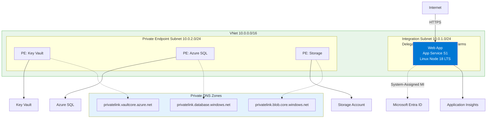
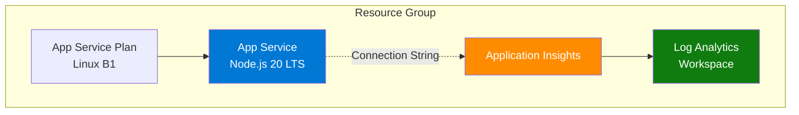

---
hide:
  - toc
content_sources:
  diagrams:
    - id: diagram-1
      type: flowchart
      source: mslearn-adapted
      mslearn_url: https://learn.microsoft.com/en-us/azure/app-service/
    - id: architecture
      type: flowchart
      source: mslearn-adapted
      mslearn_url: https://learn.microsoft.com/en-us/azure/app-service/
---

# 05. Infrastructure as Code with Bicep

⏱️ **Time**: 30 minutes  
🏗️ **Prerequisites**: Azure CLI, Bicep VS Code extension (optional but recommended)

Manual resource creation in the portal is fine for experiments, but production workloads require Infrastructure as Code (IaC). This tutorial explores how to use Bicep to provision the Node.js hosting environment.

!!! info "Infrastructure Context"
    **Service**: App Service (Linux, Standard S1) | **Network**: VNet integrated | **VNet**: ✅

    This tutorial assumes a production-ready App Service deployment with VNet integration, private endpoints for backend services, and managed identity for authentication.

<!-- diagram-id: diagram-1 -->


## What you'll learn
- How Bicep structures App Service resources
- Breaking down `main.bicep` and its modules
- Managing environment configurations with parameter files
- Deploying resources using the Azure CLI

## Architecture

<!-- diagram-id: architecture -->


## The Infrastructure Layout
The `infra/` folder in this repository contains a modular Bicep setup:
- `main.bicep`: The entry point that orchestrates modules.
- `modules/`: Individual resource definitions (App Service, App Insights, etc.).
- `profiles/`: `.bicepparam` files for different environment sizes.

## 1. Understanding main.bicep
The `main.bicep` file defines the core parameters and connects the modules.

```bicep
// Define common parameters
param location string = resourceGroup().location
param baseName string = 'nodejs-ref'
param appServicePlanSku string = 'B1'

// Orchestrate modules
module appServicePlan 'modules/appservice-plan.bicep' = {
  name: 'appServicePlan'
  params: {
    location: location
    name: 'asp-${baseName}'
    sku: appServicePlanSku
  }
}

module webApp 'modules/webapp.bicep' = {
  name: 'webApp'
  params: {
    location: location
    name: 'app-${baseName}-${uniqueString(resourceGroup().id)}'
    appServicePlanId: appServicePlan.outputs.id
    // ... other settings
  }
}
```

Key patterns used here:
- **`uniqueString()`**: Ensures your web app name is globally unique by hashing the resource group ID.
- **Output passing**: The `appServicePlanId` for the Web App is retrieved from the `appServicePlan` module output.

## 2. Using Parameter Files
Instead of passing long strings to the CLI, use `.bicepparam` files to define environment-specific values. See `infra/profiles/minimal.bicepparam`:

```bicep
using '../main.bicep'

param baseName = 'nodesimple'
param appServicePlanSku = 'B1'
param telemetryMode = 'basic'
```

## 3. Deployment
Deploy the infrastructure to a resource group. If you don't have a resource group yet, create one first:

```bash
# Create a resource group
az group create --name rg-myapp --location eastus --output json

# Deploy using the Bicep file
az deployment group create \
  --resource-group rg-myapp \
  --template-file infra/main.bicep \
  --parameters baseName=myapp appServicePlanSku=B1 \
  --output json
```

Or use a parameter file:
```bash
az deployment group create \
  --resource-group rg-myapp \
  --template-file infra/main.bicep \
  --parameters infra/profiles/minimal.bicepparam \
  --output json
```

## Verification
After the command completes, verify the resources exist:

1. **Check CLI output**: Look for `"provisioningState": "Succeeded"`.
2. **List resources**:
   ```bash
   az resource list --resource-group $RG --output table
   ```
   
   **Example output:**
   ```
   Name                                              ResourceGroup               Location      Type
   ------------------------------------------------  --------------------------  ------------  ------------------------------------------
   asp-appservice-nodejs-guide                       rg-appservice-nodejs-guide  koreacentral  Microsoft.Web/serverFarms
   log-appservice-nodejs-guide                       rg-appservice-nodejs-guide  koreacentral  Microsoft.OperationalInsights/workspaces
   appi-appservice-nodejs-guide                      rg-appservice-nodejs-guide  koreacentral  Microsoft.Insights/components
   app-appservice-nodejs-guide-gdzb56lzygs2u         rg-appservice-nodejs-guide  koreacentral  Microsoft.Web/sites
   ```

3. **Get Web App URL**:
   ```bash
   az webapp show --name $APP_NAME --resource-group $RG --query defaultHostName --output tsv
   ```
   
   **Example output:**
   ```
   app-appservice-nodejs-guide-gdzb56lzygs2u.azurewebsites.net
   ```

4. **Verify the app is running**:
   ```bash
   curl https://$APP_NAME.azurewebsites.net/health
   ```
   
   **Example output:**
   ```json
   {
     "status": "healthy",
     "timestamp": "2026-04-01T13:59:14.151Z"
   }
   ```

## Troubleshooting
- **Name Availability**: Web app names must be globally unique. If deployment fails with a "Conflict", change your `baseName`.
- **SKU Restrictions**: Some regions don't support specific SKUs (like `B1`). Try `P1V3` if `B1` is unavailable.
- **Bicep Version**: Ensure you have the latest Bicep CLI by running `az bicep upgrade`.

## Clean Up
Don't forget to delete resources when done to avoid ongoing charges:
```bash
az group delete --name rg-myapp --yes --no-wait --output json
```

## Next Steps
Now that your infrastructure is ready, proceed to **[06-ci-cd.md](./06-ci-cd.md)** to automate your application deployments.

---

## Advanced Options

!!! info "Coming Soon"
    - Terraform for multi-cloud deployments
    - Azure Developer CLI (azd) integration
- [Contribute](https://github.com/yeongseon/azure-app-service-practical-guide/issues)

## CLI Alternative (No Bicep)

Use these commands when you need an imperative deployment path without changing the existing Bicep workflow.

### Step 1: Set variables

```bash
RG="rg-express-tutorial"
LOCATION="koreacentral"
PLAN_NAME="plan-express-tutorial-s1"
APP_NAME="app-express-tutorial-abc123"
VNET_NAME="vnet-express-tutorial"
INTEGRATION_SUBNET_NAME="snet-appsvc-integration"
```

???+ example "Expected output"
    ```text
    Variables loaded for resource group, App Service plan, app name, and VNet integration.
    ```

### Step 2: Create resource group, plan, and app

```bash
az group create --name $RG --location $LOCATION
az appservice plan create --resource-group $RG --name $PLAN_NAME --is-linux --sku S1
az webapp create --resource-group $RG --plan $PLAN_NAME --name $APP_NAME --runtime "NODE|18-lts"
```

???+ example "Expected output"
    ```json
    {
      "defaultHostName": "app-express-tutorial-abc123.azurewebsites.net",
      "state": "Running"
    }
    ```

### Step 3: Configure app settings and startup command

```bash
az webapp config appsettings set --resource-group $RG --name $APP_NAME --settings SCM_DO_BUILD_DURING_DEPLOYMENT=true NODE_ENV=production
az webapp config set --resource-group $RG --name $APP_NAME --startup-file "node server.js"
```

???+ example "Expected output"
    ```json
    [
      {
        "name": "SCM_DO_BUILD_DURING_DEPLOYMENT",
        "value": "true"
      },
      {
        "name": "NODE_ENV",
        "value": "production"
      }
    ]
    ```

### Step 4 (Optional): Add VNet integration

```bash
az network vnet create --resource-group $RG --name $VNET_NAME --location $LOCATION --address-prefixes 10.0.0.0/16
az network vnet subnet create --resource-group $RG --vnet-name $VNET_NAME --name $INTEGRATION_SUBNET_NAME --address-prefixes 10.0.1.0/24 --delegations Microsoft.Web/serverFarms
az webapp vnet-integration add --resource-group $RG --name $APP_NAME --vnet $VNET_NAME --subnet $INTEGRATION_SUBNET_NAME
```

???+ example "Expected output"
    ```json
    {
      "isSwift": true,
      "subnetResourceId": "/subscriptions/<subscription-id>/resourceGroups/rg-express-tutorial/providers/Microsoft.Network/virtualNetworks/vnet-express-tutorial/subnets/snet-appsvc-integration"
    }
    ```

### Step 5: Validate effective configuration

```bash
az webapp config show --resource-group $RG --name $APP_NAME --query "{linuxFxVersion:linuxFxVersion, appCommandLine:appCommandLine}" --output json
az webapp config appsettings list --resource-group $RG --name $APP_NAME --query "[?name=='NODE_ENV' || name=='SCM_DO_BUILD_DURING_DEPLOYMENT']" --output json
```

???+ example "Expected output"
    ```json
    {
      "linuxFxVersion": "NODE|18-lts",
      "appCommandLine": "node server.js"
    }
    ```

## See Also
- [Operations Scaling](../../operations/scaling.md)

## Sources
- [Bicep Documentation](https://learn.microsoft.com/en-us/azure/azure-resource-manager/bicep/)
- [Deploy App Service resources with Bicep (Microsoft Learn)](https://learn.microsoft.com/azure/app-service/provision-resource-bicep)
