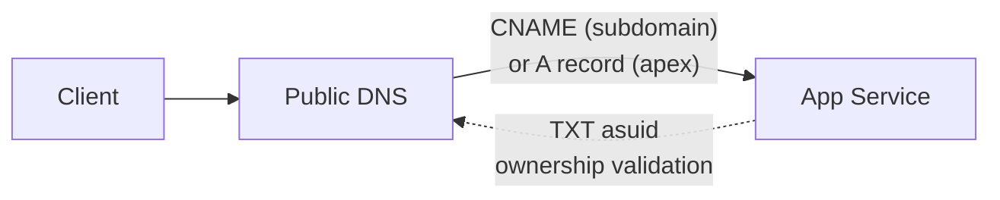
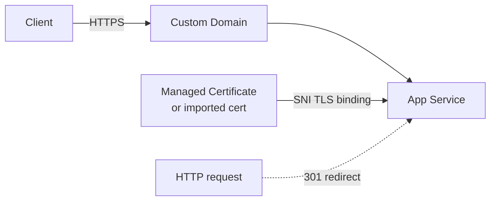

# 07. Custom Domains and SSL (OPTIONAL)

⏱️ **Time**: 30 minutes  
🏗️ **Prerequisites**: A registered domain name, access to your DNS provider

By default, your app is accessible at `*.azurewebsites.net`. For production, you'll likely want a custom domain (e.g., `www.contoso.com`) with a valid SSL certificate.

> **Note**: This tutorial is **OPTIONAL**. You can run production workloads on the default `.azurewebsites.net` domain indefinitely.

## What you'll learn
- Mapping a custom domain to your App Service
- Configuring DNS records (CNAME and TXT)
- Securing your domain with App Service Managed Certificates (Free)
- Enforcing HTTPS-only traffic

## How Custom Domains Work



Azure verifies domain ownership via a TXT record before allowing the hostname binding.

## How HTTPS Binding Works



After binding a certificate, App Service terminates TLS and can redirect all HTTP traffic to HTTPS.

## 1. Prerequisites
- **Domain Ownership**: You must own the domain you want to use.
- **DNS Access**: You must be able to create CNAME and TXT records at your domain registrar (GoDaddy, Namecheap, Azure DNS, etc.).
- **App Service Plan**: Custom domains require a paid App Service plan (not the Free F1 tier). App Service Managed Certificates require Basic tier or higher.

## 2. Configure Custom Domain
Azure uses a TXT record to verify domain ownership before allowing the mapping.

### Get Verification ID
```bash
az webapp show --name $APP_NAME --resource-group $RG --query customDomainVerificationId --output json | jq -r '.'
```

**Example output:**
```
ABC123DEF456GHI789JKL012MNO345PQR678STU901VWX234YZ
```

### Add DNS Records
Go to your DNS provider and add:
1. **TXT Record**: 
   - Host: `asuid.www` (for `www.yourdomain.com`)
   - Value: The Verification ID from the previous step.
2. **CNAME Record**:
   - Host: `www`
    - Value: `app-myapp-abc123.azurewebsites.net`

### Map the Domain in Azure
```bash
az webapp config hostname add \
  --webapp-name $APP_NAME \
  --resource-group $RG \
  --hostname www.yourdomain.com \
  --output json
```

**Example output:**
```json
{
  "hostName": "www.example.com",
  "hostNameType": "Verified",
  "siteName": "app-myapp-abc123"
}
```

## 3. SSL/TLS Configuration
Once the domain is mapped, secure it with a free Managed Certificate.

### Create Managed Certificate
```bash
az webapp config ssl create \
  --name $APP_NAME \
  --resource-group $RG \
  --hostname www.yourdomain.com \
  --output json
```

### Bind the Certificate
```bash
# Get the certificate thumbprint from the previous command output or:
THUMBPRINT=$(az webapp config ssl list --resource-group $RG --query "[?hostname=='www.yourdomain.com'].thumbprint" --output json | jq -r '.')

az webapp config ssl bind \
  --name $APP_NAME \
  --resource-group $RG \
  --certificate-thumbprint $THUMBPRINT \
  --ssl-type SniEnabled \
  --output json
```

## 4. Security Hardening
Ensure all traffic uses HTTPS and modern TLS versions.

```bash
# Force HTTPS-only
az webapp update \
  --name $APP_NAME \
  --resource-group $RG \
  --https-only true \
  --output json

# Set minimum TLS version to 1.2
az webapp config set \
  --name $APP_NAME \
  --resource-group $RG \
  --min-tls-version 1.2 \
  --output json
```

## Verification
Test your new domain using `curl`:

```bash
# Verify it redirects to HTTPS
curl -I http://www.yourdomain.com

# Verify the SSL certificate is valid
curl -v https://www.yourdomain.com/health 2>&1 | grep "SSL certificate verify ok"
```

## Troubleshooting
- **DNS Propagation**: Changes can take anywhere from a few minutes to 48 hours to propagate. Use `dig` or `nslookup` to verify your records are live.
- **Verification Failed**: Ensure the TXT record host is exactly `asuid.<subdomain>`.
- **Managed Certificate Limitations**: Managed certificates do not support wildcards (e.g., `*.yourdomain.com`). For wildcards, you must upload a custom PFX certificate.

## Next Steps
Congratulations! You've completed the core operations path. Explore the **[Recipes](./recipes/index.md)** section for advanced scenarios like Managed Identity and Key Vault integration.

---

## Advanced Options

!!! info "Coming Soon"
    - Wildcard SSL certificates
    - Azure Front Door for global delivery
- [Contribute](https://github.com/yeongseon/azure-app-service-practical-guide/issues)

## See Also
- [Operations Networking](../../operations/networking.md)

## References
- [Azure Front Door Documentation](https://learn.microsoft.com/en-us/azure/frontdoor/)
- [Map a custom domain to App Service (Microsoft Learn)](https://learn.microsoft.com/azure/app-service/app-service-web-tutorial-custom-domain)
