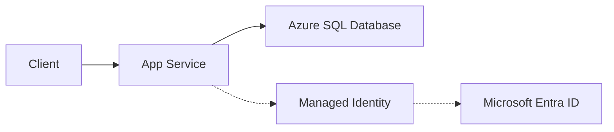

# Azure SQL Integration

This recipe shows how to connect a Node.js application running on Azure App Service to an Azure SQL Database using a passwordless Managed Identity approach.

## Overview

Azure SQL integration typically relies on connection strings with embedded credentials. Using Managed Identity eliminates the need to manage secrets like passwords or client keys, improving security and reducing operational overhead.

## Architecture



How to read this diagram: Solid arrows show runtime data flow. Dashed arrows show identity and authentication.

## Prerequisites

- Azure SQL Database
- Azure App Service with Node.js
- Managed Identity (System or User-assigned) enabled on the App Service
- The Managed Identity must be added as a user in the SQL Database with appropriate permissions (`db_datareader`, `db_datawriter`)

## Implementation

### 1. Install Dependencies

```bash
npm install mssql @azure/identity
```

### 2. Connection Logic

The `mssql` package (which uses `tedious` internally) supports Azure AD authentication.

```javascript
const sql = require('mssql');
const { DefaultAzureCredential } = require('@azure/identity');

const config = {
    server: process.env.SQL_SERVER, // e.g., 'app-myapp-abc123.database.windows.net'
  database: process.env.SQL_DATABASE,
  port: 1433,
  authentication: {
    type: 'azure-active-directory-msi-vm',
    options: {
      // For User-Assigned Identity, provide the client ID
      // clientId: process.env.AZURE_CLIENT_ID 
    }
  },
  options: {
    encrypt: true,
    trustServerCertificate: false
  },
  pool: {
    max: 10,
    min: 0,
    idleTimeoutMillis: 30000
  }
};

let poolPromise;

function getPool() {
  if (!poolPromise) {
    poolPromise = sql.connect(config);
  }
  return poolPromise;
}

async function queryData() {
  try {
    const pool = await getPool();
    const result = await pool.request()
      .query('SELECT TOP 10 * FROM YourTable');
    return result.recordset;
  } catch (err) {
    console.error('SQL error', err);
    throw err;
  }
}

module.exports = { queryData };
```

### 3. Connection Pooling Best Practices

- **Reuse the connection pool**: Create a single pool and reuse it throughout your application's lifecycle. Don't call `sql.connect()` on every request.
- **Set pool limits**: Match `pool.max` to your application's concurrency needs and App Service plan limits.
- **Idle timeout**: Use `idleTimeoutMillis` to close unused connections and save resources.

## Verification

Deploy to App Service and check the logs after triggering a database operation. You can also test locally by signing into the Azure CLI with an account that has SQL access:

```bash
az login
export SQL_SERVER="your-server.database.windows.net"
export SQL_DATABASE="your-db"
node your-app.js
```

## Troubleshooting

- **Login failed**: Ensure the Managed Identity is created as a user in the SQL Database:
  ```sql
  CREATE USER [your-app-service-name] FROM EXTERNAL PROVIDER;
  ALTER ROLE db_datareader ADD MEMBER [your-app-service-name];
  ALTER ROLE db_datawriter ADD MEMBER [your-app-service-name];
  ```
- **Connection timeout**: Check if "Allow Azure services and resources to access this server" is enabled in the Azure SQL firewall settings.
- **Managed Identity Type**: If using a User-Assigned identity, ensure `AZURE_CLIENT_ID` is set in the App Service environment variables.

---

## Advanced Topics

!!! info "Coming Soon"
    - [Connection pooling optimization](https://github.com/yeongseon/azure-app-service-practical-guide/issues)
    - [Read replicas](https://github.com/yeongseon/azure-app-service-practical-guide/issues)
    - [Contribute](https://github.com/yeongseon/azure-app-service-practical-guide/issues)

## See Also
- [Cosmos DB Integration](./cosmosdb.md)
- [Redis Cache for Sessions](./redis.md)
- [Networking Concepts](../../../platform/networking.md)

## Sources
- [Azure SQL Database connection with Node.js (Microsoft Learn)](https://learn.microsoft.com/azure/azure-sql/database/connect-query-nodejs)
- [Connect App Service to Azure Database using Managed Identity (Microsoft Learn)](https://learn.microsoft.com/azure/app-service/tutorial-connect-msi-azure-database)
