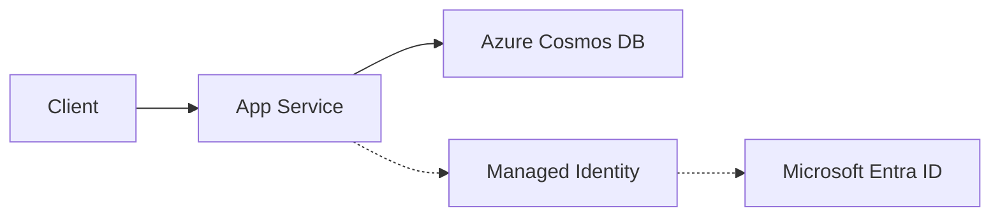

---
content_sources:
  diagrams:
    - id: architecture
      type: flowchart
      source: mslearn-adapted
      mslearn_url: https://learn.microsoft.com/en-us/azure/cosmos-db/nosql/quickstart-python
---

# Cosmos DB Integration

This recipe shows how to connect a Node.js application to Azure Cosmos DB for NoSQL using the `@azure/cosmos` SDK and passwordless Managed Identity.

## Overview

Azure Cosmos DB is a globally distributed, multi-model database service. Integrating it with Managed Identity on App Service removes the need to store secondary master keys in your application's environment variables.

## Architecture

<!-- diagram-id: architecture -->


How to read this diagram: Solid arrows show runtime data flow. Dashed arrows show identity and authentication.

## Prerequisites

- Azure Cosmos DB Account (NoSQL API)
- Azure App Service with Node.js
- Managed Identity (System or User-assigned) enabled on the App Service
- RBAC role assignment: The Managed Identity must be assigned the `Cosmos DB Built-in Data Contributor` role on the Cosmos DB account.

## Implementation

### 1. Install Dependencies

```bash
npm install @azure/cosmos @azure/identity
```

### 2. Client Initialization with Managed Identity

```javascript
const { CosmosClient } = require('@azure/cosmos');
const { DefaultAzureCredential } = require('@azure/identity');

const endpoint = process.env.COSMOS_ENDPOINT; // e.g., https://your-db.documents.azure.com:443/
const databaseId = process.env.COSMOS_DATABASE;
const containerId = process.env.COSMOS_CONTAINER;

const client = new CosmosClient({
  endpoint,
  aadCredentials: new DefaultAzureCredential()
});

async function getItems() {
  const container = client.database(databaseId).container(containerId);
  
  // Example query
  const { resources: items } = await container.items
    .query("SELECT * FROM c WHERE c.active = true")
    .fetchAll();
    
  return items;
}

module.exports = { getItems };
```

### 3. Partition Key Strategies

Choosing the right partition key is critical for performance and scalability:
- **High cardinality**: Use a property with many unique values (e.g., `userId`, `deviceId`).
- **Even distribution**: Avoid "hot partitions" by ensuring data is spread evenly across partition key values.
- **Cross-partition queries**: Design your schema to avoid these where possible, as they are more expensive.

### 4. Connection Best Practices

- **Singleton Client**: Create one `CosmosClient` instance and reuse it across your application.
- **Direct Mode**: The Node.js SDK uses HTTP/Gateway mode by default. For better performance in some scenarios, ensure your App Service and Cosmos DB are in the same region.
- **Error Handling**: Implement retry logic for transient errors (handled automatically by the SDK for many cases).

## Verification

Deploy to App Service and verify access by calling your database integration:

```bash
# Set environment variables in App Service
az webapp config appsettings set --name $APP_NAME --resource-group $RG --settings COSMOS_ENDPOINT="https://your-db.documents.azure.com:443/" COSMOS_DATABASE="tasks" COSMOS_CONTAINER="items" --output json
```

## Troubleshooting

- **Forbidden (403)**: This often means the role assignment is missing or hasn't propagated. Check the Access Control (IAM) settings on the Cosmos DB account.
- **Resource Not Found (404)**: Ensure the `databaseId` and `containerId` exactly match what you created in the portal.
- **Slow Queries**: Check if your queries are using the partition key. Use `container.items.readAll({ partitionKey: "your-key" })` for optimized reads.

---

## Advanced Topics

!!! info "Coming Soon"
    - [Change feed patterns](https://github.com/yeongseon/azure-app-service-practical-guide/issues)
    - [Global distribution](https://github.com/yeongseon/azure-app-service-practical-guide/issues)
    - [Contribute](https://github.com/yeongseon/azure-app-service-practical-guide/issues)

## See Also
- [Azure SQL Integration](./azure-sql.md)
- [Redis Cache for Sessions](./redis.md)
- [Configuration Tutorial](../tutorial/03-configuration.md)

## Sources
- [Azure Cosmos DB for NoSQL quickstart with Node.js (Microsoft Learn)](https://learn.microsoft.com/azure/cosmos-db/nosql/quickstart-nodejs)
- [Use managed identity to access Cosmos DB (Microsoft Learn)](https://learn.microsoft.com/azure/cosmos-db/managed-identity-based-authentication)
