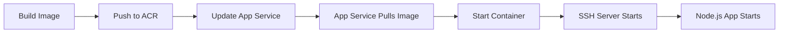
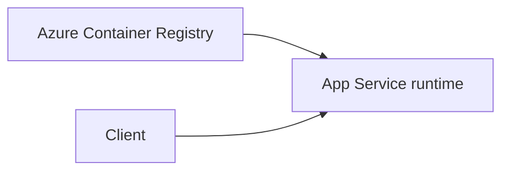

# Custom Container Deployment

This recipe explains how to deploy a Node.js application as a custom Docker container on Azure App Service for Linux, including SSH access for debugging.



## Overview

Custom containers offer full control over your application's environment, including OS dependencies and specific Node.js versions. To maintain observability on Azure, you must configure SSH for the Kudu web terminal.

## Architecture



How to read this diagram: Solid arrows show runtime data flow. Dashed arrows show identity and authentication.

## Prerequisites

- Docker Desktop or a compatible container engine
- Azure Container Registry (ACR) or Docker Hub
- Azure App Service (Web App for Containers)

## Implementation

### 1. Dockerfile Configuration

A robust Node.js Dockerfile should use multi-stage builds and include SSH setup.

```dockerfile
# Stage 1: Build
FROM node:20-alpine AS builder
WORKDIR /app
COPY package*.json ./
RUN npm install
COPY . .
RUN npm run build # If applicable

# Stage 2: Runtime
FROM node:20-alpine
WORKDIR /app

# Install SSH and configure for Kudu Web SSH
RUN apk add --no-cache openssh-server \
    && echo "root:Docker!" | chpasswd \
    && ssh-keygen -A

# Copy SSH configuration (see below)
COPY sshd_config /etc/ssh/sshd_config

# Copy application from builder
COPY --from=builder /app /app

EXPOSE 3000 2222

# Startup script to start SSH and then the application
COPY entrypoint.sh /app/entrypoint.sh
RUN chmod +x /app/entrypoint.sh

ENTRYPOINT ["/app/entrypoint.sh"]
```

### 2. Supporting Files

**sshd_config**:
```text
Port 2222
ListenAddress 0.0.0.0
LoginGraceTime 180
X11Forwarding yes
Ciphers aes128-cbc,3des-cbc,aes256-cbc,aes128-ctr,aes192-ctr,aes256-ctr
MACs hmac-sha1,hmac-sha1-96
StrictModes yes
PubkeyAuthentication no
PasswordAuthentication yes
PermitEmptyPasswords no
ChallengeResponseAuthentication no
IgnoreRhosts yes
HostbasedAuthentication no
Banner none
AcceptEnv LANG LC_*
Subsystem sftp internal-sftp
PermitRootLogin yes
```

**entrypoint.sh**:
```bash
#!/bin/sh
/usr/sbin/sshd
npm start
```

### 3. Registry and App Service Setup

Push to ACR and configure the App Service:

```bash
# Push to ACR
docker build -t yourregistry.azurecr.io/node-app:v1 .
docker push yourregistry.azurecr.io/node-app:v1

# Configure App Service
az webapp config container set --name $APP_NAME --resource-group $RG \
  --docker-custom-image-name yourregistry.azurecr.io/node-app:v1 \
  --docker-registry-server-url https://yourregistry.azurecr.io \
  --docker-registry-server-user <acr-username> \
  --docker-registry-server-password <acr-password> \
  --output json
```

## Verification

1. **Check Website**: Browse to `https://${APP_NAME}.azurewebsites.net`.
2. **Access SSH**: Go to `https://${APP_NAME}.scm.azurewebsites.net/webssh/host`. You should see a terminal in your browser.

## Troubleshooting

- **Container Not Starting**: Check the deployment logs in the Azure portal under **Deployment Center > Logs**.
- **SSH Not Connecting**: Ensure port 2222 is exposed in your Dockerfile and the `sshd` process is running. Kudu requires the root password to be exactly `Docker!`.
- **Environment Variables**: Set these in the App Service settings, not the Dockerfile. They will be injected into the container's shell environment.

---

## Advanced Topics

!!! info "Coming Soon"
    - [Multi-stage builds](https://github.com/yeongseon/azure-appservice-nodejs-guide/issues)
    - [Sidecar containers](https://github.com/yeongseon/azure-appservice-nodejs-guide/issues)
    - [Contribute](https://github.com/yeongseon/azure-appservice-nodejs-guide/issues)

## See Also
- [Native Dependencies](./native-dependencies.md)
- [How App Service Works](../../../platform/how-app-service-works.md)
- [CI/CD Tutorial](../06-ci-cd.md)

## References
- [Deploy a custom container to Azure App Service (Microsoft Learn)](https://learn.microsoft.com/azure/app-service/tutorial-custom-container)
- [SSH access to Linux containers in App Service (Microsoft Learn)](https://learn.microsoft.com/azure/app-service/configure-linux-open-ssh-session)
