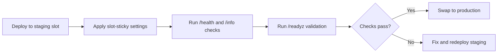

---
content_sources:
  diagrams:
    - id: deployment-slots-validation
      type: flowchart
      source: mslearn-adapted
      mslearn_url: https://learn.microsoft.com/en-us/azure/app-service/quickstart-python
---

# Deployment Slots Validation

Use staging slots to validate deployments before production swap, with health checks and automated safeguards in GitHub Actions.

<!-- diagram-id: deployment-slots-validation -->


## Prerequisites

- App Service plan supports deployment slots
- Production app already running
- CI/CD pipeline can deploy to specific slot

## Main content

### 1) Create staging slot

```bash
az webapp deployment slot create \
  --resource-group "$RG" \
  --name "$APP_NAME" \
  --slot "staging" \
  --output json
```

### 2) Configure slot-sticky settings

Mark environment-specific values so they do not swap:

```bash
az webapp config appsettings set \
  --resource-group "$RG" \
  --name "$APP_NAME" \
  --slot "staging" \
  --slot-settings NODE_ENV=staging FEATURE_FLAG_USE_BETA=true \
  --output json
```

### 3) Deploy artifact to staging slot

```bash
az webapp deploy \
  --resource-group "$RG" \
  --name "$APP_NAME" \
  --slot "staging" \
  --src-path "release.zip" \
  --type zip \
  --output json
```

### 4) Add explicit health endpoint checks

```bash
curl --fail --silent "https://$APP_NAME-staging.azurewebsites.net/health"
curl --fail --silent "https://$APP_NAME-staging.azurewebsites.net/info"
```

### 5) Add version-aware validation endpoint

```javascript
app.get('/readyz', (req, res) => {
  res.json({
    status: 'ready',
    environment: process.env.NODE_ENV || 'production',
    buildVersion: process.env.BUILD_VERSION || 'unknown'
  });
});
```

### 6) Swap staging to production

```bash
az webapp deployment slot swap \
  --resource-group "$RG" \
  --name "$APP_NAME" \
  --slot "staging" \
  --target-slot "production" \
  --output json
```

### 7) Optional auto-swap configuration

```bash
az webapp deployment slot auto-swap \
  --resource-group "$RG" \
  --name "$APP_NAME" \
  --slot "staging" \
  --auto-swap-slot "production" \
  --output json
```

Use auto-swap only when health checks and deployment confidence are high.

### 8) GitHub Actions staged deployment example

```yaml
name: Staged Deployment

on:
  push:
    branches: [ main ]

jobs:
  deploy-staging:
    runs-on: ubuntu-latest
    steps:
      - uses: actions/checkout@v4
      - name: Deploy to staging slot
        uses: azure/webapps-deploy@v3
        with:
          app-name: ${{ secrets.AZURE_WEBAPP_NAME }}
          slot-name: 'staging'
          publish-profile: ${{ secrets.AZURE_WEBAPP_PUBLISH_PROFILE_STAGING }}
          package: .

  validate:
    needs: deploy-staging
    runs-on: ubuntu-latest
    steps:
      - name: Check staging health
        run: curl --fail --silent "https://${{ secrets.AZURE_WEBAPP_NAME }}-staging.azurewebsites.net/health"

  swap:
    needs: validate
    runs-on: ubuntu-latest
    steps:
      - name: Azure Login
        uses: azure/login@v2
        with:
          creds: ${{ secrets.AZURE_CREDENTIALS }}
      - name: Swap slots
        run: |
          az webapp deployment slot swap \
            --resource-group ${{ secrets.AZURE_RESOURCE_GROUP }} \
            --name ${{ secrets.AZURE_WEBAPP_NAME }} \
            --slot staging \
            --target-slot production \
            --output none
```

!!! warning "Validate before swap, always"
    A successful deployment is not the same as a healthy runtime.
    Require endpoint validation and telemetry checks before production swap.

## Verification

- Staging serves expected build version.
- Production remains stable before swap.
- Swap completes without config leakage.
- Post-swap `/health` remains healthy.

```bash
curl --include "https://$APP_NAME.azurewebsites.net/health"
```

## Troubleshooting

### Staging healthy, production fails after swap

- Check slot-sticky config alignment.
- Verify hostnames/certs for slot-specific behavior.
- Confirm staging used production-like dependencies where required.

### Swap operation blocked

Validate no pending restart/operation exists and check App Service Activity Log for conflicts.

### Auto-swap caused unexpected release

Disable auto-swap and enforce manual approval stage in GitHub Actions for high-risk environments.

## See Also

- [Tutorial: 06. CI/CD](../tutorial/06-ci-cd.md)
- [Tutorial: 03. Configuration](../tutorial/03-configuration.md)
- For platform details, see [Azure App Service Guide](https://yeongseon.github.io/azure-app-service-practical-guide/)
