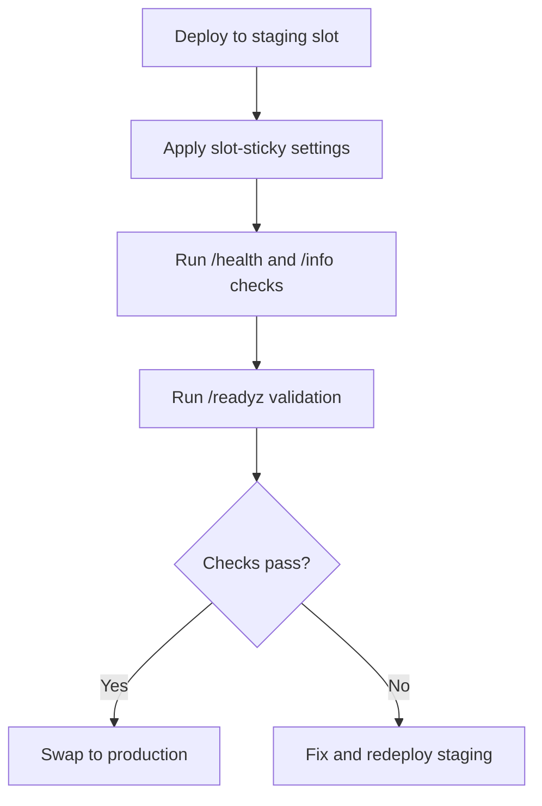

---
content_sources:
  diagrams:
    - id: deployment-slots-validation
      type: flowchart
      source: mslearn-adapted
      mslearn_url: https://learn.microsoft.com/en-us/azure/app-service/quickstart-python
---
# Deployment Slots Validation

Use staging slots to validate deployments before production swap, with health checks and automated safeguards in GitHub Actions.

<!-- diagram-id: deployment-slots-validation -->

```mermaid
flowchart TD
    A[Deploy to staging slot] --> B[Apply slot-sticky settings]
    B --> C[Run /health and /info checks]
    C --> D[Run /readyz validation]
    D --> E{Checks pass?}
    E -- Yes --> F[Swap to production]
    E -- No --> G[Fix and redeploy staging]
```

## Prerequisites

- App Service plan supports deployment slots
- Production app already running
- CI/CD pipeline can deploy to specific slot

## Main content

### 1) Create staging slot

```bash
az webapp deployment slot create \
  --resource-group "$RG" \
  --name "$APP_NAME" \
  --slot "staging" \
  --output json
```

| Flag | Description |
|---|---|
| `--resource-group "$RG"` | Creates the slot under the resource group that contains the production app. |
| `--name "$APP_NAME"` | Selects the web app that will receive the new deployment slot. |
| `--slot "staging"` | Names the new slot `staging`. |
| `--output json` | Returns the created slot configuration as JSON. |

### 2) Configure slot-sticky settings

Mark environment-specific values so they do not swap:

```bash
az webapp config appsettings set \
  --resource-group "$RG" \
  --name "$APP_NAME" \
  --slot "staging" \
  --slot-settings NODE_ENV=staging FEATURE_FLAG_USE_BETA=true \
  --output json
```

| Flag | Description |
|---|---|
| `--resource-group "$RG"` | Targets the resource group that contains the slot. |
| `--name "$APP_NAME"` | Selects the web app whose staging slot settings will be updated. |
| `--slot "staging"` | Applies the configuration change to the staging slot instead of production. |
| `--slot-settings NODE_ENV=staging FEATURE_FLAG_USE_BETA=true` | Writes slot-sticky app settings that stay with the staging slot during swaps. |
| `--output json` | Returns the updated settings payload as JSON. |

### 3) Deploy artifact to staging slot

```bash
az webapp deploy \
  --resource-group "$RG" \
  --name "$APP_NAME" \
  --slot "staging" \
  --src-path "release.zip" \
  --type zip \
  --output json
```

| Flag | Description |
|---|---|
| `--resource-group "$RG"` | Targets the resource group that contains the staging slot. |
| `--name "$APP_NAME"` | Selects the web app that should receive the deployment. |
| `--slot "staging"` | Deploys the package to the staging slot instead of production. |
| `--src-path "release.zip"` | Uploads the `release.zip` package as the deployment artifact. |
| `--type zip` | Tells App Service to treat the uploaded artifact as a Zip Deploy package. |
| `--output json` | Returns deployment details as JSON. |

### 4) Add explicit health endpoint checks

```bash
curl --fail --silent "https://$APP_NAME-staging.azurewebsites.net/health"
curl --fail --silent "https://$APP_NAME-staging.azurewebsites.net/info"
```

### 5) Add version-aware validation endpoint

```javascript
app.get('/readyz', (req, res) => {
  res.json({
    status: 'ready',
    environment: process.env.NODE_ENV || 'production',
    buildVersion: process.env.BUILD_VERSION || 'unknown'
  });
});
```

### 6) Swap staging to production

```bash
az webapp deployment slot swap \
  --resource-group "$RG" \
  --name "$APP_NAME" \
  --slot "staging" \
  --target-slot "production" \
  --output json
```

| Flag | Description |
|---|---|
| `--resource-group "$RG"` | Targets the resource group that contains the source and target slots. |
| `--name "$APP_NAME"` | Selects the web app whose slots will be swapped. |
| `--slot "staging"` | Uses the staging slot as the source of the swap. |
| `--target-slot "production"` | Promotes the staging slot into the production slot. |
| `--output json` | Returns swap-operation details as JSON. |

### 7) Optional auto-swap configuration

```bash
az webapp deployment slot auto-swap \
  --resource-group "$RG" \
  --name "$APP_NAME" \
  --slot "staging" \
  --auto-swap-slot "production" \
  --output json
```

| Flag | Description |
|---|---|
| `--resource-group "$RG"` | Targets the resource group that contains the slot configuration. |
| `--name "$APP_NAME"` | Selects the web app whose slot should auto-swap. |
| `--slot "staging"` | Enables auto-swap on the staging slot. |
| `--auto-swap-slot "production"` | Configures production as the automatic swap target. |
| `--output json` | Returns the updated auto-swap configuration as JSON. |

!!! warning "Linux Limitation"
    Auto-swap is not supported for web apps on Linux and Web App for Containers. Use manual swap or CI/CD-triggered swap instead. See [Deployment Slots](../../../operations/deployment/slots-and-swap.md) for details.

Use auto-swap only when health checks and deployment confidence are high.

### 8) GitHub Actions staged deployment example

```yaml
name: Staged Deployment

on:
  push:
    branches: [ main ]

jobs:
  deploy-staging:
    runs-on: ubuntu-latest
    steps:
      - uses: actions/checkout@v4
      - name: Deploy to staging slot
        uses: azure/webapps-deploy@v3
        with:
          app-name: ${{ secrets.AZURE_WEBAPP_NAME }}
          slot-name: 'staging'
          publish-profile: ${{ secrets.AZURE_WEBAPP_PUBLISH_PROFILE_STAGING }}
          package: .

  validate:
    needs: deploy-staging
    runs-on: ubuntu-latest
    steps:
      - name: Check staging health
        run: curl --fail --silent "https://${{ secrets.AZURE_WEBAPP_NAME }}-staging.azurewebsites.net/health"

  swap:
    needs: validate
    runs-on: ubuntu-latest
    steps:
      - name: Azure Login
        uses: azure/login@v2
        with:
          creds: ${{ secrets.AZURE_CREDENTIALS }}
      - name: Swap slots
        run: |
          az webapp deployment slot swap \
            --resource-group ${{ secrets.AZURE_RESOURCE_GROUP }} \
            --name ${{ secrets.AZURE_WEBAPP_NAME }} \
            --slot staging \
            --target-slot production \
            --output none
```

| Command | Description |
|---|---|
| `az webapp deployment slot swap --resource-group ${{ secrets.AZURE_RESOURCE_GROUP }} --name ${{ secrets.AZURE_WEBAPP_NAME }} --slot staging --target-slot production --output none` | Swaps the validated staging deployment into production from the GitHub Actions job without printing a JSON payload. |

!!! warning "Validate before swap, always"
    A successful deployment is not the same as a healthy runtime.
    Require endpoint validation and telemetry checks before production swap.

## Verification

- Staging serves expected build version.
- Production remains stable before swap.
- Swap completes without config leakage.
- Post-swap `/health` remains healthy.

```bash
curl --include "https://$APP_NAME.azurewebsites.net/health"
```

## Troubleshooting

### Staging healthy, production fails after swap

- Check slot-sticky config alignment.
- Verify hostnames/certs for slot-specific behavior.
- Confirm staging used production-like dependencies where required.

### Swap operation blocked

Validate no pending restart/operation exists and check App Service Activity Log for conflicts.

### Auto-swap caused unexpected release

Disable auto-swap and enforce manual approval stage in GitHub Actions for high-risk environments.

## Run It in the Portal

#### Portal view: Deployment slots with Swap dialog (validated promotion)

![Azure Portal Deployment slots blade for app-test-20251107 Web App with the Swap right panel open. The slot list shows app-test-20251107 with a PRODUCTION badge and app-test-20251107-staging; the toolbar exposes Save and Discard (disabled), Add, Swap (highlighted), Logs, Refresh (disabled), and Send us your feedback. The Swap panel has a Source dropdown set to app-test-20251107-staging and a Target dropdown showing app-test-20251107 with a PRODUCTION badge, followed by an info banner reading "Swap with preview can only be used with sites that have deployment slot settings enabled." and a disabled "Perform swap with preview" checkbox. A Config Changes section explains it is the final summary of configuration changes on source and target slots after the swap, with Source slot changes (selected) and Target slot changes tabs. The table columns Setting, Type, Old Value, New Value list SCM_DO_BUILD_DURING_DEPLOYMENT (AppSetting, Not set to true), APPLICATIONINSIGHTS_CONNECTION_STRING (AppSetting, Not set to a long zero-GUID instrumentation string), ApplicationInsightsAgent_EXTENSION_VERSION (AppSetting, Not set to ~3), and APPLICATIONINSIGHTSAGENT_EXTENSION_ENABLED (AppSetting, Not set to true). Bottom buttons are Start Swap (primary) and Close.](../../../assets/operations/deployment/slots-and-swap/01-swap-dialog.png)

The Deployment slots blade with the Swap panel open is the Portal counterpart to the `az webapp deployment slot swap` command this recipe drives from CI. The `Source: app-test-20251107-staging` and `Target: app-test-20251107` selectors mirror the staging-to-production promotion direction the recipe validates against. The `Config Changes` table at the bottom previews how slot-sticky settings will move during the swap, including the `APPLICATIONINSIGHTS_CONNECTION_STRING` and `SCM_DO_BUILD_DURING_DEPLOYMENT` rows visible here — the same delta you should inspect before clicking `Start Swap`. Use this Portal view as the manual checkpoint complementing the automated pre-swap validation calls (health probe, smoke test) the recipe issues against the Node.js staging slot.

## See Also

- [Tutorial: 06. CI/CD](../tutorial/06-ci-cd.md)
- [Tutorial: 03. Configuration](../tutorial/03-configuration.md)
- For platform details, see [Azure App Service Guide](https://yeongseon.github.io/azure-app-service-practical-guide/)

## Sources

- [Microsoft Learn source 1](https://learn.microsoft.com/en-us/azure/app-service/quickstart-python)
