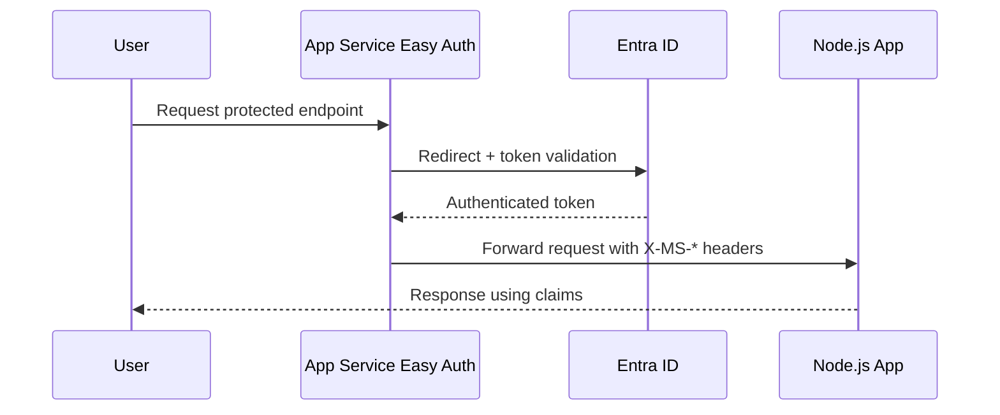

---
content_sources:
  diagrams:
    - id: app-service-built-in-authentication-easy-auth
      type: flowchart
      source: mslearn-adapted
      mslearn_url: https://learn.microsoft.com/en-us/azure/app-service/overview-authentication-authorization
---
# App Service Built-in Authentication (Easy Auth)

App Service provides a built-in authentication and authorization service, often called Easy Auth. This platform-level feature handles user logins and provides identity information to your Node.js application through HTTP headers.

<!-- diagram-id: app-service-built-in-authentication-easy-auth -->


## Overview

Easy Auth eliminates the need to manage security tokens or integrate complex authentication SDKs into your code. The platform validates incoming tokens and populates standard headers before the request reaches your application.

- **No SDK required**: Works with any language or framework.
- **Token validation**: Handled by the App Service platform.
- **Multiple providers**: Supports Microsoft Entra ID, Google, Facebook, GitHub, and more.

## When to Use

| Scenario | Recommendation |
|----------|----------------|
| Simple auth requirements | Easy Auth |
| Multiple identity providers | Easy Auth |
| Need custom auth logic | Code-based (Passport.js) |
| Fine-grained authorization | Code-based |

## Enable via Azure CLI

Use the following command to enable Microsoft Entra ID authentication for your web app:

```bash
# Enable Microsoft Entra ID auth
az webapp auth microsoft update \
  --name $APP_NAME \
  --resource-group $RG \
  --client-id "<your-app-id>" \
  --client-secret "<your-secret>" \
  --issuer "https://login.microsoftonline.com/<tenant-id>/v2.0" \
  --output json
```

| Flag | Description |
|---|---|
| `--name $APP_NAME` | Targets the web app whose Microsoft identity provider settings you want to configure. |
| `--resource-group $RG` | Identifies the resource group that contains the web app. |
| `--client-id "<your-app-id>"` | Sets the Microsoft Entra app registration client ID that Easy Auth should use. |
| `--client-secret "<your-secret>"` | Supplies the client secret that App Service uses when it talks to Microsoft Entra ID. |
| `--issuer "https://login.microsoftonline.com/<tenant-id>/v2.0"` | Defines the tenant-specific OpenID issuer URL that App Service will trust. |
| `--output json` | Returns the updated authentication-provider configuration as JSON. |

## Enable via Portal

1. Navigate to your App Service in the Azure Portal.
2. Select **Authentication** from the left menu.
3. Click **Add identity provider**.
4. Choose **Microsoft** (or your preferred provider).
5. Configure the app registration settings and save.

## Access User Information in Node.js

Your application can retrieve user identity information from specific HTTP headers injected by the platform.

```javascript
app.get('/api/profile', (req, res) => {
  const userId = req.headers['x-ms-client-principal-id'];
  const userName = req.headers['x-ms-client-principal-name'];
  
  res.json({ userId, userName });
});

// For full claims
app.get('/api/claims', (req, res) => {
  const principal = req.headers['x-ms-client-principal'];
  if (!principal) {
    return res.status(401).json({ error: 'Not authenticated' });
  }
  
  const claims = JSON.parse(Buffer.from(principal, 'base64').toString());
  res.json(claims);
});
```

## Available Headers

| Header | Description |
|--------|-------------|
| `x-ms-client-principal-id` | User's unique identity ID |
| `x-ms-client-principal-name` | User's display name or email |
| `x-ms-client-principal` | Base64-encoded JSON object containing all claims |
| `x-ms-token-aad-access-token` | The access token (if token store is enabled) |

## Local Development

Easy Auth headers are only available when running on App Service. To simulate this environment during local development, use a simple middleware to mock these headers.

```javascript
// Middleware to mock auth headers locally
if (process.env.NODE_ENV === 'development') {
  app.use((req, res, next) => {
    req.headers['x-ms-client-principal-id'] = 'dev-user-123';
    req.headers['x-ms-client-principal-name'] = 'Developer';
    next();
  });
}
```

## Verification

After deployment, verify the setup with these steps:

1. **Test unauthenticated access**: Attempt to access a protected route without logging in. Depending on your configuration, it should either redirect to a login page or return a 401 Unauthorized error.
2. **Test authenticated access**: Log in and verify that the application receives the identity headers. You can log these headers to the console or display them in a debug view.

## Troubleshooting

- **Redirect loop**: This often happens if the reply URL in your app registration doesn't match the actual URL of your App Service.
- **Token not received**: Verify that the token store is enabled in the Authentication settings.
- **Claims missing**: Ensure you've configured the correct scopes and permissions in your identity provider settings.

## Advanced Topics

!!! info "Coming Soon"
    - [Custom authentication flows](https://github.com/yeongseon/azure-app-service-practical-guide/issues)
    - [Role-based authorization with Easy Auth](https://github.com/yeongseon/azure-app-service-practical-guide/issues)
    - [Contribute](https://github.com/yeongseon/azure-app-service-practical-guide/issues)

## Run It in the Portal

#### Portal view: Authentication blade (empty state - Easy Auth entry point)

[[[ shot("platform--authentication-architecture--01-authentication-blade") ]]]

The Authentication blade in its empty state is the Portal entry point this recipe uses to enable Easy Auth. The visible `Add identity provider` action and provider list — `Microsoft`, `Apple`, `Facebook`, `GitHub`, `Google`, `Twitter`, and `OpenID Connect` — match the prerequisite on this page that an identity provider be configured before the Express app can rely on forwarded `X-MS-*` headers. Use this blade as the setup and verification surface for the recipe before testing that authenticated requests reach the Node.js app with `X-MS-CLIENT-PRINCIPAL` present.

## See Also
- [Security Operations](../../../operations/security.md)
- [Managed Identity](./managed-identity.md)

## Sources
- [Configure Azure App Service to use Microsoft Entra ID login (Microsoft Learn)](https://learn.microsoft.com/en-us/azure/app-service/configure-authentication-provider-aad)
- [Working with user identities in Azure App Service authentication (Microsoft Learn)](https://learn.microsoft.com/en-us/azure/app-service/configure-authentication-user-identities)
