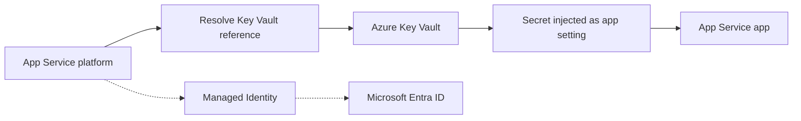

---
hide:
  - toc
content_sources:
  diagrams:
    - id: architecture
      type: flowchart
      source: mslearn-adapted
      mslearn_url: https://learn.microsoft.com/en-us/azure/app-service/app-service-key-vault-references
---

# Key Vault References

Key Vault references allow App Service to access secrets directly from Azure Key Vault through environment variables. This eliminates the need to store sensitive data in application settings and simplifies secret rotation.

## Overview

Azure App Service can automatically resolve secrets from Key Vault and inject them into your application's environment. This provides a central location for secret management and improves security by reducing the exposure of secrets in configuration files or the Azure Portal.

## Architecture

<!-- diagram-id: architecture -->


How to read this diagram: Solid arrows show runtime data flow. Dashed arrows show identity and authentication.

## Prerequisites

- **Managed Identity**: The app must have a system-assigned or user-assigned managed identity.
- **Azure Key Vault**: A vault containing the secrets you want to access.
- **Permissions**: The app's identity must have the **Key Vault Secrets User** RBAC role or an access policy with **Get** secret permissions on the vault.

## Setup Steps

### 1. Enable Managed Identity

Enable a system-assigned identity for your App Service:

```bash
az webapp identity assign \
  --name <app-name> \
  --resource-group <resource-group-name>
```

### 2. Grant Access to Key Vault

Assign the **Key Vault Secrets User** role to your app's service principal:

```bash
# Get the principalId from the identity assignment command above
PRINCIPAL_ID=$(az webapp identity show --name <app-name> --resource-group <resource-group-name> --query principalId --output tsv)

# Assign the role
az role assignment create \
  --assignee $PRINCIPAL_ID \
  --role "Key Vault Secrets User" \
  --scope /subscriptions/<subscription-id>/resourceGroups/<resource-group-name>/providers/Microsoft.KeyVault/vaults/<vault-name>
```

### 3. Add Secrets to Key Vault

If you don't have secrets yet, add one:

```bash
az keyvault secret set \
  --vault-name <vault-name> \
  --name "MySecret" \
  --value "super-secret-value"
```

### 4. Configure App Setting

Add a new application setting using the Key Vault reference syntax:

```bash
az webapp config appsettings set \
  --name <app-name> \
  --resource-group <resource-group-name> \
  --settings DB_PASSWORD="@Microsoft.KeyVault(SecretUri=https://<vault-name>.vault.azure.net/secrets/MySecret/)"
```

## Key Vault Reference Formats

You can use two different formats for the reference:

| Format | Example |
| :--- | :--- |
| **SecretUri** | `@Microsoft.KeyVault(SecretUri=https://myvault.vault.azure.net/secrets/mysecret/)` |
| **VaultName & SecretName** | `@Microsoft.KeyVault(VaultName=myvault;SecretName=mysecret)` |

For specific versions, append the version ID to the SecretUri or add `SecretVersion=id` to the name-based format.

## Verification

To check if the reference resolved correctly:

1. Go to the **Configuration** blade in the Azure Portal.
2. Look for a green checkmark next to the setting.
3. If it shows a red "X" or "Unable to resolve", check the identity permissions and the SecretUri syntax.

## Troubleshooting

- **403 Forbidden**: Ensure the identity has the correct RBAC role or access policy. RBAC changes can take up to 10 minutes to propagate.
- **Identity not found**: Verify that the app has managed identity enabled and that it's the same identity you granted access to in Key Vault.
- **Syntax Error**: Double-check the `@Microsoft.KeyVault(...)` syntax. Any missing parenthesis or semicolon will cause resolution to fail.

## Node.js Usage

Once configured, the secret is available as a standard environment variable. You don't need any special SDKs to read the secret value:

```javascript
const databasePassword = process.env.DB_PASSWORD;

if (!databasePassword) {
  console.error('DB_PASSWORD environment variable is not set');
}
```

## Advanced Topics

- **User-Assigned Identity**: If using a user-assigned identity, you must specify the identity's client ID in the reference or set the `keyVaultReferenceIdentity` property on the app.
- **Secret Rotation**: References without a specific version automatically track the latest version. It may take up to 24 hours for the app to pick up the new version.

## See Also
- [Managed Identity Recipe](./managed-identity.md)
- [Azure App Service Security Documentation](../../../operations/security.md)

## Sources
- [Official Azure Key Vault References documentation](https://learn.microsoft.com/azure/app-service/app-service-key-vault-references)
- [Use managed identity to access Key Vault from App Service (Microsoft Learn)](https://learn.microsoft.com/azure/app-service/tutorial-connect-msi-key-vault)
