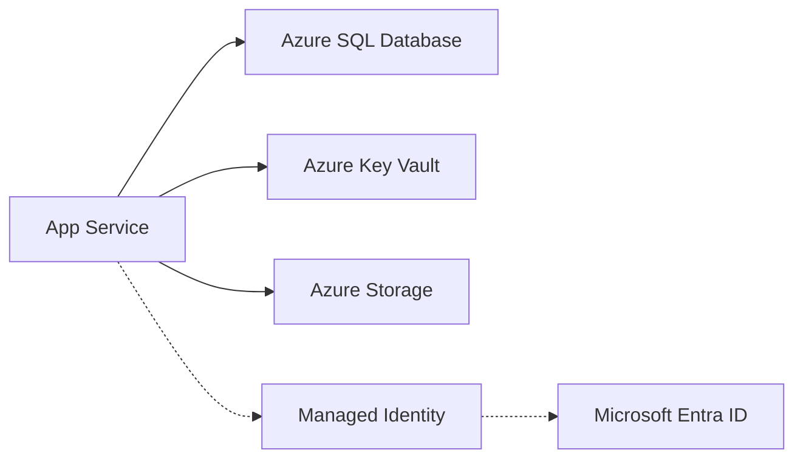

# Managed Identity for App Service

Managed Identity provides an automatically managed identity for Azure App Service to access other Azure resources like Key Vault, Storage, and SQL databases without needing secret management.

## Overview

Azure provides two types of managed identities:

| Identity Type | Usage Case | Life Cycle |
| :--- | :--- | :--- |
| **System-Assigned** | Simple use case, one app per identity. | Tied to the resource life cycle. |
| **User-Assigned** | Shared identity across multiple resources or for complex RBAC setups. | Independent life cycle, must be manually deleted. |

## Architecture



How to read this diagram: Solid arrows show runtime data flow. Dashed arrows show identity and authentication.

## Enable System-Assigned Identity

To enable identity on an existing App Service:

```bash
az webapp identity assign \
  --name $APP_NAME \
  --resource-group $RG \
  --output json
```

### CLI Output Example

```json
{
  "principalId": "xxxxxxxx-xxxx-xxxx-xxxx-xxxxxxxxxxxx",
  "tenantId": "xxxxxxxx-xxxx-xxxx-xxxx-xxxxxxxxxxxx",
  "type": "SystemAssigned"
}
```

The `principalId` is the unique identifier for this identity used in RBAC role assignments.

## Grant Access to Resources

Once the identity is enabled, grant it access to the target resource using the **Role Based Access Control (RBAC)** model.

### 1. Storage Account

Grant the **Storage Blob Data Contributor** role to read and write blobs:

```bash
az role assignment create \
  --assignee $PRINCIPAL_ID \
  --role "Storage Blob Data Contributor" \
  --scope /subscriptions/<sub-id>/resourceGroups/<rg-name>/providers/Microsoft.Storage/storageAccounts/<account-name>
```

### 2. Key Vault

Grant the **Key Vault Secrets User** role to retrieve secrets:

```bash
az role assignment create \
  --assignee $PRINCIPAL_ID \
  --role "Key Vault Secrets User" \
  --scope /subscriptions/<sub-id>/resourceGroups/<rg-name>/providers/Microsoft.KeyVault/vaults/<vault-name>
```

### 3. Azure SQL

For Azure SQL, you must use Azure AD authentication. Add the managed identity as a user in the database:

```sql
CREATE USER [my-app-name] FROM EXTERNAL PROVIDER;
ALTER ROLE db_datareader ADD MEMBER [my-app-name];
ALTER ROLE db_datawriter ADD MEMBER [my-app-name];
```

## Node.js SDK Usage

Use the `@azure/identity` package to authenticate with Azure services seamlessly:

```javascript
const { DefaultAzureCredential } = require('@azure/identity');
const { BlobServiceClient } = require('@azure/storage-blob');

// The credential automatically picks up the managed identity on App Service
const credential = new DefaultAzureCredential();

// Use the credential with any Azure SDK client
const blobClient = new BlobServiceClient(
  `https://${storageAccount}.blob.core.windows.net`,
  credential
);
```

## Local Development

`DefaultAzureCredential` works across different environments without code changes. In order of priority, it attempts to authenticate via:

1. **Environment Variables** (AZURE_CLIENT_ID, etc.)
2. **Managed Identity** (when running in Azure)
3. **Azure CLI** (when running locally)
4. **VS Code Azure Account**

For local development, run `az login` to allow the credential to use your CLI identity.

## Verification

To verify that the identity is working:

1. Use the Kudu console to check the identity endpoint:
    - `curl $MSI_ENDPOINT -H "Secret: $MSI_SECRET" -v`
2. Check the app's environment variables for `IDENTITY_ENDPOINT` and `IDENTITY_HEADER`.

## Troubleshooting

- **RBAC Propagation Delay**: Role assignments can take up to 10 minutes to take effect. If you get a 403 error immediately after granting access, wait a few minutes.
- **Wrong Identity on App**: If using multiple identities, ensure `AZURE_CLIENT_ID` is set to the client ID of the user-assigned identity you want `DefaultAzureCredential` to use.
- **Environment Conflicts**: Ensure you don't have conflicting Azure credentials in your local environment variables.

## Advanced Topics

- **User-Assigned Identity Setup**: Use `az identity create` and then `az webapp identity assign --identities <id>`.
- **Token Exchange**: You can manually request tokens for non-Azure AD resources using the identity endpoint if needed.

## See Also
- [Key Vault Reference Recipe](./key-vault-reference.md)

## Sources
- [Official Managed Identity Overview](https://learn.microsoft.com/azure/app-service/overview-managed-identity)
- [DefaultAzureCredential Reference](https://learn.microsoft.com/javascript/api/@azure/identity/defaultazurecredential)
