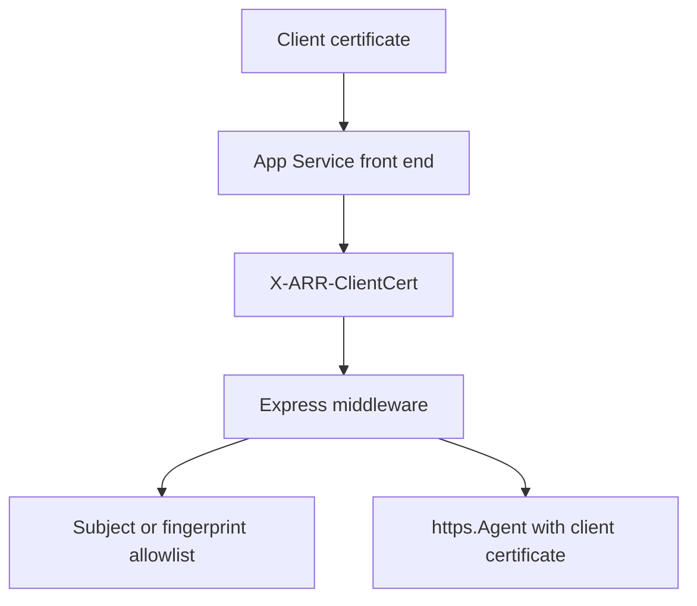

---
content_sources:
  diagrams:
    - id: nodejs-mtls-client-certificate-flow
      type: flowchart
      source: mslearn-adapted
      mslearn_url: https://learn.microsoft.com/en-us/azure/app-service/app-service-web-configure-tls-mutual-auth
      based_on:
        - https://learn.microsoft.com/en-us/azure/app-service/configure-ssl-certificate-in-code
---

# mTLS Client Certificates

Use Express middleware to parse `X-ARR-ClientCert`, validate the forwarded client certificate with `X509Certificate`, and attach a client certificate to outbound HTTPS calls through `https.Agent`.

<!-- diagram-id: nodejs-mtls-client-certificate-flow -->


## Prerequisites

- Node.js 20 or later on Azure App Service
- `clientCertEnabled=true` on the site
- A private certificate loaded for outbound calls when required

`package.json` dependencies:

```json
{
  "dependencies": {
    "express": "^4.21.0"
  }
}
```

## What You'll Build

- Express middleware that parses `X-ARR-ClientCert`
- Validation by SHA-1 thumbprint or subject CN
- Outbound HTTPS call using the App Service-provided PKCS#12 file from `/var/ssl/private/`

## Steps

### 1. Add middleware and routes

```javascript
const crypto = require('crypto');
const fs = require('fs');
const https = require('https');
const express = require('express');

const app = express();
const port = process.env.PORT || 3000;

const allowedCommonNames = new Set(
  (process.env.ALLOWED_CLIENT_CERT_COMMON_NAMES || 'api-client.contoso.com')
    .split(',')
    .map((value) => value.trim())
    .filter(Boolean)
);

const allowedThumbprints = new Set(
  (process.env.ALLOWED_CLIENT_CERT_THUMBPRINTS || '')
    .split(',')
    .map((value) => value.trim().toUpperCase())
    .filter(Boolean)
);

function parseClientCertificate(req) {
  const headerValue = req.header('X-ARR-ClientCert');
  if (!headerValue) {
    return null;
  }

  const pem = [
    '-----BEGIN CERTIFICATE-----',
    headerValue,
    '-----END CERTIFICATE-----',
    ''
  ].join('\n');

  const certificate = new crypto.X509Certificate(pem);
  const fingerprint = certificate.fingerprint.replace(/:/g, '').toUpperCase();
  const commonNameMatch = certificate.subject.match(/CN=([^,]+)/);
  const commonName = commonNameMatch ? commonNameMatch[1] : null;

  return {
    pem,
    fingerprint,
    commonName,
    validFrom: certificate.validFrom,
    validTo: certificate.validTo
  };
}

function requireKnownClientCertificate(req, res, next) {
  if (req.path === '/health') {
    return next();
  }

  const clientCertificate = parseClientCertificate(req);
  if (!clientCertificate) {
    return res.status(403).json({ error: 'client certificate header missing' });
  }

  if (allowedThumbprints.size > 0 && allowedThumbprints.has(clientCertificate.fingerprint)) {
    req.clientCertificate = clientCertificate;
    return next();
  }

  if (clientCertificate.commonName && allowedCommonNames.has(clientCertificate.commonName)) {
    req.clientCertificate = clientCertificate;
    return next();
  }

  return res.status(403).json({ error: 'client certificate is not allowlisted' });
}

app.use(requireKnownClientCertificate);

app.get('/health', (_req, res) => {
  res.json({ status: 'ok' });
});

app.get('/cert-info', (req, res) => {
  res.json(req.clientCertificate);
});

app.get('/outbound-mtls', async (_req, res, next) => {
  try {
    const pfxPath = process.env.OUTBOUND_CLIENT_CERT_PATH || '/var/ssl/private/<thumbprint>.p12';
    const pfxPassword = process.env.OUTBOUND_CLIENT_CERT_PASSWORD || '';
    const targetUrl = new URL(process.env.REMOTE_API_URL || 'https://api.contoso.com/health');

    const agent = new https.Agent({
      pfx: fs.readFileSync(pfxPath),
      passphrase: pfxPassword || undefined,
      rejectUnauthorized: true
    });

    const responseBody = await new Promise((resolve, reject) => {
      const request = https.get(
        targetUrl,
        { agent },
        (response) => {
          let body = '';
          response.on('data', (chunk) => { body += chunk; });
          response.on('end', () => resolve({ statusCode: response.statusCode, body }));
        }
      );

      request.on('error', reject);
    });

    res.json(responseBody);
  } catch (error) {
    next(error);
  }
});

app.use((error, _req, res, _next) => {
  res.status(500).json({ error: error.message });
});

app.listen(port, () => {
  console.log(`Server listening on ${port}`);
});
```

### 2. Configure environment variables

```bash
az webapp config appsettings set \
  --resource-group $RG \
  --name $APP_NAME \
  --settings \
    ALLOWED_CLIENT_CERT_COMMON_NAMES="api-client.contoso.com,partner-gateway.contoso.com" \
    ALLOWED_CLIENT_CERT_THUMBPRINTS="" \
    OUTBOUND_CLIENT_CERT_PATH="/var/ssl/private/<thumbprint>.p12" \
    OUTBOUND_CLIENT_CERT_PASSWORD="<certificate-password>" \
    REMOTE_API_URL="https://api.contoso.com/health" \
  --output json
```

### 3. Test with curl

```bash
curl --include \
  --cert ./client.pem \
  --key ./client.key \
  "https://$APP_NAME.azurewebsites.net/cert-info"
```

## Verification

- `/cert-info` returns the certificate fingerprint or CN for an allowlisted caller
- A caller without an allowlisted certificate receives `403`
- `/outbound-mtls` succeeds only when the PKCS#12 file exists under `/var/ssl/private/`, the password is correct, and the downstream service trusts the certificate

## Next Steps / Clean Up

- Replace CN-only checks with issuer and SAN validation
- Centralize certificate validation in a dedicated middleware module
- Remove or lock down diagnostics endpoints after rollout validation

## See Also

- [Incoming Client Certificates](../../../operations/incoming-client-certificates.md)
- [Outbound Client Certificates](../../../operations/outbound-client-certificates.md)
- [Easy Auth](./easy-auth.md)

## Sources

- [Set up TLS mutual authentication for Azure App Service (Microsoft Learn)](https://learn.microsoft.com/en-us/azure/app-service/app-service-web-configure-tls-mutual-auth)
- [Use TLS/SSL certificates in your application code in Azure App Service (Microsoft Learn)](https://learn.microsoft.com/en-us/azure/app-service/configure-ssl-certificate-in-code)
