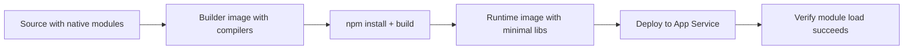

# Native Dependencies

This recipe explains how to manage native Node.js modules like `sharp` and `bcrypt` on Azure App Service using multi-stage Docker builds.



## Overview

Native modules contain C/C++ code that must be compiled for the target operating system and architecture. When deploying to Azure App Service (Linux), compiling these locally (e.g., on Windows or macOS) can result in runtime errors like `ELF header invalid`.

## Prerequisites

- Azure App Service (Linux)
- Docker Desktop (for building custom containers)

## Implementation

### 1. Build-time vs Runtime Dependencies

Some modules (like `sharp`) require system-level libraries during compilation and execution.

- **sharp**: Requires `libvips` and related development headers.
- **bcrypt**: Requires `python3`, `make`, and `g++` for compilation.

### 2. Multi-stage Docker Build for Native Modules

A multi-stage build allows you to use a heavy build image with all the compilation tools and copy only the final artifacts to a slim runtime image.

```dockerfile
# Stage 1: Build
FROM node:20-bookworm AS builder
WORKDIR /app

# Install compilation tools
RUN apt-get update && apt-get install -y \
    build-essential \
    python3 \
    libvips-dev \
    && rm -rf /var/lib/apt/lists/*

COPY package*.json ./
RUN npm install --include=dev

COPY . .
RUN npm run build

# Stage 2: Runtime
FROM node:20-bookworm-slim
WORKDIR /app

# Install runtime-only library dependencies (e.g., for sharp)
RUN apt-get update && apt-get install -y \
    libvips \
    && rm -rf /var/lib/apt/lists/*

# Copy only the production node_modules and built assets
COPY --from=builder /app/node_modules ./node_modules
COPY --from=builder /app/dist ./dist

EXPOSE 8080
CMD ["node", "dist/index.js"]
```

### 3. Alternative for Zip Deployments

If you are not using containers and instead using Zip Deploy, ensure you use **Remote Build** so the compilation happens on the Linux App Service server. Set `SCM_DO_BUILD_DURING_DEPLOYMENT=true` in App Settings, then deploy:

```bash
az webapp deploy --resource-group $RG --name $APP_NAME --src-path <zip-file> --type zip --output json
```

## Verification

After deployment, test functionality by triggering an image resize with `sharp` or a password hash with `bcrypt`.

```bash
# Log into the App Service SSH terminal and check for errors
# https://${APP_NAME}.scm.azurewebsites.net/webssh/host
node -e "require('sharp')"
node -e "require('bcrypt')"
```

## Troubleshooting

- **Error: ELF header invalid**: This usually means the module was compiled on a different OS (e.g., Windows) and copied to Linux. Re-run `npm install` on the target platform or use Docker.
- **Missing shared libraries (.so files)**: If `sharp` fails with `libvips.so.42 not found`, ensure you installed the runtime dependencies (`libvips`) in your Dockerfile.
- **Compilation Failures**: Ensure the build stage has `build-essential`, `python3`, and `make`.

---

## Advanced Topics

!!! info "Coming Soon"
    - [Pre-built binaries](https://github.com/yeongseon/azure-app-service-practical-guide/issues)
    - [Alpine compatibility](https://github.com/yeongseon/azure-app-service-practical-guide/issues)
    - [Contribute](https://github.com/yeongseon/azure-app-service-practical-guide/issues)

## See Also
- [Custom Container](./custom-container.md)
- [Next.js on App Service](./nextjs.md)
- [How App Service Works](../../../platform/how-app-service-works.md)

## Sources
- [Configure Node.js on Azure App Service (Microsoft Learn)](https://learn.microsoft.com/azure/app-service/configure-language-nodejs)
- [Run a custom Linux container in App Service (Microsoft Learn)](https://learn.microsoft.com/azure/app-service/tutorial-custom-container)
