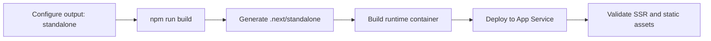

# Next.js on App Service

This recipe covers deploying a Next.js application to Azure App Service using the standalone build feature and SSR configuration.



## Overview

Next.js is a popular React framework that supports both client-side and server-side rendering (SSR). For optimal performance and resource usage on Azure App Service, the **standalone** build mode is highly recommended.

## Prerequisites

- Next.js 12+ (standalone mode requires Next.js 12 or newer)
- Azure App Service (Linux) with Node.js 18+

## Implementation

### 1. Standalone Build Configuration

Enable standalone mode in your `next.config.js` or `next.config.mjs` file:

```javascript
/** @type {import('next').NextConfig} */
const nextConfig = {
  output: 'standalone',
  // Optional: Add other configurations like images or localized routing
};

module.exports = nextConfig;
```

### 2. Standalone Build Script

When you run `npm run build`, Next.js will generate a `.next/standalone` folder that contains only the files needed for production deployment, significantly reducing your bundle size.

### 3. Dockerfile for Next.js Standalone

Using a Dockerfile is the most reliable way to deploy Next.js standalone.

```dockerfile
# Stage 1: Build
FROM node:20-alpine AS builder
WORKDIR /app
COPY package*.json ./
RUN npm install
COPY . .
RUN npm run build

# Stage 2: Runtime
FROM node:20-alpine AS runner
WORKDIR /app
ENV NODE_ENV production

# Don't run as root
RUN addgroup --system --gid 1001 nodejs \
    && adduser --system --uid 1001 nextjs

# Copy standalone build artifacts
COPY --from=builder /app/public ./public
COPY --from=builder --chown=nextjs:nodejs /app/.next/standalone ./
COPY --from=builder --chown=nextjs:nodejs /app/.next/static ./.next/static

USER nextjs

EXPOSE 3000
ENV PORT 3000

# Next.js standalone entrypoint
CMD ["node", "server.js"]
```

### 4. Static File Handling and Environment Variables

- **Static files**: Next.js automatically serves static files from the `public` folder and `.next/static`. 
- **Environment variables**: Public variables (`NEXT_PUBLIC_*`) are baked into the build. Private variables (e.g., `DATABASE_URL`) should be set as **App Settings** in the Azure portal and accessed in your `getServerSideProps` or `getStaticProps` functions.

## Verification

1. Deploy the container and browse to the URL.
2. Check the **Web App logs** to see the Next.js server starting:
   ```bash
    az webapp log tail --name $APP_NAME --resource-group $RG
   ```

## Troubleshooting

- **404 for static assets**: Ensure you copied both the `public` and `.next/static` folders into the runtime image correctly.
- **Port issues**: Azure App Service redirects traffic to port 80/443. Ensure your `server.js` listens on the port specified by the `PORT` environment variable (default is 3000).
- **SSR latency**: Use **VNET integration** to connect your App Service to downstream resources (e.g., Azure SQL, Redis) for lower latency in SSR data fetching.

---

## Advanced Topics

!!! info "Coming Soon"
    - [ISR on App Service](https://github.com/yeongseon/azure-app-service-practical-guide/issues)
    - [Edge middleware](https://github.com/yeongseon/azure-app-service-practical-guide/issues)
    - [Contribute](https://github.com/yeongseon/azure-app-service-practical-guide/issues)

## See Also
- [Custom Container](./custom-container.md)
- [Redis Cache for Sessions](./redis.md)
- [Logging & Monitoring Tutorial](../04-logging-monitoring.md)

## Sources
- [Deploy Next.js hybrid apps to Azure Static Web Apps (Microsoft Learn)](https://learn.microsoft.com/azure/static-web-apps/deploy-nextjs-hybrid)
- [Configure Node.js on Azure App Service (Microsoft Learn)](https://learn.microsoft.com/azure/app-service/configure-language-nodejs)
