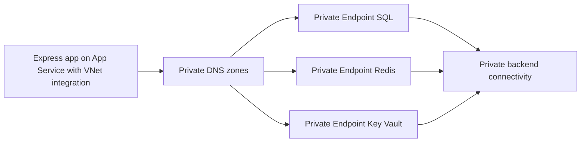

---
content_sources:
  diagrams:
    - id: private-endpoints
      type: flowchart
      source: mslearn-adapted
      mslearn_url: https://learn.microsoft.com/en-us/azure/app-service/networking/private-endpoint
---

# Private Endpoints

Connect an Express app on App Service to SQL, Redis, and Key Vault over private endpoints while preserving standard Azure service DNS names.

<!-- diagram-id: private-endpoints -->


## Prerequisites

- App Service Plan tier that supports VNet integration
- Virtual network with integration and private endpoint subnets
- Azure SQL, Redis, and Key Vault resources ready for private endpoint

## Main Content

### 1) Prepare subnet and DNS architecture

Recommended layout:

- `snet-appservice-integration` for VNet integration
- `snet-private-endpoints` for private endpoint NICs
- Private DNS zones linked to the VNet

### 2) Enable VNet integration for the app

```bash
az webapp vnet-integration add \
  --resource-group "$RG" \
  --name "$APP_NAME" \
  --vnet "$VNET_NAME" \
  --subnet "snet-appservice-integration" \
  --output json
```

### 3) Create private endpoint for Azure SQL

```bash
az network private-endpoint create \
  --resource-group "$RG" \
  --name "pe-sql-node" \
  --vnet-name "$VNET_NAME" \
  --subnet "snet-private-endpoints" \
  --private-connection-resource-id "/subscriptions/<subscription-id>/resourceGroups/<sql-rg>/providers/Microsoft.Sql/servers/<sql-server>" \
  --group-id sqlServer \
  --connection-name "pe-sql-node-conn" \
  --output json
```

### 4) Create private endpoints for Redis and Key Vault

```bash
az network private-endpoint create \
  --resource-group "$RG" \
  --name "pe-redis-node" \
  --vnet-name "$VNET_NAME" \
  --subnet "snet-private-endpoints" \
  --private-connection-resource-id "/subscriptions/<subscription-id>/resourceGroups/<redis-rg>/providers/Microsoft.Cache/Redis/<redis-name>" \
  --group-id redisCache \
  --connection-name "pe-redis-node-conn" \
  --output json

az network private-endpoint create \
  --resource-group "$RG" \
  --name "pe-kv-node" \
  --vnet-name "$VNET_NAME" \
  --subnet "snet-private-endpoints" \
  --private-connection-resource-id "/subscriptions/<subscription-id>/resourceGroups/<kv-rg>/providers/Microsoft.KeyVault/vaults/<kv-name>" \
  --group-id vault \
  --connection-name "pe-kv-node-conn" \
  --output json
```

### 5) Configure environment variables for Express app

```bash
az webapp config appsettings set \
  --resource-group "$RG" \
  --name "$APP_NAME" \
  --settings \
    SQL_SERVER_FQDN="<sql-server>.database.windows.net" \
    SQL_DATABASE_NAME="<db-name>" \
    REDIS_HOST="<redis-name>.redis.cache.windows.net" \
    REDIS_PORT="6380" \
    KEY_VAULT_URI="https://<kv-name>.vault.azure.net/" \
  --output json
```

### 6) Use `process.env`, `@azure/identity`, `mssql`, and `ioredis`

```javascript
const sql = require("mssql");
const Redis = require("ioredis");
const { DefaultAzureCredential } = require("@azure/identity");

const credential = new DefaultAzureCredential();

async function openSqlConnection() {
  const tokenResponse = await credential.getToken("https://database.windows.net/.default");
  return sql.connect({
    server: process.env.SQL_SERVER_FQDN,
    database: process.env.SQL_DATABASE_NAME,
    options: {
      encrypt: true,
    },
    authentication: {
      type: "azure-active-directory-access-token",
      options: {
        token: tokenResponse.token,
      },
    },
  });
}

const redisClient = new Redis({
  host: process.env.REDIS_HOST,
  port: Number(process.env.REDIS_PORT),
  tls: {},
});
```

### 7) Link required private DNS zones

Ensure links exist for:

- `privatelink.database.windows.net`
- `privatelink.redis.cache.windows.net`
- `privatelink.vaultcore.azure.net`

### 8) Add CI networking validation step

```yaml
- name: Validate private endpoint state
  run: |
    az network private-endpoint list \
      --resource-group "$RG" \
      --output table
```

!!! warning "Private endpoint setup requires DNS correctness"
    Most incidents are caused by missing or incorrect private DNS links.
    Validate name resolution before debugging Express application code.

## Verification

1. Confirm app has VNet integration.
2. Confirm each private endpoint is in `Approved` state.
3. Confirm SQL, Redis, and Key Vault hostnames resolve to private IP addresses.

```bash
az webapp vnet-integration list \
  --resource-group "$RG" \
  --name "$APP_NAME" \
  --output table
```

## Troubleshooting

### SQL login timeout or socket errors

- Verify NSG allows outbound 1433 from integration subnet.
- Confirm SQL private endpoint approval and firewall settings.
- Check token acquisition with managed identity.

### Redis connection reset or timeout

- Confirm private DNS resolves Redis hostname to private IP.
- Verify Redis TLS port 6380 is reachable.

### Key Vault calls fail intermittently

- Validate route table and DNS path for `vault.azure.net` via private link.
- Check App Service managed identity permissions on Key Vault.

## See Also

- [Azure SQL](azure-sql.md)
- [Redis Cache](redis.md)
- [VNet Integration](vnet-integration.md)
- [Platform: Networking](../../../platform/networking.md)

## Sources

- [Use private endpoints for Azure App Service apps](https://learn.microsoft.com/en-us/azure/app-service/networking/private-endpoint)
- [Integrate your app with an Azure virtual network](https://learn.microsoft.com/en-us/azure/app-service/configure-vnet-integration-enable)
- [Tutorial: Connect to Azure SQL Database from Node.js on App Service without secrets using a managed identity](https://learn.microsoft.com/en-us/azure/app-service/tutorial-connect-msi-azure-database)
