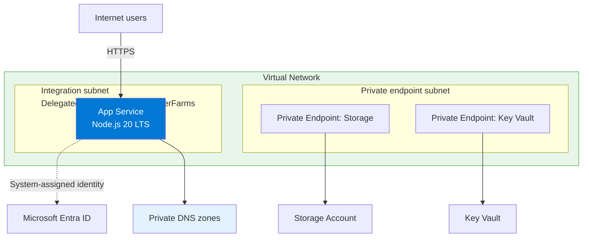
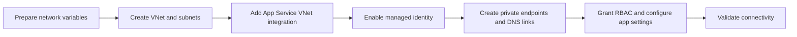

---
hide:
  - toc
content_sources:
  diagrams:
    - id: private-network-deploy
      type: flowchart
      source: self-generated
      justification: "Synthesized from Microsoft Learn guidance for App Service VNet integration, private endpoints, managed identity, and the Node.js quickstart to consolidate the advanced deployment path that was previously embedded in 02-first-deploy.md."
      based_on:
        - https://learn.microsoft.com/en-us/azure/app-service/configure-vnet-integration-enable
        - https://learn.microsoft.com/en-us/azure/app-service/networking/private-endpoint
        - https://learn.microsoft.com/en-us/azure/app-service/overview-managed-identity
        - https://learn.microsoft.com/en-us/azure/app-service/tutorial-connect-msi-azure-database
    - id: private-network-flow
      type: flowchart
      source: self-generated
      justification: "Summarizes the advanced deployment sequence by combining Microsoft Learn networking and identity setup steps for App Service."
      based_on:
        - https://learn.microsoft.com/en-us/azure/app-service/configure-vnet-integration-enable
        - https://learn.microsoft.com/en-us/azure/app-service/networking/private-endpoint
        - https://learn.microsoft.com/en-us/azure/app-service/overview-managed-identity
---

# Private Network Deploy

Use this recipe after [02. First Deploy](../02-first-deploy.md) when the app must reach Azure services through VNet integration, private endpoints, and managed identity.

<!-- diagram-id: private-network-deploy -->


## Overview

<!-- diagram-id: private-network-flow -->


## Prerequisites

- Completed [02. First Deploy](../02-first-deploy.md)
- Azure CLI authenticated with permission to manage networking and RBAC
- Existing Node.js App Service app
- App Service plan tier that supports VNet integration

## Main Content

### Step 1: Set advanced deployment variables

```bash
RG="rg-express-tutorial"
LOCATION="koreacentral"
APP_NAME="app-express-tutorial-abc123"
VNET_NAME="vnet-express-tutorial"
INTEGRATION_SUBNET_NAME="snet-appsvc-integration"
PE_SUBNET_NAME="snet-private-endpoints"
STORAGE_NAME="stexpresstutorialabc123"
KEY_VAULT_NAME="kv-express-tutorial-abc123"
```

| Command/Code | Purpose |
|--------------|---------|
| `RG`, `LOCATION`, `APP_NAME` | Reuse the deployed app and its resource group context. |
| `VNET_NAME`, `INTEGRATION_SUBNET_NAME`, `PE_SUBNET_NAME` | Define the virtual network and the two required subnet roles. |
| `STORAGE_NAME`, `KEY_VAULT_NAME` | Name the private backend services used in this recipe. |

### Step 2: Create the VNet and required subnets

```bash
az network vnet create --resource-group $RG --name $VNET_NAME --location $LOCATION --address-prefixes 10.0.0.0/16
az network vnet subnet create --resource-group $RG --vnet-name $VNET_NAME --name $INTEGRATION_SUBNET_NAME --address-prefixes 10.0.1.0/24 --delegations Microsoft.Web/serverFarms
az network vnet subnet create --resource-group $RG --vnet-name $VNET_NAME --name $PE_SUBNET_NAME --address-prefixes 10.0.2.0/24 --disable-private-endpoint-network-policies true
```

| Command/Code | Purpose |
|--------------|---------|
| `az network vnet create --resource-group $RG --name $VNET_NAME --location $LOCATION --address-prefixes 10.0.0.0/16` | Creates the virtual network for the advanced deployment. |
| `az network vnet subnet create --resource-group $RG --vnet-name $VNET_NAME --name $INTEGRATION_SUBNET_NAME --address-prefixes 10.0.1.0/24 --delegations Microsoft.Web/serverFarms` | Creates the delegated subnet used by App Service VNet integration. |
| `az network vnet subnet create --resource-group $RG --vnet-name $VNET_NAME --name $PE_SUBNET_NAME --address-prefixes 10.0.2.0/24 --disable-private-endpoint-network-policies true` | Creates a dedicated subnet for private endpoints. |

### Step 3: Integrate the web app with the VNet

```bash
az webapp vnet-integration add --resource-group $RG --name $APP_NAME --vnet $VNET_NAME --subnet $INTEGRATION_SUBNET_NAME
```

| Command/Code | Purpose |
|--------------|---------|
| `az webapp vnet-integration add --resource-group $RG --name $APP_NAME --vnet $VNET_NAME --subnet $INTEGRATION_SUBNET_NAME` | Routes outbound app traffic through the delegated integration subnet. |

### Step 4: Enable system-assigned managed identity

```bash
az webapp identity assign --resource-group $RG --name $APP_NAME
```

| Command/Code | Purpose |
|--------------|---------|
| `az webapp identity assign --resource-group $RG --name $APP_NAME` | Enables a system-assigned managed identity for the web app. |

### Step 5: Create backend services and private endpoints

```bash
az storage account create --resource-group $RG --name $STORAGE_NAME --location $LOCATION --sku Standard_LRS --kind StorageV2
az keyvault create --resource-group $RG --name $KEY_VAULT_NAME --location $LOCATION --sku standard
STORAGE_ID="$(az storage account show --resource-group $RG --name $STORAGE_NAME --query id --output tsv)"
KEY_VAULT_ID="$(az keyvault show --resource-group $RG --name $KEY_VAULT_NAME --query id --output tsv)"
az network private-endpoint create --resource-group $RG --name pe-storage-blob --vnet-name $VNET_NAME --subnet $PE_SUBNET_NAME --private-connection-resource-id $STORAGE_ID --group-id blob --connection-name pe-storage-blob-connection
az network private-endpoint create --resource-group $RG --name pe-keyvault --vnet-name $VNET_NAME --subnet $PE_SUBNET_NAME --private-connection-resource-id $KEY_VAULT_ID --group-id vault --connection-name pe-keyvault-connection
```

| Command/Code | Purpose |
|--------------|---------|
| `az storage account create --resource-group $RG --name $STORAGE_NAME --location $LOCATION --sku Standard_LRS --kind StorageV2` | Creates a storage account that the app will reach through a private endpoint. |
| `az keyvault create --resource-group $RG --name $KEY_VAULT_NAME --location $LOCATION --sku standard` | Creates a Key Vault for secret access over private networking. |
| `STORAGE_ID="$(az storage account show --resource-group $RG --name $STORAGE_NAME --query id --output tsv)"` | Captures the storage account resource ID for private endpoint creation. |
| `KEY_VAULT_ID="$(az keyvault show --resource-group $RG --name $KEY_VAULT_NAME --query id --output tsv)"` | Captures the Key Vault resource ID for private endpoint creation. |
| `az network private-endpoint create --resource-group $RG --name pe-storage-blob --vnet-name $VNET_NAME --subnet $PE_SUBNET_NAME --private-connection-resource-id $STORAGE_ID --group-id blob --connection-name pe-storage-blob-connection` | Creates a private endpoint for Azure Storage blob access. |
| `az network private-endpoint create --resource-group $RG --name pe-keyvault --vnet-name $VNET_NAME --subnet $PE_SUBNET_NAME --private-connection-resource-id $KEY_VAULT_ID --group-id vault --connection-name pe-keyvault-connection` | Creates a private endpoint for Key Vault access. |

### Step 6: Create private DNS zones and link them to the VNet

```bash
az network private-dns zone create --resource-group $RG --name privatelink.blob.core.windows.net
az network private-dns zone create --resource-group $RG --name privatelink.vaultcore.azure.net
az network private-dns link vnet create --resource-group $RG --zone-name privatelink.blob.core.windows.net --name link-storage-dns --virtual-network $VNET_NAME --registration-enabled false
az network private-dns link vnet create --resource-group $RG --zone-name privatelink.vaultcore.azure.net --name link-keyvault-dns --virtual-network $VNET_NAME --registration-enabled false
az network private-endpoint dns-zone-group create --resource-group $RG --endpoint-name pe-storage-blob --name storage-zone-group --private-dns-zone privatelink.blob.core.windows.net --zone-name blob
az network private-endpoint dns-zone-group create --resource-group $RG --endpoint-name pe-keyvault --name keyvault-zone-group --private-dns-zone privatelink.vaultcore.azure.net --zone-name vault
```

| Command/Code | Purpose |
|--------------|---------|
| `az network private-dns zone create --resource-group $RG --name privatelink.blob.core.windows.net` | Creates the private DNS zone for Azure Storage blob endpoints. |
| `az network private-dns zone create --resource-group $RG --name privatelink.vaultcore.azure.net` | Creates the private DNS zone for Key Vault endpoints. |
| `az network private-dns link vnet create --resource-group $RG --zone-name privatelink.blob.core.windows.net --name link-storage-dns --virtual-network $VNET_NAME --registration-enabled false` | Links the storage private DNS zone to the VNet. |
| `az network private-dns link vnet create --resource-group $RG --zone-name privatelink.vaultcore.azure.net --name link-keyvault-dns --virtual-network $VNET_NAME --registration-enabled false` | Links the Key Vault private DNS zone to the VNet. |
| `az network private-endpoint dns-zone-group create --resource-group $RG --endpoint-name pe-storage-blob --name storage-zone-group --private-dns-zone privatelink.blob.core.windows.net --zone-name blob` | Associates the storage private endpoint with its private DNS zone. |
| `az network private-endpoint dns-zone-group create --resource-group $RG --endpoint-name pe-keyvault --name keyvault-zone-group --private-dns-zone privatelink.vaultcore.azure.net --zone-name vault` | Associates the Key Vault private endpoint with its private DNS zone. |

### Step 7: Grant RBAC and configure app settings

```bash
PRINCIPAL_ID="$(az webapp identity show --resource-group $RG --name $APP_NAME --query principalId --output tsv)"
az role assignment create --assignee-object-id $PRINCIPAL_ID --assignee-principal-type ServicePrincipal --role "Storage Blob Data Contributor" --scope $STORAGE_ID
az role assignment create --assignee-object-id $PRINCIPAL_ID --assignee-principal-type ServicePrincipal --role "Key Vault Secrets User" --scope $KEY_VAULT_ID
az webapp config appsettings set --resource-group $RG --name $APP_NAME --settings STORAGE_ACCOUNT_URL="https://$STORAGE_NAME.blob.core.windows.net" KEY_VAULT_URI="https://$KEY_VAULT_NAME.vault.azure.net/"
```

| Command/Code | Purpose |
|--------------|---------|
| `PRINCIPAL_ID="$(az webapp identity show --resource-group $RG --name $APP_NAME --query principalId --output tsv)"` | Retrieves the managed identity object ID used for role assignments. |
| `az role assignment create --assignee-object-id $PRINCIPAL_ID --assignee-principal-type ServicePrincipal --role "Storage Blob Data Contributor" --scope $STORAGE_ID` | Grants the app permission to read and write blobs without secrets. |
| `az role assignment create --assignee-object-id $PRINCIPAL_ID --assignee-principal-type ServicePrincipal --role "Key Vault Secrets User" --scope $KEY_VAULT_ID` | Grants the app permission to read secrets from Key Vault. |
| `az webapp config appsettings set --resource-group $RG --name $APP_NAME --settings STORAGE_ACCOUNT_URL="https://$STORAGE_NAME.blob.core.windows.net" KEY_VAULT_URI="https://$KEY_VAULT_NAME.vault.azure.net/"` | Exposes the standard service hostnames to the Node.js app as environment variables. |

### Step 8: Use managed identity in Node.js and validate

```javascript
const { DefaultAzureCredential } = require("@azure/identity");
const { BlobServiceClient } = require("@azure/storage-blob");
const { SecretClient } = require("@azure/keyvault-secrets");

const credential = new DefaultAzureCredential();

const blobServiceClient = new BlobServiceClient(process.env.STORAGE_ACCOUNT_URL, credential);
const secretClient = new SecretClient(process.env.KEY_VAULT_URI, credential);
```

```bash
az webapp vnet-integration list --resource-group $RG --name $APP_NAME --output table
az network private-endpoint list --resource-group $RG --output table
```

| Command/Code | Purpose |
|--------------|---------|
| `DefaultAzureCredential()` | Uses the App Service managed identity in Azure without storing credentials in code. |
| `BlobServiceClient(process.env.STORAGE_ACCOUNT_URL, credential)` | Connects to Azure Storage through the standard blob hostname and managed identity. |
| `SecretClient(process.env.KEY_VAULT_URI, credential)` | Connects to Key Vault through the standard vault hostname and managed identity. |
| `az webapp vnet-integration list --resource-group $RG --name $APP_NAME --output table` | Confirms the app is attached to the expected VNet subnet. |
| `az network private-endpoint list --resource-group $RG --output table` | Confirms the private endpoints are provisioned and approved. |

## Verification

- `az webapp vnet-integration list` shows the expected VNet and delegated subnet.
- `az network private-endpoint list` shows private endpoints in a healthy state.
- The app can use `DefaultAzureCredential` to reach Storage and Key Vault without secrets.
- Storage and Key Vault hostnames resolve through the linked private DNS zones.

## Troubleshooting

### Private endpoint exists but the app still uses public resolution

- Confirm the private DNS zones are linked to the same VNet used for App Service integration.
- Verify the private endpoint DNS zone groups were created successfully.

### Managed identity requests return `403`

- Wait a few minutes for RBAC propagation.
- Verify the role assignments target the correct `principalId` and resource scope.

### App cannot connect after VNet integration

- Confirm the integration subnet is delegated to `Microsoft.Web/serverFarms`.
- Review NSG and route table rules if your VNet uses custom egress controls.

## See Also

- [VNet Integration](./vnet-integration.md)
- [Private Endpoints](./private-endpoints.md)
- [Managed Identity](./managed-identity.md)
- [Key Vault References](./key-vault-reference.md)

## Sources

- [Integrate your app with an Azure virtual network](https://learn.microsoft.com/en-us/azure/app-service/configure-vnet-integration-enable)
- [Use private endpoints for Azure App Service apps](https://learn.microsoft.com/en-us/azure/app-service/networking/private-endpoint)
- [Use managed identities for App Service and Azure Functions](https://learn.microsoft.com/en-us/azure/app-service/overview-managed-identity)
- [Tutorial: Connect to Azure SQL Database from Node.js on App Service without secrets using a managed identity](https://learn.microsoft.com/en-us/azure/app-service/tutorial-connect-msi-azure-database)
