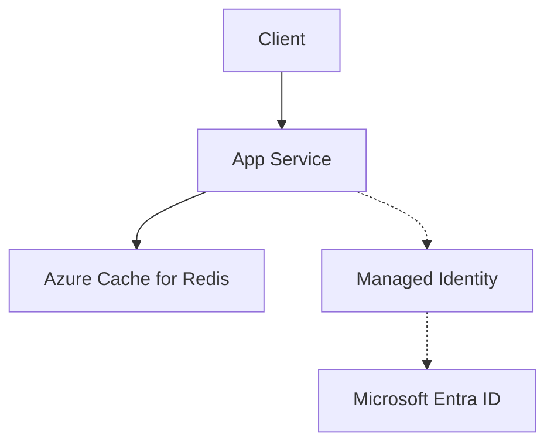

---
content_sources:
  diagrams:
    - id: architecture
      type: flowchart
      source: mslearn-adapted
      mslearn_url: https://learn.microsoft.com/en-us/azure/azure-cache-for-redis/cache-python-get-started
---

# Azure Cache for Redis Integration

This recipe shows how to integrate Azure Cache for Redis with a Node.js Express application for session storage and data caching.

## Overview

Redis is an in-memory data store frequently used as a cache or session provider. On Azure App Service, a shared session state (via Redis) is required if you are using multiple instances (scale-out) or need persistent sessions during redeployments.

## Architecture

<!-- diagram-id: architecture -->


How to read this diagram: Solid arrows show runtime data flow. Dashed arrows show identity and authentication.

## Prerequisites

- Azure Cache for Redis instance
- Azure App Service with Node.js
- Access key or connection string for the Redis instance

## Implementation

### 1. Install Dependencies

```bash
npm install ioredis express-session connect-redis
```

### 2. Basic Redis Setup

```javascript
const Redis = require('ioredis');

// Connect using REDIS_CONNECTION_STRING from App Service configuration
const redisClient = new Redis(process.env.REDIS_CONNECTION_STRING, {
  tls: {
    // Azure Cache for Redis uses valid TLS certificates;
    // the default (rejectUnauthorized: true) is correct and secure.
  },
  // Ensure the connection is kept alive
  keepAlive: 1000,
  retryStrategy: (times) => Math.min(times * 50, 2000)
});

redisClient.on('error', (err) => console.error('Redis Client Error', err));

module.exports = redisClient;
```

### 3. Session Storage with express-session

```javascript
const express = require('express');
const session = require('express-session');
const RedisStore = require('connect-redis').default;
const redisClient = require('./redis-client');

const app = express();

app.use(session({
  store: new RedisStore({ client: redisClient }),
  secret: process.env.SESSION_SECRET || 'keyboard cat',
  resave: false,
  saveUninitialized: false,
  cookie: {
    secure: true, // Recommended for App Service (HTTPS by default)
    httpOnly: true,
    maxAge: 86400000 // 1 day
  }
}));
```

### 4. Caching Patterns

```javascript
async function getCachedData(key, fetchFn) {
  const cachedValue = await redisClient.get(key);
  if (cachedValue) {
    return JSON.parse(cachedValue);
  }

  const freshData = await fetchFn();
  await redisClient.set(key, JSON.stringify(freshData), 'EX', 3600); // 1-hour expiration
  return freshData;
}
```

## Verification

Test the integration by logging session data or reading/writing to Redis:

```bash
# Set environment variables
az webapp config appsettings set --name $APP_NAME --resource-group $RG --settings REDIS_CONNECTION_STRING="rediss://:<key>@<host>:6380" SESSION_SECRET="super-secret" --output json
```

## Troubleshooting

- **Connection Refused (6380)**: Ensure you are using `rediss://` (with an extra 's') to specify SSL/TLS connection.
- **Session Loss**: If your app scales to multiple instances, ensure all instances point to the same Redis instance for session state.
- **Performance**: Monitor Redis metrics in the Azure Portal. High latency might indicate a need for a larger Redis SKU or colocating your Redis and App Service in the same region.

---

## Advanced Topics

!!! info "Coming Soon"
    - [Cluster mode](https://github.com/yeongseon/azure-app-service-practical-guide/issues)
    - [Persistence strategies](https://github.com/yeongseon/azure-app-service-practical-guide/issues)
    - [Contribute](https://github.com/yeongseon/azure-app-service-practical-guide/issues)

## See Also
- [Scaling Concepts](../../../platform/scaling.md)
- [Networking Concepts](../../../platform/networking.md)
- [Cosmos DB Integration](./cosmosdb.md)

## Sources
- [Get started with Azure Cache for Redis and Node.js (Microsoft Learn)](https://learn.microsoft.com/azure/azure-cache-for-redis/cache-nodejs-get-started)
- [Best practices for Azure Cache for Redis (Microsoft Learn)](https://learn.microsoft.com/azure/azure-cache-for-redis/cache-best-practices-development)
