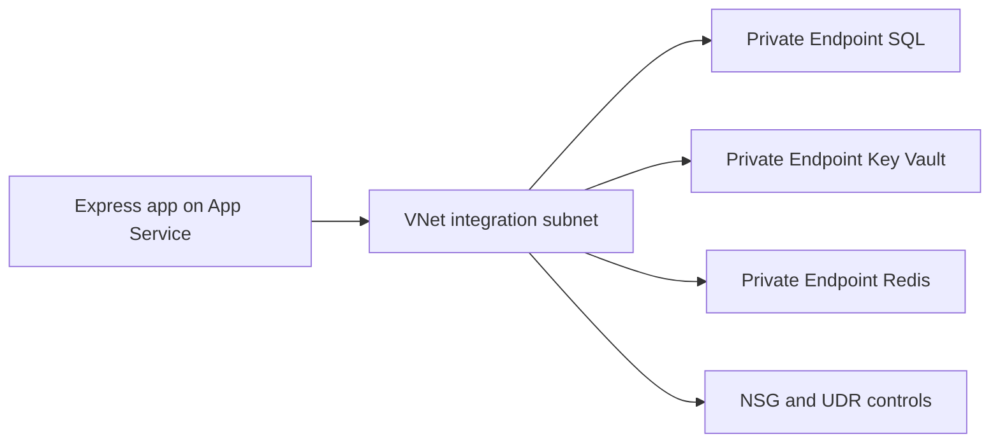

---
hide:
  - toc
content_sources:
  diagrams:
    - id: vnet-integration
      type: flowchart
      source: mslearn-adapted
      mslearn_url: https://learn.microsoft.com/en-us/azure/app-service/overview-vnet-integration
---

# VNet Integration

Enable VNet integration for an Express app on App Service so outbound dependency traffic flows over private network paths.

<!-- diagram-id: vnet-integration -->


## Prerequisites

- App Service Plan tier that supports VNet integration
- Existing virtual network and delegated subnet for App Service
- Permissions to manage VNet, NSG, private endpoints, and DNS links

## Main Content

### 1) Create delegated subnet

```bash
az network vnet subnet create \
  --resource-group "$RG" \
  --vnet-name "vnet-appservice" \
  --name "snet-appservice-integration" \
  --address-prefixes "10.10.1.0/24" \
  --delegations "Microsoft.Web/serverFarms" \
  --output json
```

### 2) Connect App Service to subnet

```bash
az webapp vnet-integration add \
  --resource-group "$RG" \
  --name "$APP_NAME" \
  --vnet "vnet-appservice" \
  --subnet "snet-appservice-integration" \
  --output json
```

### 3) Enable route-all for strict egress control (optional)

```bash
az webapp config appsettings set \
  --resource-group "$RG" \
  --name "$APP_NAME" \
  --settings WEBSITE_VNET_ROUTE_ALL=1 \
  --output json
```

### 4) Apply NSG baseline

Allow outbound traffic only to required private dependencies (for example 1433, 6380, 443), then collect NSG flow logs for troubleshooting.

### 5) Create private endpoints and DNS links

Use dedicated private endpoint subnets for SQL, Key Vault, and Redis and link these private DNS zones:

- `privatelink.database.windows.net`
- `privatelink.vaultcore.azure.net`
- `privatelink.redis.cache.windows.net`

### 6) Configure Express runtime settings with `process.env`

```bash
az webapp config appsettings set \
  --resource-group "$RG" \
  --name "$APP_NAME" \
  --settings \
    SQL_SERVER_FQDN="<sql-private-fqdn>" \
    SQL_DATABASE_NAME="<db-name>" \
    REDIS_HOST="<redis-private-fqdn>" \
    REDIS_PORT="6380" \
    KEY_VAULT_URI="https://<kv-name>.vault.azure.net/" \
  --output json
```

### 7) Use managed identity and private FQDNs in Node.js

```javascript
const { DefaultAzureCredential } = require("@azure/identity");
const sql = require("mssql");

const credential = new DefaultAzureCredential();

async function queryHealth() {
  const token = await credential.getToken("https://database.windows.net/.default");
  const pool = await sql.connect({
    server: process.env.SQL_SERVER_FQDN,
    database: process.env.SQL_DATABASE_NAME,
    options: { encrypt: true },
    authentication: {
      type: "azure-active-directory-access-token",
      options: { token: token.token },
    },
  });
  return pool.request().query("SELECT 1 AS ok");
}
```

### 8) Add validation checks in CI pipeline

```yaml
- name: Validate VNet integration and endpoint state
  run: |
    az webapp vnet-integration list \
      --resource-group "$RG" \
      --name "$APP_NAME" \
      --output table
    az network private-endpoint list \
      --resource-group "$RG" \
      --output table
```

!!! note "Inbound versus outbound"
    VNet integration is outbound-only for App Service.
    Inbound private access requires additional architecture such as private endpoint for the app.

## Verification

- `az webapp vnet-integration list` returns expected VNet and subnet.
- Dependency hostnames resolve to private IP addresses in runtime diagnostics.
- App can access SQL, Redis, and Key Vault without public endpoint access.

## Troubleshooting

### Private endpoint exists but app still cannot connect

- Validate DNS zone links and A records.
- Confirm NSG and route table do not block outbound dependency traffic.

### Public DNS resolution from app runtime

- Check DNS server configuration for the VNet.
- Ensure split-horizon DNS rules are forwarding to Azure private DNS.

### Failure after enabling route-all

- Validate default route and firewall path for required Azure services.
- Temporarily disable route-all to verify routing as the root cause.

## See Also

- [Key Vault References](key-vault-reference.md)
- [Azure SQL](azure-sql.md)
- [Private Endpoints](private-endpoints.md)
- [Operations: Networking](../../../operations/networking.md)

## Sources

- [Integrate your app with an Azure virtual network](https://learn.microsoft.com/en-us/azure/app-service/configure-vnet-integration-enable)
- [Use private endpoints for Azure App Service apps](https://learn.microsoft.com/en-us/azure/app-service/networking/private-endpoint)
- [Tutorial: Connect to Azure SQL Database from Node.js on App Service without secrets using a managed identity](https://learn.microsoft.com/en-us/azure/app-service/tutorial-connect-msi-azure-database)
