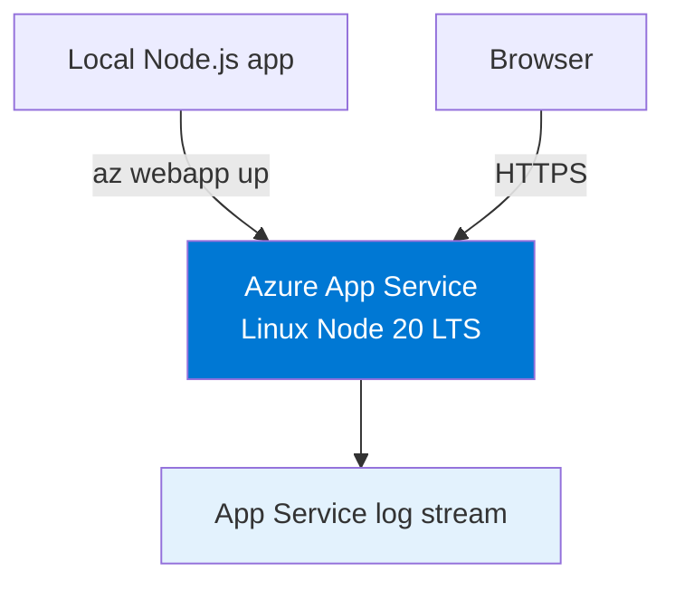
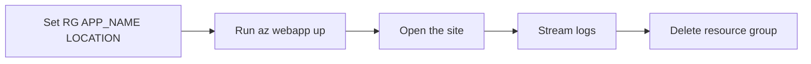

---
hide:
  - toc
content_sources:
  diagrams:
    - id: simple-architecture
      type: flowchart
      source: mslearn-adapted
      mslearn_url: https://learn.microsoft.com/en-us/azure/app-service/quickstart-nodejs
    - id: simple-flow
      type: flowchart
      source: mslearn-adapted
      mslearn_url: https://learn.microsoft.com/en-us/azure/app-service/quickstart-nodejs
---

# 02. First Deploy

**Time estimate: 5 minutes**

Deploy the Express app from [01. Local Run](./01-local-run.md) to Azure App Service with a single `az webapp up` command.

!!! tip "Need private networking or managed identity?"
    Use the advanced recipe: [Private Network Deploy](../recipes/private-network-deploy.md).

<!-- diagram-id: simple-architecture -->


## Overview

<!-- diagram-id: simple-flow -->


## Prerequisites

- Completed [01. Local Run](./01-local-run.md)
- Azure CLI installed and authenticated with `az login`
- Node.js installed locally

## Main Content

### Step 1: Set deployment variables

```bash
RG="rg-express-tutorial"
APP_NAME="app-express-tutorial-abc123"
LOCATION="koreacentral"
```

| Command/Parameter | Purpose |
|-------------------|---------|
| `RG="rg-express-tutorial"` | Defines the resource group that will hold the App Service resources. |
| `APP_NAME="app-express-tutorial-abc123"` | Sets the globally unique web app name. |
| `LOCATION="koreacentral"` | Selects the Azure region for the deployment. |

### Step 2: Deploy with `az webapp up`

Run this command from the Node.js app folder.

```bash
az webapp up --name $APP_NAME --resource-group $RG --location $LOCATION --runtime "NODE:20-lts" --sku B1
```

| Command/Parameter | Purpose |
|-------------------|---------|
| `az webapp up --name $APP_NAME --resource-group $RG --location $LOCATION --runtime "NODE:20-lts" --sku B1` | Creates the resource group, App Service plan, and web app if needed, then uploads and deploys the current app source. |
| `--name $APP_NAME` | Uses the specified globally unique web app name. |
| `--resource-group $RG` | Places the deployment in the selected resource group. |
| `--location $LOCATION` | Creates resources in the selected Azure region. |
| `--runtime "NODE:20-lts"` | Uses the Node.js 20 LTS runtime on Linux App Service. |
| `--sku B1` | Uses the Basic B1 pricing tier. |

???+ example "Expected output"
    ```text
    The webapp 'app-express-tutorial-abc123' doesn't exist
    Creating Resource group 'rg-express-tutorial' ...
    Creating AppServicePlan 'appsvc_asp_Linux_koreacentral' ...
    Creating webapp 'app-express-tutorial-abc123' ...
    Configuring default logging for the app, if not already enabled
    Starting zip deployment...
    You can launch the app at http://app-express-tutorial-abc123.azurewebsites.net
    ```

### Step 3: Verify deployment

```bash
WEB_APP_URL="https://$(az webapp show --resource-group $RG --name $APP_NAME --query defaultHostName --output tsv)"
curl $WEB_APP_URL
```

| Command/Parameter | Purpose |
|-------------------|---------|
| `WEB_APP_URL="https://$(az webapp show --resource-group $RG --name $APP_NAME --query defaultHostName --output tsv)"` | Builds the app URL from the hostname returned by App Service. |
| `az webapp show --resource-group $RG --name $APP_NAME --query defaultHostName --output tsv` | Returns only the default hostname so the shell can build the site URL. |
| `--resource-group $RG` | Queries the web app inside the tutorial resource group. |
| `--name $APP_NAME` | Selects the deployed Node.js web app to inspect. |
| `--query defaultHostName` | Extracts only the default hostname field from the response. |
| `--output tsv` | Formats the hostname as plain text for shell substitution. |
| `curl $WEB_APP_URL` | Confirms the deployed app responds over HTTPS. |

???+ example "Expected output"
    ```text
    <!DOCTYPE html>
    <html>
    <head>
      <title>Express</title>
    </head>
    ```

### Step 4: View logs

```bash
az webapp log tail --resource-group $RG --name $APP_NAME
```

| Command/Parameter | Purpose |
|-------------------|---------|
| `az webapp log tail --resource-group $RG --name $APP_NAME` | Streams live application logs from the deployed web app. |
| `--resource-group $RG` | Reads logs from the resource group that contains the app. |
| `--name $APP_NAME` | Streams logs for the deployed Node.js web app. |

???+ example "Expected output"
    ```text
    2026-04-10T10:20:11  Connected to log stream.
    2026-04-10T10:20:15  GET / 200 5.012 ms
    ```

### Step 5: Cleanup

```bash
az group delete --name $RG --yes --no-wait
```

| Command/Parameter | Purpose |
|-------------------|---------|
| `az group delete --name $RG --yes --no-wait` | Deletes the resource group and all App Service resources created by the tutorial. |
| `--name $RG` | Targets the tutorial resource group for deletion. |
| `--yes` | Skips the interactive confirmation prompt. |
| `--no-wait` | Returns immediately while Azure continues the deletion in the background. |

## Advanced Topics

`az webapp up` is the fastest way to publish a Node.js app, but production environments often add VNet integration, private endpoints, and managed identity after the first deployment.

## See Also

- [01. Local Run](./01-local-run.md)
- [03. Configuration](./03-configuration.md)
- [Private Network Deploy](../recipes/private-network-deploy.md)
- [06. CI/CD](./06-ci-cd.md)

## Sources

- [Quickstart: Create a Node.js web app in Azure App Service](https://learn.microsoft.com/en-us/azure/app-service/quickstart-nodejs)
- [az webapp up](https://learn.microsoft.com/en-us/cli/azure/webapp#az-webapp-up)
- [Configure diagnostic logging in App Service](https://learn.microsoft.com/en-us/azure/app-service/troubleshoot-diagnostic-logs)
