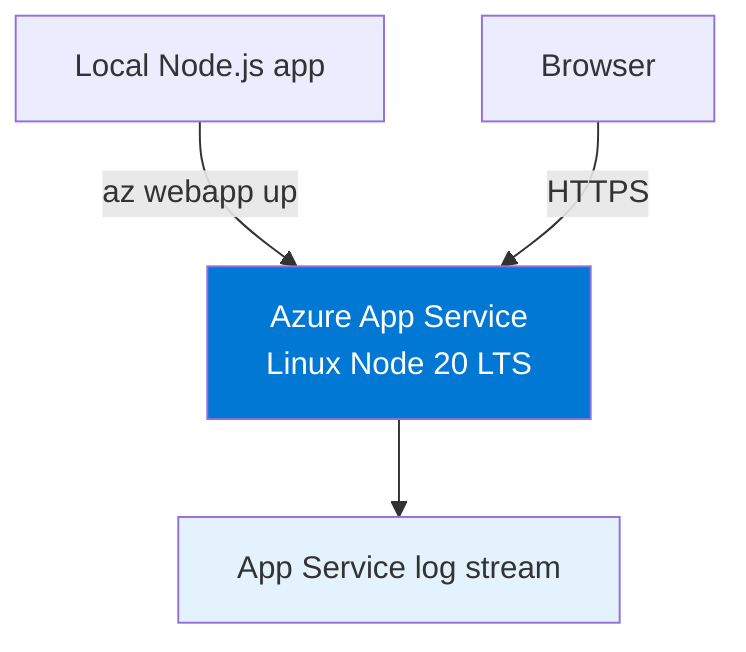
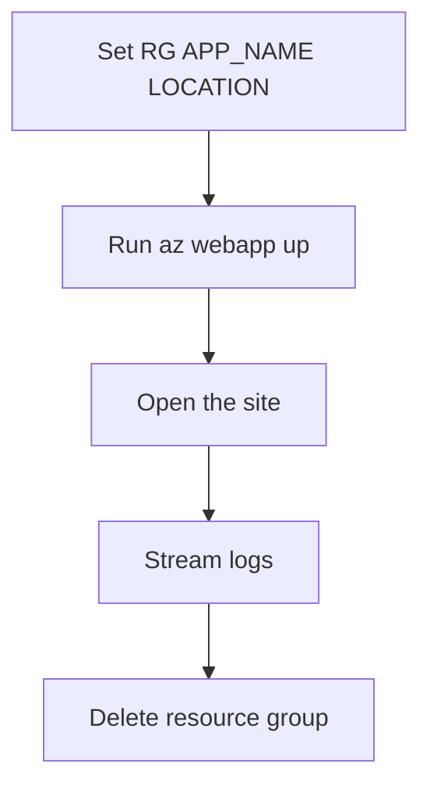

---
content_sources:
  diagrams:
    - id: simple-architecture
      type: flowchart
      source: mslearn-adapted
      mslearn_url: https://learn.microsoft.com/en-us/azure/app-service/quickstart-nodejs
    - id: simple-flow
      type: flowchart
      source: mslearn-adapted
      mslearn_url: https://learn.microsoft.com/en-us/azure/app-service/quickstart-nodejs
---
# 02. First Deploy

**Time estimate: 5 minutes**

Deploy the Express app from [01. Local Run](./01-local-run.md) to Azure App Service with a single `az webapp up` command.

!!! tip "Need private networking or managed identity?"
    Use the advanced recipe: [Private Network Deploy](../recipes/private-network-deploy.md).

<!-- diagram-id: simple-architecture -->

```mermaid
flowchart TD
    DEV[Local Node.js app] -->|az webapp up| APP[Azure App Service\nLinux Node 20 LTS]
    USER[Browser] -->|HTTPS| APP
    APP --> LOGS[App Service log stream]

    style APP fill:#0078d4,color:#fff
    style LOGS fill:#E3F2FD
```

## Overview

<!-- diagram-id: simple-flow -->

```mermaid
flowchart TD
    A[Set RG APP_NAME LOCATION] --> B[Run az webapp up]
    B --> C[Open the site]
    C --> D[Stream logs]
    D --> E[Delete resource group]
```

## Prerequisites

- Completed [01. Local Run](./01-local-run.md)
- Azure CLI installed and authenticated with `az login`
- Node.js installed locally

## Main Content

### Step 1: Set deployment variables

```bash
RG="rg-express-tutorial"
APP_NAME="app-express-tutorial-abc123"
LOCATION="koreacentral"
```

| Command/Parameter | Purpose |
|-------------------|---------|
| `RG="rg-express-tutorial"` | Defines the resource group that will hold the App Service resources. |
| `APP_NAME="app-express-tutorial-abc123"` | Sets the globally unique web app name. |
| `LOCATION="koreacentral"` | Selects the Azure region for the deployment. |

### Step 2: Deploy with `az webapp up`

Run this command from the Node.js app folder.

```bash
az webapp up --name $APP_NAME --resource-group $RG --location $LOCATION --runtime "NODE:20-lts" --sku B1
```

| Command/Parameter | Purpose |
|-------------------|---------|
| `az webapp up --name $APP_NAME --resource-group $RG --location $LOCATION --runtime "NODE:20-lts" --sku B1` | Creates the resource group, App Service plan, and web app if needed, then uploads and deploys the current app source. |
| `--name $APP_NAME` | Uses the specified globally unique web app name. |
| `--resource-group $RG` | Places the deployment in the selected resource group. |
| `--location $LOCATION` | Creates resources in the selected Azure region. |
| `--runtime "NODE:20-lts"` | Uses the Node.js 20 LTS runtime on Linux App Service. |
| `--sku B1` | Uses the Basic B1 pricing tier. |

???+ example "Expected output"
    ```text
    The webapp 'app-express-tutorial-abc123' doesn't exist
    Creating Resource group 'rg-express-tutorial' ...
    Creating AppServicePlan 'appsvc_asp_Linux_koreacentral' ...
    Creating webapp 'app-express-tutorial-abc123' ...
    Configuring default logging for the app, if not already enabled
    Starting zip deployment...
    You can launch the app at http://app-express-tutorial-abc123.azurewebsites.net
    ```

!!! warning "Build automation: quick-start vs production"
    `az webapp up` performs an Oryx/Kudu build on App Service during deployment (equivalent to `SCM_DO_BUILD_DURING_DEPLOYMENT=true`). That is fine for this quick-start and for local development, but production deployments should publish a pre-built artifact and set `SCM_DO_BUILD_DURING_DEPLOYMENT=false` for deterministic, reproducible releases. See [Best Practices: SCM_DO_BUILD vs pre-built artifacts](../../../best-practices/deployment.md#scm_do_build_during_deployment-vs-pre-built-artifacts).

### Step 3: Verify deployment

```bash
WEB_APP_URL="https://$(az webapp show --resource-group $RG --name $APP_NAME --query defaultHostName --output tsv)"
curl $WEB_APP_URL
```

| Command/Parameter | Purpose |
|-------------------|---------|
| `WEB_APP_URL="https://$(az webapp show --resource-group $RG --name $APP_NAME --query defaultHostName --output tsv)"` | Builds the app URL from the hostname returned by App Service. |
| `az webapp show --resource-group $RG --name $APP_NAME --query defaultHostName --output tsv` | Returns only the default hostname so the shell can build the site URL. |
| `--resource-group $RG` | Queries the web app inside the tutorial resource group. |
| `--name $APP_NAME` | Selects the deployed Node.js web app to inspect. |
| `--query defaultHostName` | Extracts only the default hostname field from the response. |
| `--output tsv` | Formats the hostname as plain text for shell substitution. |
| `curl $WEB_APP_URL` | Confirms the deployed app responds over HTTPS. |

???+ example "Expected output"
    ```text
    <!DOCTYPE html>
    <html>
    <head>
      <title>Express</title>
    </head>
    ```

### Step 4: View logs

> **Note:** `az webapp log tail` may not work reliably for Linux App Service. Use the Azure Portal Log stream or `/home/LogFiles` as alternatives.

```bash
az webapp log tail --resource-group $RG --name $APP_NAME
```

| Command/Parameter | Purpose |
|-------------------|---------|
| `az webapp log tail --resource-group $RG --name $APP_NAME` | Streams live application logs from the deployed web app. |
| `--resource-group $RG` | Reads logs from the resource group that contains the app. |
| `--name $APP_NAME` | Streams logs for the deployed Node.js web app. |

???+ example "Expected output"
    ```text
    2026-04-10T10:20:11  Connected to log stream.
    2026-04-10T10:20:15  GET / 200 5.012 ms
    ```

### Step 5: Cleanup

```bash
az group delete --name $RG --yes --no-wait
```

| Command/Parameter | Purpose |
|-------------------|---------|
| `az group delete --name $RG --yes --no-wait` | Deletes the resource group and all App Service resources created by the tutorial. |
| `--name $RG` | Targets the tutorial resource group for deletion. |
| `--yes` | Skips the interactive confirmation prompt. |
| `--no-wait` | Returns immediately while Azure continues the deletion in the background. |

## Advanced Topics

`az webapp up` is the fastest way to publish a Node.js app, but production environments often add VNet integration, private endpoints, and managed identity after the first deployment.

## Run It in the Portal

#### Portal view: Web App Overview blade - first-deploy verification surface

![Azure portal Overview blade for `app-test-20251107` (Web App) with a command bar (`Browse`, `Stop`, `Swap`, `Restart`, `Delete`, `Refresh`, `Download publish profile`, `Reset publish profile`, `Share to mobile`, `Send us your feedback`) and an Essentials panel showing Resource group `rg-test-20251107`, Status `Running`, Location `Korea Central`, Subscription `Visual Studio Enterprise Subscription`, Subscription ID `00000000-0000-0000-0000-000000000000`, Default domain `app-test-20251107.azurewebsites.net`, App Service Plan `asp-test-20251107 (P0v3: 1)`, Operating System `Linux`, and Health Check `Not Configured`. The Properties tab is selected (next to Monitoring, Logs, Capabilities, Notifications (1), Recommendations) and surfaces Web app (`Publishing model: Code`, `Runtime Stack: Python - 3.11`, `Runtime status: Healthy`), Domains (`2 Domains View all`), Hosting (`Plan Type: App Service plan`, `Instance Count: 1`, `SKU and size: Premium0V3 (P0v3)` with `Scale up` link), Deployment Center (`Last deployment: Successful on Thursday, November 6, 10:58:01 PM`, `Deployment provider: None`), Application Insights (`Name: ai-test-20251107`, `Region: Korea Central`), and Networking (`Inbound IP addresses: 20.200.197.3, 2603:1040:f05:3::208`, `Private endpoint connections: 0 private endpoints`, `Virtual network integration: Not configured`). Left nav under the search box lists Overview (selected), Activity log, Access control (IAM), Tags, Diagnose and solve problems, Microsoft Defender for Cloud, Events (preview), Log stream, AI (preview), Resource visualizer, with collapsed groups Deployment, Settings, Performance, App Service plan, Development Tools, API, Monitoring, Automation, and Support + troubleshooting.](../../../assets/platform/architecture/01-app-service-overview.png)

After running `az webapp up --runtime "NODE:20-lts"` in this tutorial, the Overview blade is the first Portal verification surface. The Essentials panel confirms the app the command created or reused: `Status: Running`, `Operating System: Linux`, `Default domain`, and the attached `App Service Plan` are all visible on this blade. The selected Properties tab adds `Runtime Stack` and `Runtime status` rows under `Web app` — the screenshot was captured from a Python deployment, so the visible value is `Runtime Stack: Python - 3.11`; the same row reports the Node.js stack value for this tutorial's Express app after deployment. Use the `Default domain` value to open the deployed app in a browser, which is the Portal-side check that corresponds to this tutorial's `curl` verification step.

## See Also

- [01. Local Run](./01-local-run.md)
- [03. Configuration](./03-configuration.md)
- [Private Network Deploy](../recipes/private-network-deploy.md)
- [06. CI/CD](./06-ci-cd.md)

## Sources

- [Quickstart: Create a Node.js web app in Azure App Service](https://learn.microsoft.com/en-us/azure/app-service/quickstart-nodejs)
- [az webapp up](https://learn.microsoft.com/en-us/cli/azure/webapp#az-webapp-up)
- [Configure diagnostic logging in App Service](https://learn.microsoft.com/en-us/azure/app-service/troubleshoot-diagnostic-logs)
