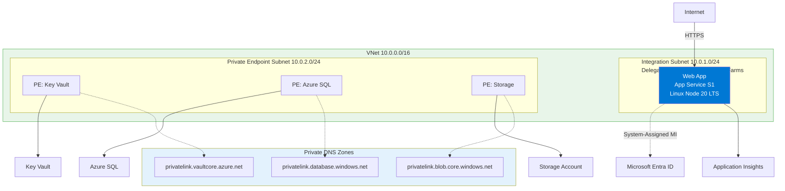
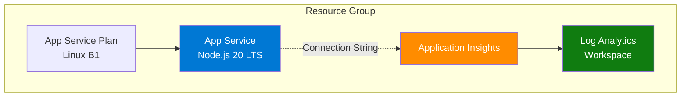

---
content_sources:
  diagrams:
    - id: diagram-1
      type: flowchart
      source: mslearn-adapted
      mslearn_url: https://learn.microsoft.com/en-us/azure/app-service/
    - id: architecture
      type: flowchart
      source: mslearn-adapted
      mslearn_url: https://learn.microsoft.com/en-us/azure/app-service/
---
# 05. Infrastructure as Code with Bicep

⏱️ **Time**: 30 minutes  
🏗️ **Prerequisites**: Azure CLI, Bicep VS Code extension (optional but recommended)

Manual resource creation in the portal is fine for experiments, but production workloads require Infrastructure as Code (IaC). This tutorial explores how to use Bicep to provision the Node.js hosting environment.

!!! info "Infrastructure Context"
    **Service**: App Service (Linux, Standard S1) | **Network**: VNet integrated | **VNet**: ✅

    This tutorial assumes a production-ready App Service deployment with VNet integration, private endpoints for backend services, and managed identity for authentication.

<!-- diagram-id: diagram-1 -->


## What you'll learn
- How Bicep structures App Service resources
- Breaking down `main.bicep` and its modules
- Managing environment configurations with parameter files
- Deploying resources using the Azure CLI

## Architecture

<!-- diagram-id: architecture -->


## The Infrastructure Layout
The `infra/` folder in this repository contains a modular Bicep setup:
- `main.bicep`: The entry point that orchestrates modules.
- `modules/`: Individual resource definitions (App Service, App Insights, etc.).
- `profiles/`: `.bicepparam` files for different environment sizes.

## 1. Understanding main.bicep
The `main.bicep` file defines the core parameters and connects the modules.

```bicep
// Define common parameters
param location string = resourceGroup().location
param baseName string = 'nodejs-ref'
param appServicePlanSku string = 'B1'

// Orchestrate modules
module appServicePlan 'modules/appservice-plan.bicep' = {
  name: 'appServicePlan'
  params: {
    location: location
    name: 'asp-${baseName}'
    sku: appServicePlanSku
  }
}

module webApp 'modules/webapp.bicep' = {
  name: 'webApp'
  params: {
    location: location
    name: 'app-${baseName}-${uniqueString(resourceGroup().id)}'
    appServicePlanId: appServicePlan.outputs.id
    // ... other settings
  }
}
```

| Command/Code | Purpose |
|--------------|---------|
| `param location string = resourceGroup().location` | Defaults the deployment region to the current resource group's location |
| `param baseName string = 'nodejs-ref'` | Sets the base naming prefix used across resources |
| `param appServicePlanSku string = 'B1'` | Sets the default App Service plan SKU |
| `module appServicePlan ...` | Deploys the App Service plan module |
| `module webApp ...` | Deploys the web app module and links it to the plan output |
| `uniqueString(resourceGroup().id)` | Generates a globally unique suffix for the web app name |

Key patterns used here:
- **`uniqueString()`**: Ensures your web app name is globally unique by hashing the resource group ID.
- **Output passing**: The `appServicePlanId` for the Web App is retrieved from the `appServicePlan` module output.

## 2. Using Parameter Files
Instead of passing long strings to the CLI, use `.bicepparam` files to define environment-specific values. See `infra/profiles/minimal.bicepparam`:

```bicep
using '../main.bicep'

param baseName = 'nodesimple'
param appServicePlanSku = 'B1'
param telemetryMode = 'basic'
```

| Command/Code | Purpose |
|--------------|---------|
| `using '../main.bicep'` | Tells the parameter file which Bicep template it configures |
| `param baseName = 'nodesimple'` | Sets the environment-specific base resource name |
| `param appServicePlanSku = 'B1'` | Overrides the App Service plan size for this profile |
| `param telemetryMode = 'basic'` | Sets the tutorial app's telemetry mode for this deployment |

## 3. Deployment
Deploy the infrastructure to a resource group. If you don't have a resource group yet, create one first:

```bash
# Create a resource group
az group create --name rg-myapp --location eastus --output json

# Deploy using the Bicep file
az deployment group create \
  --resource-group rg-myapp \
  --template-file infra/main.bicep \
  --parameters baseName=myapp appServicePlanSku=B1 \
  --output json
```

| Command/Code | Purpose |
|--------------|---------|
| `az group create --name rg-myapp --location eastus --output json` | Creates the resource group that will hold the Bicep deployment |
| `az deployment group create ... --template-file infra/main.bicep ...` | Deploys the main Bicep template to the resource group |
| `baseName=myapp appServicePlanSku=B1` | Supplies inline parameter values for naming and SKU selection |

Or use a parameter file:
```bash
az deployment group create \
  --resource-group rg-myapp \
  --template-file infra/main.bicep \
  --parameters infra/profiles/minimal.bicepparam \
  --output json
```

| Command/Code | Purpose |
|--------------|---------|
| `az deployment group create ... --parameters infra/profiles/minimal.bicepparam` | Deploys the Bicep template using a reusable parameter file |

## Verification
After the command completes, verify the resources exist:

1. **Check CLI output**: Look for `"provisioningState": "Succeeded"`.
2. **List resources**:
   ```bash
   az resource list --resource-group $RG --output table
   ```

   | Command/Code | Purpose |
   |--------------|---------|
   | `az resource list --resource-group $RG --output table` | Lists all resources created in the target resource group |
   
   **Example output:**
   <!-- Verified: real az CLI output from koreacentral, 2026-05-01 -->
   ```
   Name                    ResourceGroup            Location      Type                               Status
   ----------------------  -----------------------  ------------  ---------------------------------  --------
   plan-<masked>           rg-<masked>              koreacentral  Microsoft.Web/serverFarms
   app-<masked>            rg-<masked>              koreacentral  Microsoft.Web/sites
   ```

3. **Get Web App URL**:
   ```bash
   az webapp show --name $APP_NAME --resource-group $RG --query defaultHostName --output tsv
   ```

   | Command/Code | Purpose |
   |--------------|---------|
   | `az webapp show --name $APP_NAME --resource-group $RG --query defaultHostName --output tsv` | Retrieves the default hostname for the deployed web app |
   
   **Example output:**
   <!-- Verified: real az CLI output from koreacentral, 2026-05-01 -->
   ```
   app-<masked>.azurewebsites.net
   ```

4. **Verify the app is running**:
   ```bash
   curl https://$APP_NAME.azurewebsites.net/health
   ```

   | Command/Code | Purpose |
   |--------------|---------|
   | `curl https://$APP_NAME.azurewebsites.net/health` | Confirms the deployed app is serving health responses |

    **Example output:**
    <!-- Verified: real local execution output from node v22.17.0, 2026-05-01 -->
    ```json
    {
      "status": "healthy",
      "timestamp": "2026-05-01T08:33:46.798Z"
    }
    ```

    | Command/Code | Purpose |
    |--------------|---------|
    | `status` | Shows the application reports itself as healthy |
    | `timestamp` | Shows when the health check response was generated |

## Troubleshooting
- **Name Availability**: Web app names must be globally unique. If deployment fails with a "Conflict", change your `baseName`.
- **SKU Restrictions**: Some regions don't support specific SKUs (like `B1`). Try `P1V3` if `B1` is unavailable.
- **Bicep Version**: Ensure you have the latest Bicep CLI by running `az bicep upgrade`.

## Clean Up
Don't forget to delete resources when done to avoid ongoing charges:
```bash
az group delete --name rg-myapp --yes --no-wait --output json
```

| Command/Code | Purpose |
|--------------|---------|
| `az group delete --name rg-myapp --yes --no-wait --output json` | Starts deleting the tutorial resource group without prompting |

## Next Steps
Now that your infrastructure is ready, proceed to **[06-ci-cd.md](./06-ci-cd.md)** to automate your application deployments.

---

## Advanced Options

!!! info "Coming Soon"
    - Terraform for multi-cloud deployments
    - Azure Developer CLI (azd) integration
- [Contribute](https://github.com/yeongseon/azure-app-service-practical-guide/issues)

## CLI Alternative (No Bicep)

Use these commands when you need an imperative deployment path without changing the existing Bicep workflow.

### Step 1: Set variables

```bash
RG="rg-express-tutorial"
LOCATION="koreacentral"
PLAN_NAME="plan-express-tutorial-s1"
APP_NAME="app-express-tutorial-abc123"
VNET_NAME="vnet-express-tutorial"
INTEGRATION_SUBNET_NAME="snet-appsvc-integration"
```

| Command/Code | Purpose |
|--------------|---------|
| `RG`, `LOCATION`, `PLAN_NAME`, `APP_NAME` | Define the core resource names for the CLI deployment path |
| `VNET_NAME`, `INTEGRATION_SUBNET_NAME` | Define the networking resources for optional VNet integration |

???+ example "Expected output"
    ```text
    Variables loaded for resource group, App Service plan, app name, and VNet integration.
    ```

### Step 2: Create resource group, plan, and app

```bash
az group create --name $RG --location $LOCATION
az appservice plan create --resource-group $RG --name $PLAN_NAME --is-linux --sku S1
az webapp create --resource-group $RG --plan $PLAN_NAME --name $APP_NAME --runtime "NODE|20-lts"
```

| Command/Code | Purpose |
|--------------|---------|
| `az group create ...` | Creates the resource group for the imperative deployment |
| `az appservice plan create ...` | Creates the Linux App Service plan |
| `az webapp create ... --runtime "NODE\|20-lts"` | Creates the Node.js web app |

???+ example "Expected output"
```json
{
  "defaultHostName": "app-express-tutorial-abc123.azurewebsites.net",
  "state": "Running"
}
```

| Command/Code | Purpose |
|--------------|---------|
| `defaultHostName` | Shows the hostname assigned to the new app |
| `state` | Confirms the web app is running |

### Step 3: Configure app settings and startup command

```bash
az webapp config appsettings set --resource-group $RG --name $APP_NAME --settings SCM_DO_BUILD_DURING_DEPLOYMENT=true NODE_ENV=production
az webapp config set --resource-group $RG --name $APP_NAME --startup-file "node server.js"
```

| Command/Code | Purpose |
|--------------|---------|
| `az webapp config appsettings set ...` | Enables remote build and sets production mode |
| `az webapp config set ... --startup-file "node server.js"` | Configures the startup command for the app |

???+ example "Expected output"
```json
[
  {
    "name": "SCM_DO_BUILD_DURING_DEPLOYMENT",
    "value": "true"
  },
  {
    "name": "NODE_ENV",
    "value": "production"
  }
]
```

| Command/Code | Purpose |
|--------------|---------|
| `SCM_DO_BUILD_DURING_DEPLOYMENT` | Enables build automation during deployment |
| `NODE_ENV` | Sets the runtime environment to production |

### Step 4 (Optional): Add VNet integration

```bash
az network vnet create --resource-group $RG --name $VNET_NAME --location $LOCATION --address-prefixes 10.0.0.0/16
az network vnet subnet create --resource-group $RG --vnet-name $VNET_NAME --name $INTEGRATION_SUBNET_NAME --address-prefixes 10.0.1.0/24 --delegations Microsoft.Web/serverFarms
az webapp vnet-integration add --resource-group $RG --name $APP_NAME --vnet $VNET_NAME --subnet $INTEGRATION_SUBNET_NAME
```

| Command/Code | Purpose |
|--------------|---------|
| `az network vnet create ...` | Creates the virtual network for the app |
| `az network vnet subnet create ... --delegations Microsoft.Web/serverFarms` | Creates the delegated subnet used for App Service integration |
| `az webapp vnet-integration add ...` | Connects the web app to the integration subnet |

???+ example "Expected output"
```json
{
  "isSwift": true,
  "subnetResourceId": "/subscriptions/<subscription-id>/resourceGroups/rg-express-tutorial/providers/Microsoft.Network/virtualNetworks/vnet-express-tutorial/subnets/snet-appsvc-integration"
}
```

| Command/Code | Purpose |
|--------------|---------|
| `isSwift` | Confirms regional VNet integration is active |
| `subnetResourceId` | Shows the subnet attached to the app |

### Step 5: Validate effective configuration

```bash
az webapp config show --resource-group $RG --name $APP_NAME --query "{linuxFxVersion:linuxFxVersion, appCommandLine:appCommandLine}" --output json
az webapp config appsettings list --resource-group $RG --name $APP_NAME --query "[?name=='NODE_ENV' || name=='SCM_DO_BUILD_DURING_DEPLOYMENT']" --output json
```

| Command/Code | Purpose |
|--------------|---------|
| `az webapp config show ...` | Displays the effective runtime and startup command |
| `az webapp config appsettings list ...` | Confirms key application settings were applied |

???+ example "Expected output"
```json
{
  "linuxFxVersion": "NODE|20-lts",
  "appCommandLine": "node server.js"
}
```

| Command/Code | Purpose |
|--------------|---------|
| `linuxFxVersion` | Shows the configured Node.js runtime stack |
| `appCommandLine` | Shows the startup command App Service will run |

## Run It in the Portal

#### Portal view: Resource group overview (verifying Bicep deployment outputs)

![Resource group overview blade for `rg-test-20251107` in Korea Central showing an Essentials panel with Subscription "Visual Studio Enterprise Subscription", Subscription ID `00000000-0000-0000-0000-000000000000`, Deployments "2 Failed, 4 Succeeded", and Location "Korea Central". The Resources tab lists 11 related resources grouped by type, including Application Insights (`ai-test-20251107`), App Service (`app-test-20251107`), App Service Domain (`app-test-20251107.net` and `domain-test-20251107.com`), DNS Zone (`app-test-20251107.net` and `domain-test-20251107.com`), Microsoft.Web certificate (`app-test-20251107.net-app-test-20251107`), App Service (Slot) (`staging (app-test-20251107/staging)`), Application Insights Smart Detection, Action group, App Service Plan (`asp-test-20251107`), and Failure Anomalies smart detector alert rule. The command bar includes Create, Manage view, Delete resource group, Refresh, Export to CSV, Open query, Assign tags, Move, Delete, and Export template buttons.](../../../assets/platform/resource-relationships/01-resource-group.png)

After running `az deployment group create --template-file ./infra/main.bicep`, the resource group overview is the Portal surface for checking what the deployment produced. The visible `Resources` tab shows how Azure inventories related resources as separate rows in one resource group, including `App Service`, `App Service Plan`, and `Application Insights`. For this Node.js tutorial, use the same blade to confirm that the web app and plan created by your Bicep deployment exist, then open the `Deployments` entry in Essentials if you need to inspect deployment history after a partial failure. The `Export template` button is also useful when you want to compare deployed ARM state with the Bicep source for the Express app's infrastructure.

## See Also
- [Operations Scaling](../../../operations/scaling.md)

## Sources
- [Bicep Documentation](https://learn.microsoft.com/en-us/azure/azure-resource-manager/bicep/)
- [Deploy App Service resources with Bicep (Microsoft Learn)](https://learn.microsoft.com/en-us/azure/app-service/provision-resource-bicep)
