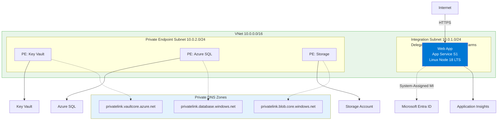
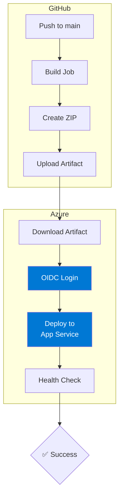

---
content_sources:
  diagrams:
    - id: diagram-1
      type: flowchart
      source: mslearn-adapted
      mslearn_url: https://learn.microsoft.com/en-us/azure/app-service/deploy-continuous-deployment
    - id: ci-cd-pipeline-flow
      type: flowchart
      source: mslearn-adapted
      mslearn_url: https://learn.microsoft.com/en-us/azure/app-service/deploy-continuous-deployment
---

# 06. CI/CD with GitHub Actions

⏱️ **Time**: 45 minutes  
🏗️ **Prerequisites**: GitHub repository, Azure subscription, Contributor permissions

Automating your deployment pipeline ensures consistent and reliable releases. This tutorial shows how to use GitHub Actions with OIDC (OpenID Connect) for secure, passwordless authentication.

!!! info "Infrastructure Context"
    **Service**: App Service (Linux, Standard S1) | **Network**: VNet integrated | **VNet**: ✅

    This tutorial assumes a production-ready App Service deployment with VNet integration, private endpoints for backend services, and managed identity for authentication.

<!-- diagram-id: diagram-1 -->


## What you'll learn
- How OIDC authentication works with Azure
- Building and packaging a Node.js app in GitHub Actions
- Deploying to a production environment
- Managing staging slots for zero-downtime releases

## CI/CD Pipeline Flow

<!-- diagram-id: ci-cd-pipeline-flow -->


## 1. Setup OIDC Authentication
OIDC eliminates the need for long-lived secrets in GitHub. You'll create a trust relationship between GitHub and Azure.

### Create Azure AD App Registration
```bash
# Set variables
GITHUB_ORG="your-github-username"
GITHUB_REPO="azure-app-service-practical-guide"
AAD_APP_NAME="github-actions-$GITHUB_REPO"

# Create app registration
CLIENT_ID=$(az ad app create --display-name "$AAD_APP_NAME" --query appId --output json | jq -r '.')
```

| Command/Code | Purpose |
|--------------|---------|
| `GITHUB_ORG`, `GITHUB_REPO`, `AAD_APP_NAME` | Define the GitHub repo and Entra app registration names used for OIDC |
| `CLIENT_ID=$(az ad app create ... | jq -r '.')` | Creates the Entra app registration and stores its application ID |

### Create Federated Credential
This tells Azure to trust tokens issued by GitHub for your specific repository and branch.
```bash
az ad app federated-credential create \
  --id $CLIENT_ID \
  --parameters '{
    "name": "github-main",
    "issuer": "https://token.actions.githubusercontent.com",
    "subject": "repo:'$GITHUB_ORG'/'$GITHUB_REPO':ref:refs/heads/main",
    "audiences": ["api://AzureADTokenExchange"]
  }' \
  --output json
```

| Command/Code | Purpose |
|--------------|---------|
| `az ad app federated-credential create ...` | Adds a GitHub OIDC trust configuration to the Entra app |
| `--id $CLIENT_ID` | Targets the app registration created for GitHub Actions |
| `subject` | Restricts token trust to one repository and branch |
| `audiences` | Declares the expected token audience for Azure token exchange |

### Grant Azure Permissions
```bash
SUBSCRIPTION_ID=$(az account show --query id --output json | jq -r '.')
RG="rg-myapp"

# Create service principal
az ad sp create --id $CLIENT_ID --output json

# Assign Contributor role to the resource group
az role assignment create \
  --assignee $CLIENT_ID \
  --role "Contributor" \
  --scope "/subscriptions/$SUBSCRIPTION_ID/resourceGroups/$RG" \
  --output json
```

| Command/Code | Purpose |
|--------------|---------|
| `SUBSCRIPTION_ID=$(az account show ... | jq -r '.')` | Captures the current Azure subscription ID |
| `RG="rg-myapp"` | Sets the resource group that the workflow may deploy to |
| `az ad sp create --id $CLIENT_ID --output json` | Creates a service principal for the app registration |
| `az role assignment create ... --role "Contributor" ...` | Grants the service principal Contributor access to the resource group |

## 2. Configure GitHub Secrets
In your GitHub repository, go to **Settings → Secrets and variables → Actions** and add:
- `AZURE_CLIENT_ID`: The App ID from step 1.
- `AZURE_TENANT_ID`: Your Azure AD tenant ID (`az account show --query tenantId --output json | jq -r '.'`).
- `AZURE_SUBSCRIPTION_ID`: Your subscription ID.

Also add a **Variable**:
 - `APP_NAME`: Your App Service name.

## 3. The Workflow File
The `.github/workflows/deploy.yml` file handles the build and deploy. Key sections include:

```yaml
permissions:
  id-token: write # Required for OIDC
  contents: read

jobs:
  deploy:
    steps:
      - name: Azure Login (OIDC)
        uses: azure/login@v2
        with:
          client-id: ${{ secrets.AZURE_CLIENT_ID }}
          tenant-id: ${{ secrets.AZURE_TENANT_ID }}
          subscription-id: ${{ secrets.AZURE_SUBSCRIPTION_ID }}

      - name: Deploy to Azure App Service
        uses: azure/webapps-deploy@v3
        with:
          app-name: ${{ vars.APP_NAME }}
          package: deploy.zip
```

**Workflow execution summary:**

1. **Azure Login**: Exchanges the GitHub OIDC token for an Azure access token.
2. **Deploy**: Uploads the `deploy.zip` artifact to App Service and triggers the remote build/restart process.

**Example log output from GitHub Actions:**
```text
Logging in to Azure with OIDC...
Done setting up OIDC.
Successfully logged in to Azure.

Starting deployment to app-myapp-abc123...
Package deployment using ZIP Deploy initiated.
Successfully deployed to https://app-myapp-abc123.azurewebsites.net
```

## 4. Staging Slots (Optional but Recommended)
For zero-downtime deployments, deploy to a `staging` slot first, verify it, and then swap to production.

```bash
# Create a staging slot
az webapp deployment slot create \
  --name $APP_NAME \
  --resource-group $RG \
  --slot staging \
  --output json
```

| Command/Code | Purpose |
|--------------|---------|
| `az webapp deployment slot create ... --slot staging --output json` | Creates a staging deployment slot for safer releases |

The `.github/workflows/deploy-slot.yml` in this repo demonstrates this pattern:

1. Deploy to the staging slot.
2. Run health checks against the staging URL.
3. Use `az webapp deployment slot swap` to move staging to production.

## Verification
1. Push a change to your `main` branch.
2. Monitor the **Actions** tab in GitHub.
3. Once finished, verify the deployment:
   ```bash
    curl -f "https://app-myapp-abc123.azurewebsites.net/health"
   ```

   | Command/Code | Purpose |
   |--------------|---------|
   | `curl -f "https://app-myapp-abc123.azurewebsites.net/health"` | Fails if the deployed app does not return a successful health response |

## Troubleshooting
- **OIDC Connection**: If login fails, check that the `subject` in your federated credential exactly matches the repository and branch path.
- **Node Version**: Ensure the `NODE_VERSION` in your workflow matches the one configured on your App Service.
- **Zip Packaging**: If the app fails to start, verify that `server.js` is at the root of the uploaded zip package.

## Next Steps
Proceed to **[07-custom-domain-ssl.md](./07-custom-domain-ssl.md)** (Optional) to learn about custom domains and certificates.

---

## Advanced Options

!!! info "Coming Soon"
    - Multi-environment pipelines (Dev, Staging, Prod)
    - Manual approval gates in GitHub Actions
    - Integration with Azure Pipelines (ADO)
- [Contribute](https://github.com/yeongseon/azure-app-service-practical-guide/issues)

## See Also
- [Operations Deployment Slots](../../../operations/deployment-slots.md)
- [GitHub Actions Documentation](https://docs.github.com/en/actions)

## Sources
- [Azure OIDC Documentation (Microsoft Learn)](https://learn.microsoft.com/en-us/azure/active-directory/develop/workload-identity-federation)
- [Deploy to App Service using GitHub Actions (Microsoft Learn)](https://learn.microsoft.com/azure/app-service/deploy-github-actions)
