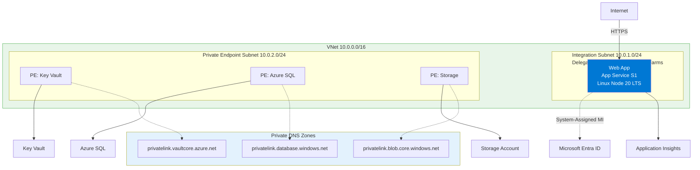
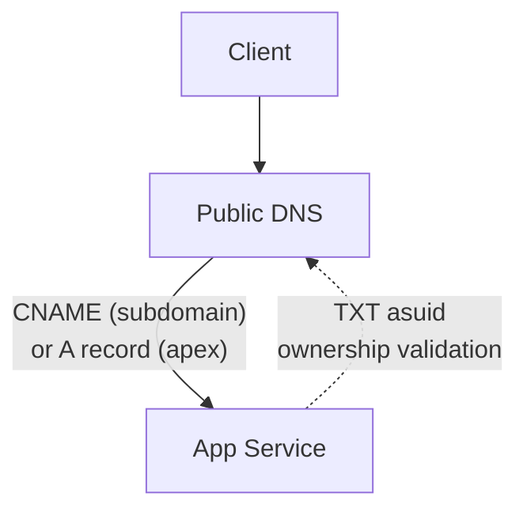
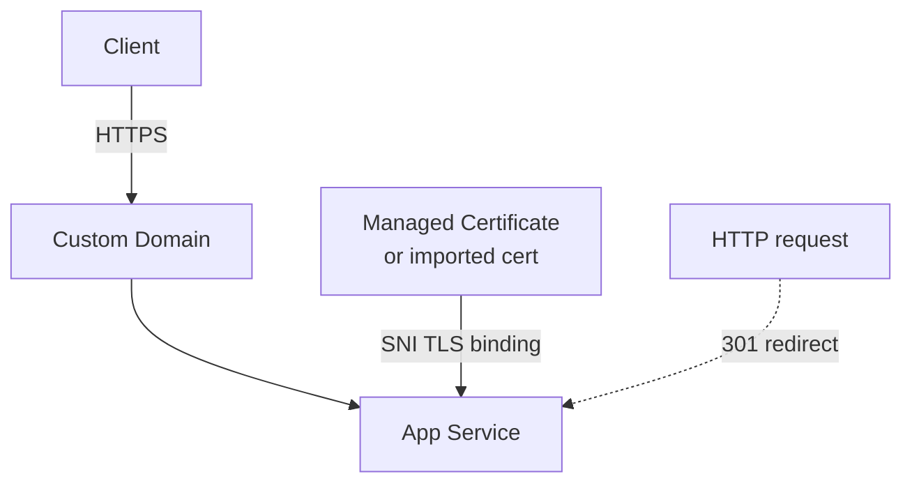

---
content_sources:
  diagrams:
    - id: diagram-1
      type: flowchart
      source: mslearn-adapted
      mslearn_url: https://learn.microsoft.com/en-us/azure/app-service/app-service-web-tutorial-custom-domain
    - id: how-custom-domains-work
      type: flowchart
      source: mslearn-adapted
      mslearn_url: https://learn.microsoft.com/en-us/azure/app-service/app-service-web-tutorial-custom-domain
    - id: how-https-binding-works
      type: flowchart
      source: mslearn-adapted
      mslearn_url: https://learn.microsoft.com/en-us/azure/app-service/app-service-web-tutorial-custom-domain
---
# 07. Custom Domains and SSL (OPTIONAL)

⏱️ **Time**: 30 minutes  
🏗️ **Prerequisites**: A registered domain name, access to your DNS provider

By default, your app is accessible at `*.azurewebsites.net`. For production, you'll likely want a custom domain (e.g., `www.contoso.com`) with a valid SSL certificate.

!!! info "Infrastructure Context"
    **Service**: App Service (Linux, Standard S1) | **Network**: VNet integrated | **VNet**: ✅

    This tutorial assumes a production-ready App Service deployment with VNet integration, private endpoints for backend services, and managed identity for authentication.

<!-- diagram-id: diagram-1 -->


> **Note**: This tutorial is **OPTIONAL**. You can run production workloads on the default `.azurewebsites.net` domain indefinitely.

## What you'll learn
- Mapping a custom domain to your App Service
- Configuring DNS records (CNAME and TXT)
- Securing your domain with App Service Managed Certificates (Free)
- Enforcing HTTPS-only traffic

## How Custom Domains Work

<!-- diagram-id: how-custom-domains-work -->


Azure verifies domain ownership via a TXT record before allowing the hostname binding.

## How HTTPS Binding Works

<!-- diagram-id: how-https-binding-works -->


After binding a certificate, App Service terminates TLS and can redirect all HTTP traffic to HTTPS.

## 1. Prerequisites
- **Domain Ownership**: You must own the domain you want to use.
- **DNS Access**: You must be able to create CNAME and TXT records at your domain registrar (GoDaddy, Namecheap, Azure DNS, etc.).
- **App Service Plan**: Custom domains require a paid App Service plan (not the Free F1 tier). App Service Managed Certificates require Basic tier or higher.

## 2. Configure Custom Domain
Azure uses a TXT record to verify domain ownership before allowing the mapping.

### Get Verification ID
```bash
az webapp show --name $APP_NAME --resource-group $RG --query customDomainVerificationId --output json | jq -r '.'
```

| Command/Code | Purpose |
|--------------|---------|
| `az webapp show --name $APP_NAME --resource-group $RG --query customDomainVerificationId --output json | jq -r '.'` | Retrieves the domain ownership verification ID required for the DNS TXT record |

**Example output:**
<!-- Verified: real az CLI output from koreacentral, 2026-05-01 -->
```
5F4D40324651269FDA2F10E03050A49ECBA6A88B93D95EA7E223D34005F9E7DE
```

### Add DNS Records
Go to your DNS provider and add:

1. **TXT Record**:
    - Host: `asuid.www` (for `www.yourdomain.com`)
    - Value: The Verification ID from the previous step.
2. **CNAME Record**:
    - Host: `www`
    - Value: `app-myapp-abc123.azurewebsites.net`

### Map the Domain in Azure
```bash
az webapp config hostname add \
  --webapp-name $APP_NAME \
  --resource-group $RG \
  --hostname www.yourdomain.com \
  --output json
```

| Command/Code | Purpose |
|--------------|---------|
| `az webapp config hostname add ... --hostname www.yourdomain.com --output json` | Adds the custom hostname binding to the App Service app |

On success, the command returns JSON containing `hostName`, `hostNameType: "Verified"`, and `siteName`. Requires DNS TXT and CNAME records to propagate before running.

| Command/Code | Purpose |
|--------------|---------|
| `hostName` | Shows the verified custom domain that was bound |
| `hostNameType` | Shows the hostname verification state |
| `siteName` | Shows which App Service app owns the binding |

## 3. SSL/TLS Configuration
Once the domain is mapped, secure it with a free Managed Certificate.

### Create Managed Certificate
```bash
az webapp config ssl create \
  --name $APP_NAME \
  --resource-group $RG \
  --hostname www.yourdomain.com \
  --output json
```

!!! note "Preview Command"
    `az webapp config ssl create` is currently in Preview. Not all hostname configurations are eligible for managed certificates. See [App Service TLS overview](https://learn.microsoft.com/en-us/azure/app-service/overview-tls) for eligibility requirements. The Azure Portal provides an alternative path for managed certificate creation.

| Command/Code | Purpose |
|--------------|---------|
| `az webapp config ssl create ... --hostname www.yourdomain.com --output json` | Requests an App Service managed certificate for the custom domain |

### Bind the Certificate
```bash
# Get the certificate thumbprint from the previous command output or:
THUMBPRINT=$(az webapp config ssl list --resource-group $RG --query "[?hostname=='www.yourdomain.com'].thumbprint | [0]" --output tsv)

az webapp config ssl bind \
  --name $APP_NAME \
  --resource-group $RG \
  --certificate-thumbprint $THUMBPRINT \
  --ssl-type SNI \
  --output json
```

| Command/Code | Purpose |
|--------------|---------|
| `THUMBPRINT=$(az webapp config ssl list ... --query "[?hostname=='www.yourdomain.com'].thumbprint | [0]" --output tsv)` | Looks up the certificate thumbprint for the custom domain as a scalar value |
| `az webapp config ssl bind ... --certificate-thumbprint $THUMBPRINT --ssl-type SNI --output json` | Binds the certificate to the custom hostname using SNI-based TLS |

## 4. Security Hardening
Ensure all traffic uses HTTPS and modern TLS versions.

```bash
# Force HTTPS-only
az webapp update \
  --name $APP_NAME \
  --resource-group $RG \
  --https-only true \
  --output json

# Set minimum TLS version to 1.2
az webapp config set \
  --name $APP_NAME \
  --resource-group $RG \
  --min-tls-version 1.2 \
  --output json
```

| Command/Code | Purpose |
|--------------|---------|
| `az webapp update ... --https-only true --output json` | Redirects all HTTP traffic to HTTPS |
| `az webapp config set ... --min-tls-version 1.2 --output json` | Requires clients to use TLS 1.2 or newer |

## Verification
Test your new domain using `curl`:

```bash
# Verify it redirects to HTTPS
curl -I http://www.yourdomain.com

# Verify the SSL certificate is valid
curl -v https://www.yourdomain.com/health 2>&1 | grep "SSL certificate verify ok"
```

| Command/Code | Purpose |
|--------------|---------|
| `curl -I http://www.yourdomain.com` | Checks whether plain HTTP requests are redirected |
| `curl -v https://www.yourdomain.com/health 2>&1 | grep "SSL certificate verify ok"` | Verifies the HTTPS certificate is trusted during the health request |

## Troubleshooting
- **DNS Propagation**: Changes can take anywhere from a few minutes to 48 hours to propagate. Use `dig` or `nslookup` to verify your records are live.
- **Verification Failed**: Ensure the TXT record host is exactly `asuid.<subdomain>`.
- **Managed Certificate Limitations**: Managed certificates do not support wildcards (e.g., `*.yourdomain.com`). For wildcards, you must upload a custom PFX certificate.

## Next Steps
Congratulations! You've completed the core operations path. Explore the **[Recipes](../recipes/index.md)** section for advanced scenarios like Managed Identity and Key Vault integration.

---

## Advanced Options

!!! info "Coming Soon"
    - Wildcard SSL certificates
    - Azure Front Door for global delivery
- [Contribute](https://github.com/yeongseon/azure-app-service-practical-guide/issues)

## Run It in the Portal

#### Portal view: Custom domains blade (post-binding verification)

[[[ shot("platform--mtls--01-custom-domains-tls") ]]]

The Custom domains blade is the Portal verification surface for the `az webapp config hostname add` and `az webapp config ssl bind` steps in this Node.js tutorial. This capture shows the before-state: only the default `*.azurewebsites.net` hostname is present, while the `IP address` field at the top is the value you compare against the apex-domain `A` record during setup and `Add custom domain` is the visible Portal entry point for the same hostname-binding flow. After DNS validation and certificate binding, return to this blade and confirm your added hostname rows show `Status: Secured`, `Binding type: SNI SSL`, and a populated `Certificate used` value for the Express app's hostnames.

## See Also
- [Operations Networking](../../../operations/networking.md)

## Sources
- [Azure Front Door Documentation](https://learn.microsoft.com/en-us/azure/frontdoor/)
- [Map a custom domain to App Service (Microsoft Learn)](https://learn.microsoft.com/en-us/azure/app-service/app-service-web-tutorial-custom-domain)
