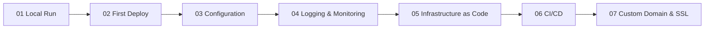

---
content_sources:
  diagrams:
    - id: tutorial-progress
      type: flowchart
      source: mslearn-adapted
      mslearn_url: https://learn.microsoft.com/en-us/azure/app-service/
---

# Node.js Tutorial Overview

**Estimated time: 2–3 hours**

This tutorial walks through the full Azure App Service path for a Node.js app, from local validation to custom domain and SSL.

## Prerequisites

- **Node.js 18+**
- **npm**
- **Azure CLI**

## Tutorial Progression

<!-- diagram-id: tutorial-progress -->

## Steps

| Step | Tutorial | What you'll do |
|---|---|---|
| 1 | [01. Local Run](./01-local-run.md) | Run the app locally and validate App Service-ready defaults |
| 2 | [02. First Deploy](./02-first-deploy.md) | Deploy the app to Azure App Service for the first time |
| 3 | [03. Configuration](./03-configuration.md) | Configure app settings, startup behavior, and environment variables |
| 4 | [04. Logging & Monitoring](./04-logging-monitoring.md) | Enable logs, observe runtime behavior, and verify telemetry |
| 5 | [05. Infrastructure as Code](./05-infrastructure-as-code.md) | Provision the App Service resources with repeatable IaC |
| 6 | [06. CI/CD](./06-ci-cd.md) | Automate build and deployment using a pipeline |
| 7 | [07. Custom Domain & SSL](./07-custom-domain-ssl.md) | Bind a custom domain and secure it with TLS |

## Recommended Reading

- [Node.js Guide](../index.md)
- [Node.js Runtime Details](../nodejs-runtime.md)
- [Node.js Recipes](../recipes/index.md)

## Sources

- [Azure App Service documentation](https://learn.microsoft.com/en-us/azure/app-service/)
- [Quickstart: Deploy a Node.js web app to Azure App Service](https://learn.microsoft.com/en-us/azure/app-service/quickstart-nodejs)
