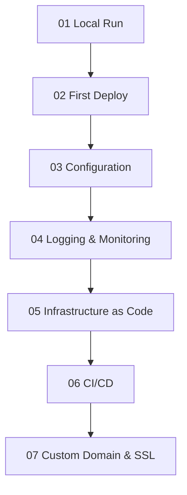

---
content_sources:
  diagrams:
  - id: tutorial-progress
    type: flowchart
    source: mslearn-adapted
    mslearn_url: https://learn.microsoft.com/en-us/azure/app-service/
validation:
  az_cli:
    last_tested: null
    cli_version: null
    result: not_tested
---
# Node.js Tutorial Overview

**Estimated time: 2–3 hours**

This tutorial walks through the full Azure App Service path for a Node.js app, from local validation to custom domain and SSL.

## Prerequisites

- **Node.js 20+**
- **npm**
- **Azure CLI**

## Tutorial Progression

<!-- diagram-id: tutorial-progress -->

```mermaid
flowchart TD
    A[01 Local Run] --> B[02 First Deploy]
    B --> C[03 Configuration]
    C --> D[04 Logging & Monitoring]
    D --> E[05 Infrastructure as Code]
    E --> F[06 CI/CD]
    F --> G[07 Custom Domain & SSL]
```

## Steps

| Step | Tutorial | What you'll do |
|---|---|---|
| 1 | [01. Local Run](./01-local-run.md) | Run the app locally and validate App Service-ready defaults |
| 2 | [02. First Deploy](./02-first-deploy.md) | Deploy the app to Azure App Service for the first time |
| 3 | [03. Configuration](./03-configuration.md) | Configure app settings, startup behavior, and environment variables |
| 4 | [04. Logging & Monitoring](./04-logging-monitoring.md) | Enable logs, observe runtime behavior, and verify telemetry |
| 5 | [05. Infrastructure as Code](./05-infrastructure-as-code.md) | Provision the App Service resources with repeatable IaC |
| 6 | [06. CI/CD](./06-ci-cd.md) | Automate build and deployment using a pipeline |
| 7 | [07. Custom Domain & SSL](./07-custom-domain-ssl.md) | Bind a custom domain and secure it with TLS |

## Recommended Reading

- [Node.js Guide](../index.md)
- [Node.js Runtime Details](../nodejs-runtime.md)
- [Node.js Recipes](../recipes/index.md)

## Run It in the Portal

#### Portal view: App Service Web App overview (tutorial destination blade)

![Azure portal Overview blade for `app-test-20251107` (Web App) with a command bar (`Browse`, `Stop`, `Swap`, `Restart`, `Delete`, `Refresh`, `Download publish profile`, `Reset publish profile`, `Share to mobile`, `Send us your feedback`) and an Essentials panel showing Resource group `rg-test-20251107`, Status `Running`, Location `Korea Central`, Subscription `Visual Studio Enterprise Subscription`, Subscription ID `00000000-0000-0000-0000-000000000000`, Default domain `app-test-20251107.azurewebsites.net`, App Service Plan `asp-test-20251107 (P0v3: 1)`, Operating System `Linux`, and Health Check `Not Configured`. The Properties tab is selected (next to Monitoring, Logs, Capabilities, Notifications (1), Recommendations) and surfaces Web app (`Publishing model: Code`, `Runtime Stack: Python - 3.11`, `Runtime status: Healthy`), Domains (`2 Domains View all`), Hosting (`Plan Type: App Service plan`, `Instance Count: 1`, `SKU and size: Premium0V3 (P0v3)` with `Scale up` link), Deployment Center (`Last deployment: Successful on Thursday, November 6, 10:58:01 PM`, `Deployment provider: None`), Application Insights (`Name: ai-test-20251107`, `Region: Korea Central`), and Networking (`Inbound IP addresses: 20.200.197.3, 2603:1040:f05:3::208`, `Private endpoint connections: 0 private endpoints`, `Virtual network integration: Not configured`). Left nav under the search box lists Overview (selected), Activity log, Access control (IAM), Tags, Diagnose and solve problems, Microsoft Defender for Cloud, Events (preview), Log stream, AI (preview), Resource visualizer, with collapsed groups Deployment, Settings, Performance, App Service plan, Development Tools, API, Monitoring, Automation, and Support + troubleshooting.](../../../assets/platform/architecture/01-app-service-overview.png)

The Web App `Overview` blade brings the main tutorial state into one visible page. The `Essentials` panel shows `Status: Running`, `Default domain`, `App Service Plan: asp-test-20251107 (P0v3: 1)`, and `Operating System: Linux`, while the selected `Properties` tab adds `Runtime Stack` and `Runtime status` rows under `Web app` — the screenshot was captured from a Python deployment, so the visible value is `Runtime Stack: Python - 3.11`; the same row reports the Node.js stack value for the Express app produced by this tutorial. The same blade also shows hosting, deployment, monitoring, and networking summaries in the `Hosting`, `Deployment Center`, `Application Insights`, and `Networking` sections. The command bar at the top exposes the visible management actions for the app, including `Browse`, `Stop`, `Swap`, `Restart`, `Delete`, and `Refresh`.

## See Also

- [Guide home](../../../index.md)
- [Start here](../../../start-here/overview.md)

## Sources

- [Azure App Service documentation](https://learn.microsoft.com/en-us/azure/app-service/)
- [Quickstart: Deploy a Node.js web app to Azure App Service](https://learn.microsoft.com/en-us/azure/app-service/quickstart-nodejs)
