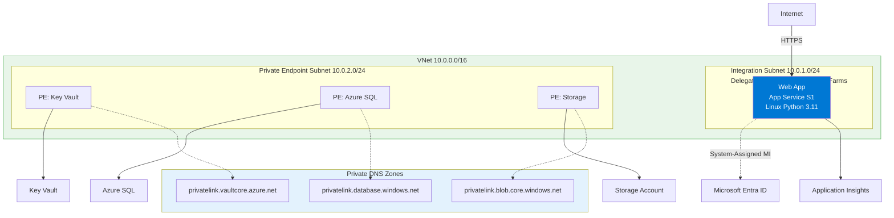
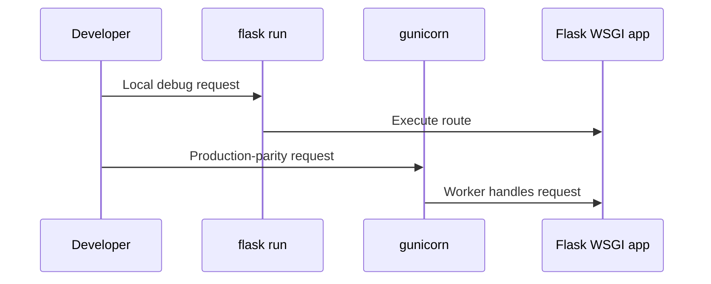

---
hide:
  - toc
content_sources:
  diagrams:
    - id: 01-run-flask-locally-with-app-service-parity
      type: flowchart
      source: mslearn-adapted
      mslearn_url: https://learn.microsoft.com/en-us/azure/app-service/
    - id: validate-worker-and-timeout-behavior
      type: flowchart
      source: mslearn-adapted
      mslearn_url: https://learn.microsoft.com/en-us/azure/app-service/
---

# 01 - Run Flask Locally with App Service Parity

This guide sets up a local Flask workflow that mirrors Azure App Service behavior. You will run both development and production-style servers to reduce deployment surprises.

!!! info "Infrastructure Context"
    **Service**: App Service (Linux, Standard S1) | **Network**: VNet integrated | **VNet**: ✅

    This tutorial assumes a production-ready App Service deployment with VNet integration, private endpoints for backend services, and managed identity for authentication.

<!-- diagram-id: 01-run-flask-locally-with-app-service-parity -->


## Prerequisites

- Python 3.11 or newer
- Repository cloned locally
- Terminal with Bash, Zsh, or PowerShell

## Main Content

### Create and activate a virtual environment

```bash
cd app
python -m venv .venv
source .venv/bin/activate
```

| Command | Purpose |
|---------|---------|
| `cd app` | Moves into the Flask application directory before creating the environment. |
| `python -m venv .venv` | Creates an isolated Python virtual environment in `.venv`. |
| `source .venv/bin/activate` | Activates the virtual environment in the current shell session. |

On Windows:

```powershell
.venv\Scripts\Activate.ps1
```

### Install dependencies from requirements.txt

```bash
pip install --upgrade pip
pip install -r requirements.txt
```

| Command | Purpose |
|---------|---------|
| `pip install --upgrade pip` | Updates `pip` to the latest available version in the virtual environment. |
| `pip install -r requirements.txt` | Installs all Python packages required by the Flask app. |

### Run with Flask CLI for development

`flask run` provides fast iteration and debug-friendly behavior:

```bash
export FLASK_APP=src.app:app
export FLASK_ENV=development
flask run --port 8000
```

| Command | Purpose |
|---------|---------|
| `export FLASK_APP=src.app:app` | Points Flask CLI to the application object exposed by `src.app`. |
| `export FLASK_ENV=development` | Enables Flask development-friendly behavior for local work. |
| `flask run --port 8000` | Starts the Flask development server on port `8000`. |
| `--port 8000` | Binds the local development server to TCP port `8000`. |

Verify:

```bash
curl http://localhost:8000/health
```

| Command | Purpose |
|---------|---------|
| `curl http://localhost:8000/health` | Sends a test request to the health endpoint to confirm the app is responding. |

### Run with Gunicorn for production parity

App Service Linux runs Python apps via Gunicorn. Validate the same startup shape locally:

```bash
export PORT=8000
gunicorn --bind=0.0.0.0:$PORT src.app:app
```

| Command | Purpose |
|---------|---------|
| `export PORT=8000` | Sets the port variable that matches how App Service passes the listening port. |
| `gunicorn --bind=0.0.0.0:$PORT src.app:app` | Starts the Flask app with Gunicorn for production-style local testing. |
| `--bind=0.0.0.0:$PORT` | Listens on all network interfaces using the port stored in `PORT`. |
| `src.app:app` | Tells Gunicorn which Python module and WSGI app object to load. |

### Validate worker and timeout behavior

Tune worker and timeout values to simulate production load:

```bash
gunicorn --bind=0.0.0.0:$PORT --workers 2 --timeout 120 src.app:app
```

| Command | Purpose |
|---------|---------|
| `gunicorn --bind=0.0.0.0:$PORT --workers 2 --timeout 120 src.app:app` | Runs Gunicorn with explicit worker and timeout settings to simulate production behavior. |
| `--bind=0.0.0.0:$PORT` | Exposes the service on the configured host and port. |
| `--workers 2` | Starts two worker processes to handle concurrent requests. |
| `--timeout 120` | Restarts workers if a request takes longer than 120 seconds. |

<!-- diagram-id: validate-worker-and-timeout-behavior -->


## Advanced Topics

Add `python-dotenv` for local `.env` loading, then compare request latency and memory profile between Flask development server and Gunicorn workers.

## See Also
- [02 - First Deploy](./02-first-deploy.md)

## Sources
- [Configure a Linux Python app (Microsoft Learn)](https://learn.microsoft.com/en-us/azure/app-service/configure-language-python)
- [Quickstart: Deploy a Python web app (Microsoft Learn)](https://learn.microsoft.com/en-us/azure/app-service/quickstart-python)
