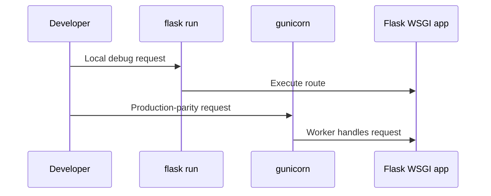

---
hide:
  - toc
---

# 01 - Run Flask Locally with App Service Parity

This guide sets up a local Flask workflow that mirrors Azure App Service behavior. You will run both development and production-style servers to reduce deployment surprises.

## Prerequisites

- Python 3.11 or newer
- Repository cloned locally
- Terminal with Bash, Zsh, or PowerShell

## Main Content

### Create and activate a virtual environment

```bash
cd app
python -m venv .venv
source .venv/bin/activate
```

On Windows:

```powershell
.venv\Scripts\Activate.ps1
```

### Install dependencies from requirements.txt

```bash
pip install --upgrade pip
pip install -r requirements.txt
```

### Run with Flask CLI for development

`flask run` provides fast iteration and debug-friendly behavior:

```bash
export FLASK_APP=src.app:app
export FLASK_ENV=development
flask run --port 8000
```

Verify:

```bash
curl http://localhost:8000/health
```

### Run with Gunicorn for production parity

App Service Linux runs Python apps via Gunicorn. Validate the same startup shape locally:

```bash
export PORT=8000
gunicorn --bind=0.0.0.0:$PORT src.app:app
```

### Validate worker and timeout behavior

Tune worker and timeout values to simulate production load:

```bash
gunicorn --bind=0.0.0.0:$PORT --workers 2 --timeout 120 src.app:app
```



## Advanced Topics

Add `python-dotenv` for local `.env` loading, then compare request latency and memory profile between Flask development server and Gunicorn workers.

## See Also
- [02 - First Deploy](./02-first-deploy.md)

## Sources
- [Configure a Linux Python app (Microsoft Learn)](https://learn.microsoft.com/en-us/azure/app-service/configure-language-python)
- [Quickstart: Deploy a Python web app (Microsoft Learn)](https://learn.microsoft.com/en-us/azure/app-service/quickstart-python)
