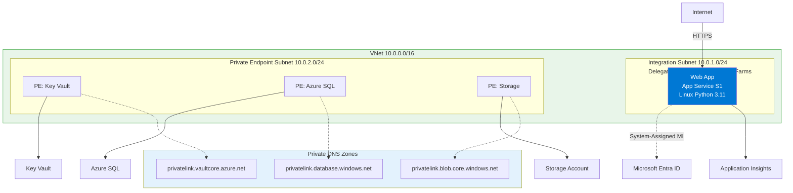
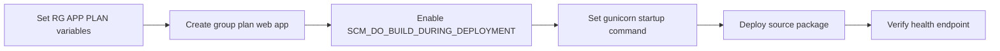

---
hide:
  - toc
content_sources:
  diagrams:
    - id: 02-first-deployment-to-azure-app-service
      type: flowchart
      source: mslearn-adapted
      mslearn_url: https://learn.microsoft.com/en-us/azure/app-service/quickstart-python
    - id: diagram-2
      type: flowchart
      source: mslearn-adapted
      mslearn_url: https://learn.microsoft.com/en-us/azure/app-service/quickstart-python
---

# 02 - First Deployment to Azure App Service

This chapter deploys a Flask app to Azure App Service using Python build automation. It focuses on `requirements.txt`, Oryx build detection, and explicit startup command settings.

!!! info "Infrastructure Context"
    **Service**: App Service (Linux, Standard S1) | **Network**: VNet integrated | **VNet**: ✅

    This tutorial assumes a production-ready App Service deployment with VNet integration, private endpoints for backend services, and managed identity for authentication.

<!-- diagram-id: 02-first-deployment-to-azure-app-service -->


<!-- diagram-id: diagram-2 -->


## Prerequisites

- Completed [01 - Local Run](./01-local-run.md)
- Azure CLI authenticated
- Resource naming variables prepared

## Main Content

### Step 1: Prepare deployment variables

```bash
SUBSCRIPTION_ID="<subscription-id>"
RG="rg-flask-tutorial"
LOCATION="koreacentral"
PLAN_NAME="plan-flask-tutorial-s1"
APP_NAME="app-flask-tutorial-abc123"
VNET_NAME="vnet-flask-tutorial"
INTEGRATION_SUBNET_NAME="snet-appsvc-integration"
PE_SUBNET_NAME="snet-private-endpoints"
STORAGE_NAME="stflasktutorialabc123"
```

| Command | Purpose |
|---------|---------|
| `SUBSCRIPTION_ID="<subscription-id>"` | Stores the Azure subscription ID used for the deployment. |
| `RG="rg-flask-tutorial"` | Defines the resource group name for all tutorial resources. |
| `LOCATION="koreacentral"` | Sets the Azure region where resources will be created. |
| `PLAN_NAME="plan-flask-tutorial-s1"` | Defines the App Service plan name. |
| `APP_NAME="app-flask-tutorial-abc123"` | Sets the globally unique web app name. |
| `VNET_NAME="vnet-flask-tutorial"` | Defines the virtual network name. |
| `INTEGRATION_SUBNET_NAME="snet-appsvc-integration"` | Names the subnet used for App Service VNet integration. |
| `PE_SUBNET_NAME="snet-private-endpoints"` | Names the subnet reserved for private endpoints. |
| `STORAGE_NAME="stflasktutorialabc123"` | Sets the storage account name used later in the tutorial. |

### Step 2: Select the target subscription

```bash
az account set --subscription $SUBSCRIPTION_ID
az account show --query "{subscriptionId:id, tenantId:tenantId, user:user.name}" --output json
```

| Command | Purpose |
|---------|---------|
| `az account set --subscription $SUBSCRIPTION_ID` | Switches Azure CLI to the target subscription. |
| `--subscription $SUBSCRIPTION_ID` | Selects the subscription ID stored in the variable. |
| `az account show --query "{subscriptionId:id, tenantId:tenantId, user:user.name}" --output json` | Displays the active subscription, tenant, and signed-in user for verification. |
| `--query` | Filters the Azure CLI response to only the fields needed for confirmation. |
| `--output json` | Returns the result in JSON format. |

???+ example "Expected output"
    ```json
    {
      "subscriptionId": "<subscription-id>",
      "tenantId": "<tenant-id>",
      "user": "user@example.com"
    }
    ```

### Step 3: Create resource group, App Service plan, and web app

```bash
az group create --name $RG --location $LOCATION
az appservice plan create --resource-group $RG --name $PLAN_NAME --is-linux --sku S1
az webapp create --resource-group $RG --plan $PLAN_NAME --name $APP_NAME --runtime "PYTHON|3.11"
```

| Command | Purpose |
|---------|---------|
| `az group create --name $RG --location $LOCATION` | Creates the resource group that holds the tutorial resources. |
| `--name $RG` | Sets the resource group name. |
| `--location $LOCATION` | Places the resource group metadata in the selected Azure region. |
| `az appservice plan create --resource-group $RG --name $PLAN_NAME --is-linux --sku S1` | Creates a Linux App Service plan sized for the app. |
| `--resource-group $RG` | Deploys the App Service plan into the tutorial resource group. |
| `--name $PLAN_NAME` | Names the App Service plan resource. |
| `--is-linux` | Creates a Linux hosting plan instead of Windows. |
| `--sku S1` | Chooses the Standard S1 pricing tier. |
| `az webapp create --resource-group $RG --plan $PLAN_NAME --name $APP_NAME --runtime "PYTHON|3.11"` | Creates the Python web app in the App Service plan. |
| `--plan $PLAN_NAME` | Attaches the web app to the specified App Service plan. |
| `--runtime "PYTHON|3.11"` | Selects Python 3.11 as the App Service runtime stack. |

???+ example "Expected output"
    ```json
    {
      "defaultHostName": "app-flask-tutorial-abc123.azurewebsites.net",
      "enabledHostNames": [
        "app-flask-tutorial-abc123.azurewebsites.net",
        "app-flask-tutorial-abc123.scm.azurewebsites.net"
      ],
      "state": "Running"
    }
    ```

### Step 4: Create VNet and delegated integration subnet

```bash
az network vnet create --resource-group $RG --name $VNET_NAME --location $LOCATION --address-prefixes 10.0.0.0/16
az network vnet subnet create --resource-group $RG --vnet-name $VNET_NAME --name $INTEGRATION_SUBNET_NAME --address-prefixes 10.0.1.0/24 --delegations Microsoft.Web/serverFarms
```

| Command | Purpose |
|---------|---------|
| `az network vnet create --resource-group $RG --name $VNET_NAME --location $LOCATION --address-prefixes 10.0.0.0/16` | Creates the virtual network used by the tutorial environment. |
| `--name $VNET_NAME` | Sets the virtual network name. |
| `--address-prefixes 10.0.0.0/16` | Reserves the address space for the virtual network. |
| `az network vnet subnet create --resource-group $RG --vnet-name $VNET_NAME --name $INTEGRATION_SUBNET_NAME --address-prefixes 10.0.1.0/24 --delegations Microsoft.Web/serverFarms` | Creates the subnet used for App Service VNet integration. |
| `--vnet-name $VNET_NAME` | Targets the subnet creation at the specified VNet. |
| `--name $INTEGRATION_SUBNET_NAME` | Names the integration subnet. |
| `--address-prefixes 10.0.1.0/24` | Allocates the subnet CIDR block. |
| `--delegations Microsoft.Web/serverFarms` | Delegates the subnet to App Service plans for integration. |

???+ example "Expected output"
    ```json
    {
      "addressPrefix": "10.0.1.0/24",
      "delegations": [
        {
          "serviceName": "Microsoft.Web/serverFarms"
        }
      ],
      "name": "snet-appsvc-integration"
    }
    ```

### Step 5: Create private endpoint subnet

```bash
az network vnet subnet create --resource-group $RG --vnet-name $VNET_NAME --name $PE_SUBNET_NAME --address-prefixes 10.0.2.0/24 --disable-private-endpoint-network-policies true
```

| Command | Purpose |
|---------|---------|
| `az network vnet subnet create --resource-group $RG --vnet-name $VNET_NAME --name $PE_SUBNET_NAME --address-prefixes 10.0.2.0/24 --disable-private-endpoint-network-policies true` | Creates a subnet dedicated to private endpoints. |
| `--name $PE_SUBNET_NAME` | Names the private endpoint subnet. |
| `--address-prefixes 10.0.2.0/24` | Assigns the CIDR block for private endpoints. |
| `--disable-private-endpoint-network-policies true` | Disables subnet policies that would block private endpoint creation. |

???+ example "Expected output"
    ```json
    {
      "addressPrefix": "10.0.2.0/24",
      "name": "snet-private-endpoints",
      "privateEndpointNetworkPolicies": "Disabled"
    }
    ```

### Step 6: Integrate the web app with the VNet

```bash
az webapp vnet-integration add --resource-group $RG --name $APP_NAME --vnet $VNET_NAME --subnet $INTEGRATION_SUBNET_NAME
```

| Command | Purpose |
|---------|---------|
| `az webapp vnet-integration add --resource-group $RG --name $APP_NAME --vnet $VNET_NAME --subnet $INTEGRATION_SUBNET_NAME` | Connects the web app to the delegated integration subnet. |
| `--name $APP_NAME` | Selects the App Service app to integrate. |
| `--vnet $VNET_NAME` | Chooses the virtual network for outbound integration. |
| `--subnet $INTEGRATION_SUBNET_NAME` | Chooses the delegated subnet used by the web app. |

???+ example "Expected output"
    ```json
    {
      "isSwift": true,
      "subnetResourceId": "/subscriptions/<subscription-id>/resourceGroups/rg-flask-tutorial/providers/Microsoft.Network/virtualNetworks/vnet-flask-tutorial/subnets/snet-appsvc-integration"
    }
    ```

### Step 7: Assign managed identity to the web app

```bash
az webapp identity assign --resource-group $RG --name $APP_NAME
```

| Command | Purpose |
|---------|---------|
| `az webapp identity assign --resource-group $RG --name $APP_NAME` | Enables a system-assigned managed identity for the web app. |
| `--name $APP_NAME` | Targets the specific App Service instance. |

???+ example "Expected output"
    ```json
    {
      "principalId": "<object-id>",
      "tenantId": "<tenant-id>",
      "type": "SystemAssigned"
    }
    ```

### Step 8: Enable Oryx build and set startup command

Oryx detects Python projects when `requirements.txt` exists in the deployed package root.

```bash
ls requirements.txt
az webapp config appsettings set --resource-group $RG --name $APP_NAME --settings SCM_DO_BUILD_DURING_DEPLOYMENT=true
az webapp config set --resource-group $RG --name $APP_NAME --startup-file "gunicorn --bind=0.0.0.0:$PORT src.app:app"
```

| Command | Purpose |
|---------|---------|
| `ls requirements.txt` | Verifies that `requirements.txt` exists at the deployment package root for Oryx detection. |
| `az webapp config appsettings set --resource-group $RG --name $APP_NAME --settings SCM_DO_BUILD_DURING_DEPLOYMENT=true` | Enables server-side build automation during deployment. |
| `--settings SCM_DO_BUILD_DURING_DEPLOYMENT=true` | Tells App Service to run Oryx build steps after upload. |
| `az webapp config set --resource-group $RG --name $APP_NAME --startup-file "gunicorn --bind=0.0.0.0:$PORT src.app:app"` | Configures the startup command used by the Python app in App Service. |
| `--startup-file "gunicorn --bind=0.0.0.0:$PORT src.app:app"` | Sets Gunicorn as the process that starts the Flask app. |

???+ example "Expected output"
    ```json
    {
      "name": "SCM_DO_BUILD_DURING_DEPLOYMENT",
      "value": "true"
    }
    ```

### Step 9: Deploy from local source

```bash
az webapp up --resource-group $RG --name $APP_NAME --runtime "PYTHON:3.11"
```

| Command | Purpose |
|---------|---------|
| `az webapp up --resource-group $RG --name $APP_NAME --runtime "PYTHON:3.11"` | Uploads the current app source and deploys it to the existing web app. |
| `--resource-group $RG` | Targets the deployment at the tutorial resource group. |
| `--name $APP_NAME` | Uses the existing web app name for deployment. |
| `--runtime "PYTHON:3.11"` | Confirms the deployment uses the Python 3.11 runtime. |

???+ example "Expected output"
    ```text
    {"status":"Build successful"}
    {"status":"Deployment successful"}
    You can launch the app at http://app-flask-tutorial-abc123.azurewebsites.net
    ```

### Step 10: Verify URL, health, and deployment history

```bash
WEB_APP_URL="https://$(az webapp show --resource-group $RG --name $APP_NAME --query defaultHostName --output tsv)"
curl $WEB_APP_URL/health
az webapp log deployment list --resource-group $RG --name $APP_NAME --output table
```

| Command | Purpose |
|---------|---------|
| `WEB_APP_URL="https://$(az webapp show --resource-group $RG --name $APP_NAME --query defaultHostName --output tsv)"` | Builds the full HTTPS site URL from the app's default hostname. |
| `az webapp show ... --query defaultHostName --output tsv` | Retrieves only the default hostname value for the web app. |
| `curl $WEB_APP_URL/health` | Calls the health endpoint to confirm the deployed app responds successfully. |
| `az webapp log deployment list --resource-group $RG --name $APP_NAME --output table` | Lists recent deployment records for troubleshooting and verification. |
| `--output table` | Formats deployment history in a readable table. |

???+ example "Expected output"
    ```text
    {"status":"ok"}

    Id    Status   Author     Message
    ----  -------  ---------  ----------------------
    1234  Success  N/A        deployment successful
    ```

### Step 11 (Optional): Create a private endpoint for Storage

```bash
az storage account create --resource-group $RG --name $STORAGE_NAME --location $LOCATION --sku Standard_LRS --kind StorageV2

STORAGE_ID="$(az storage account show --resource-group $RG --name $STORAGE_NAME --query id --output tsv)"

az network private-endpoint create --resource-group $RG --name pe-storage-blob --vnet-name $VNET_NAME --subnet $PE_SUBNET_NAME --private-connection-resource-id $STORAGE_ID --group-id blob --connection-name pe-storage-blob-connection
```

| Command | Purpose |
|---------|---------|
| `az storage account create --resource-group $RG --name $STORAGE_NAME --location $LOCATION --sku Standard_LRS --kind StorageV2` | Creates a storage account that can later be accessed through a private endpoint. |
| `--sku Standard_LRS` | Uses standard locally redundant storage. |
| `--kind StorageV2` | Creates a general-purpose v2 storage account. |
| `STORAGE_ID="$(az storage account show --resource-group $RG --name $STORAGE_NAME --query id --output tsv)"` | Captures the storage account resource ID for the next command. |
| `az storage account show ... --query id --output tsv` | Returns only the storage account resource ID as plain text. |
| `az network private-endpoint create --resource-group $RG --name pe-storage-blob --vnet-name $VNET_NAME --subnet $PE_SUBNET_NAME --private-connection-resource-id $STORAGE_ID --group-id blob --connection-name pe-storage-blob-connection` | Creates a private endpoint for the storage account's Blob service. |
| `--vnet-name $VNET_NAME` | Places the private endpoint inside the selected virtual network. |
| `--subnet $PE_SUBNET_NAME` | Uses the subnet reserved for private endpoints. |
| `--private-connection-resource-id $STORAGE_ID` | Points the private endpoint at the target storage account resource. |
| `--group-id blob` | Connects specifically to the Blob subresource. |
| `--connection-name pe-storage-blob-connection` | Names the private link connection object. |

???+ example "Expected output"
    ```json
    {
      "name": "pe-storage-blob",
      "privateLinkServiceConnections": [
        {
          "groupIds": [
            "blob"
          ],
          "privateLinkServiceId": "/subscriptions/<subscription-id>/resourceGroups/rg-flask-tutorial/providers/Microsoft.Storage/storageAccounts/stflasktutorialabc123"
        }
      ]
    }
    ```

### Step 12: Stream live logs

!!! note "Enable logging first"
    `az webapp log tail` only streams output if application logging is enabled.

    ```bash
    az webapp log config --resource-group $RG --name $APP_NAME --application-logging filesystem --level information
    ```

    | Command | Purpose |
    |---------|---------|
    | `az webapp log config --resource-group $RG --name $APP_NAME --application-logging filesystem --level information` | Enables filesystem-based application logging so `log tail` has data to stream. |
    | `--application-logging filesystem` | Writes application logs to the App Service filesystem. |
    | `--level information` | Persists informational, warning, and error application logs. |

```bash
az webapp log tail --resource-group $RG --name $APP_NAME
```

| Command | Purpose |
|---------|---------|
| `az webapp log tail --resource-group $RG --name $APP_NAME` | Streams live application and platform logs from App Service. |
| `--name $APP_NAME` | Targets the specific deployed web app. |

### Step 13: Inspect files in Kudu (SCM)

Open `https://<app-name>.scm.azurewebsites.net` in a browser. The SCM site provides:

- **File browser** - browse `/home/site/wwwroot` and verify deployed files
- **Bash console** - run commands inside the container
- **Log stream** - view raw platform and app logs

## Advanced Topics

Adopt Zip Deploy for deterministic packages, pin transitive dependencies with `pip freeze`, and benchmark startup time with and without prebuilt wheels.

## See Also
- [03 - Configuration](./03-configuration.md)

## Sources
- [Quickstart: Deploy a Python web app (Microsoft Learn)](https://learn.microsoft.com/en-us/azure/app-service/quickstart-python)
- [Deploy to App Service using GitHub Actions (Microsoft Learn)](https://learn.microsoft.com/en-us/azure/app-service/deploy-github-actions)
- [Kudu service overview (Microsoft Learn)](https://learn.microsoft.com/azure/app-service/resources-kudu)
- [Enable diagnostic logging (Microsoft Learn)](https://learn.microsoft.com/azure/app-service/troubleshoot-diagnostic-logs)
