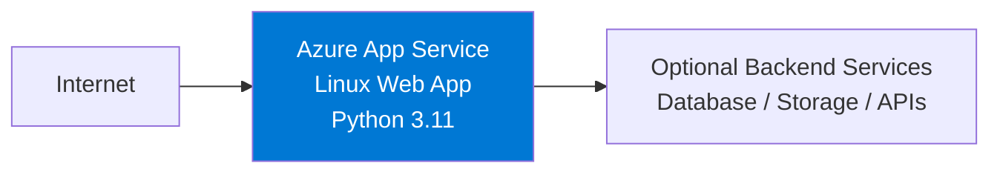

---
hide:
  - toc
content_sources:
  diagrams:
    - id: 02-first-deployment-to-azure-app-service
      type: flowchart
      source: mslearn-adapted
      mslearn_url: https://learn.microsoft.com/en-us/azure/app-service/quickstart-python
---

# 02 - First Deployment to Azure App Service

This chapter deploys the Flask app from [01 - Local Run](./01-local-run.md) to Azure App Service in a few minutes using `az webapp up`. It uses public access and a Basic B1 plan so you can focus on the fastest first deployment path.

!!! info "Deployment Scope"
    **Service**: App Service (Linux, Python 3.11) | **Access**: Public internet | **Tier**: Basic B1

    This walkthrough intentionally skips VNet integration, private endpoints, and managed identity. For that production-style pattern, use [Private Network Deployment Recipe](./recipes/private-network-deploy.md).

<!-- diagram-id: 02-first-deployment-to-azure-app-service -->


## Prerequisites

- Completed [01 - Local Run](./01-local-run.md)
- Azure CLI authenticated with `az login`
- Flask app source available in your current working directory

## Main Content

### Step 1: Set deployment variables

```bash
RG="rg-flask-tutorial"
APP_NAME="app-flask-tutorial-abc123"
LOCATION="koreacentral"
```

| Command | Purpose |
|---------|---------|
| `RG="rg-flask-tutorial"` | Defines the resource group name that will contain the deployment. |
| `APP_NAME="app-flask-tutorial-abc123"` | Sets the globally unique web app name. |
| `LOCATION="koreacentral"` | Chooses the Azure region for the deployment. |

### Step 2: Deploy with `az webapp up`

```bash
az webapp up --name $APP_NAME --resource-group $RG --location $LOCATION --runtime "PYTHON:3.11" --sku B1
```

| Command | Purpose |
|---------|---------|
| `az webapp up --name $APP_NAME --resource-group $RG --location $LOCATION --runtime "PYTHON:3.11" --sku B1` | Creates the resource group, App Service plan, and web app if needed, then uploads and deploys the current app source. |
| `--name $APP_NAME` | Uses the specified globally unique web app name. |
| `--resource-group $RG` | Creates or reuses the target resource group. |
| `--location $LOCATION` | Places the deployment in the selected Azure region. |
| `--runtime "PYTHON:3.11"` | Selects the Python 3.11 App Service runtime. |
| `--sku B1` | Uses the Basic B1 pricing tier, which is compatible with a simple public deployment. |

???+ example "Expected output"
    ```text
    The webapp 'app-flask-tutorial-abc123' doesn't exist
    Creating Resource group 'rg-flask-tutorial' ...
    Creating AppServicePlan 'appsvc_linux_koreacentral' ...
    Creating webapp 'app-flask-tutorial-abc123' ...
    Configuring default logging for the app, if not already enabled
    Creating zip with contents of dir ...
    Deploying from zip file ...
    You can launch the app at http://app-flask-tutorial-abc123.azurewebsites.net
    ```

### Step 3: Verify the deployment

```bash
WEB_APP_URL="https://$(az webapp show --resource-group $RG --name $APP_NAME --query defaultHostName --output tsv)"
curl $WEB_APP_URL/health
```

| Command | Purpose |
|---------|---------|
| `WEB_APP_URL="https://$(az webapp show --resource-group $RG --name $APP_NAME --query defaultHostName --output tsv)"` | Builds the site URL from the web app hostname returned by Azure. |
| `az webapp show --resource-group $RG --name $APP_NAME --query defaultHostName --output tsv` | Returns only the default hostname for the deployed app. |
| `curl $WEB_APP_URL/health` | Calls the Flask health endpoint to confirm the app is responding. |

???+ example "Expected output"
    ```json
    {"status":"ok"}
    ```

### Step 4: View logs

!!! note "Enable application logging first"
    `az webapp log tail` is most useful after filesystem application logging is enabled.

```bash
az webapp log config --resource-group $RG --name $APP_NAME --application-logging filesystem --level information
az webapp log tail --resource-group $RG --name $APP_NAME
```

| Command | Purpose |
|---------|---------|
| `az webapp log config --resource-group $RG --name $APP_NAME --application-logging filesystem --level information` | Enables filesystem application logging so the log stream contains app output. |
| `--application-logging filesystem` | Writes application logs to the App Service filesystem. |
| `--level information` | Captures informational, warning, and error log events. |
| `az webapp log tail --resource-group $RG --name $APP_NAME` | Streams live application and platform logs from the deployed web app. |

### Step 5: Cleanup

```bash
az group delete --name $RG --yes --no-wait
```

| Command | Purpose |
|---------|---------|
| `az group delete --name $RG --yes --no-wait` | Deletes the tutorial resource group and all resources created by `az webapp up`. |
| `--name $RG` | Targets the resource group used in this tutorial. |
| `--yes` | Skips the interactive confirmation prompt. |
| `--no-wait` | Starts deletion asynchronously so the terminal returns immediately. |

## Advanced Topics

When you are ready for private connectivity, move to a topology that adds VNet integration, private endpoints, and managed identity.

## Next Steps

- [03 - Configuration](./03-configuration.md)
- [Private Network Deployment Recipe](./recipes/private-network-deploy.md)

## Sources

- [Quickstart: Deploy a Python web app (Microsoft Learn)](https://learn.microsoft.com/en-us/azure/app-service/quickstart-python)
- [Enable diagnostic logging for apps in Azure App Service (Microsoft Learn)](https://learn.microsoft.com/azure/app-service/troubleshoot-diagnostic-logs)
