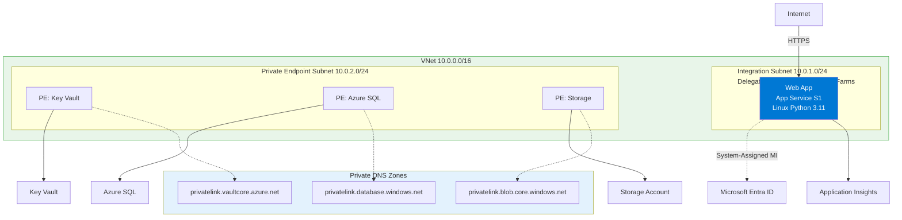
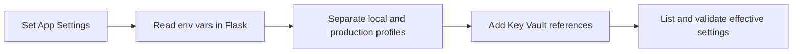

---
hide:
  - toc
content_sources:
  diagrams:
    - id: 03-configure-flask-app-settings-on-app-service
      type: flowchart
      source: mslearn-adapted
      mslearn_url: https://learn.microsoft.com/en-us/azure/app-service/configure-common
    - id: diagram-2
      type: flowchart
      source: mslearn-adapted
      mslearn_url: https://learn.microsoft.com/en-us/azure/app-service/configure-common
---

# 03 - Configure Flask App Settings on App Service

This guide standardizes runtime configuration for Flask on Azure App Service. You will set environment settings, separate dev/prod behavior, and secure secrets with Key Vault references.

!!! info "Infrastructure Context"
    **Service**: App Service (Linux, Standard S1) | **Network**: VNet integrated | **VNet**: ✅

    This tutorial assumes a production-ready App Service deployment with VNet integration, private endpoints for backend services, and managed identity for authentication.

<!-- diagram-id: 03-configure-flask-app-settings-on-app-service -->


<!-- diagram-id: diagram-2 -->


## Prerequisites

- Completed [02 - First Deploy](./02-first-deploy.md)
- Deployed web app running in App Service

## Main Content

### Configure application settings in App Service

```bash
az webapp config appsettings set \
  --resource-group $RG \
  --name $APP_NAME \
  --settings FLASK_ENV=production APP_ENV=production LOG_LEVEL=INFO
```

In Flask code, read settings from environment variables:

```python
import os

FLASK_ENV = os.getenv("FLASK_ENV", "production")
APP_ENV = os.getenv("APP_ENV", "production")
LOG_LEVEL = os.getenv("LOG_LEVEL", "INFO")
```

### Use environment strategy for local vs cloud

Recommended pattern:

- Local development: `FLASK_ENV=development`, `APP_ENV=local`
- App Service: `FLASK_ENV=production`, `APP_ENV=production`

### Add Key Vault reference for secrets

```bash
KEYVAULT_NAME="kv-flask-tutorial"
SECRET_NAME="DbPassword"

az webapp config appsettings set \
  --resource-group $RG \
  --name $APP_NAME \
  --settings "DB_PASSWORD=@Microsoft.KeyVault(SecretUri=https://$KEYVAULT_NAME.vault.azure.net/secrets/$SECRET_NAME/)"
```

### Validate effective settings

```bash
az webapp config appsettings list --resource-group $RG --name $APP_NAME
```

Masked example:

```json
[
  {
    "name": "DB_PASSWORD",
    "value": "@Microsoft.KeyVault(SecretUri=https://kv-flask-tutorial.vault.azure.net/secrets/DbPassword/)"
  },
  {
    "name": "WEBSITE_RUN_FROM_PACKAGE",
    "value": "1"
  }
]
```

## Advanced Topics

Move from single-secret references to identity-based SDK retrieval for dynamic secret versioning and reduced configuration drift across environments.

## See Also
- [04 - Logging and Monitoring](./04-logging-monitoring.md)
- [Key Vault References Recipe](./recipes/key-vault-reference.md)

## Sources
- [Configure an App Service app (Microsoft Learn)](https://learn.microsoft.com/en-us/azure/app-service/configure-common)
- [Use Key Vault references as app settings (Microsoft Learn)](https://learn.microsoft.com/en-us/azure/app-service/app-service-key-vault-references)
